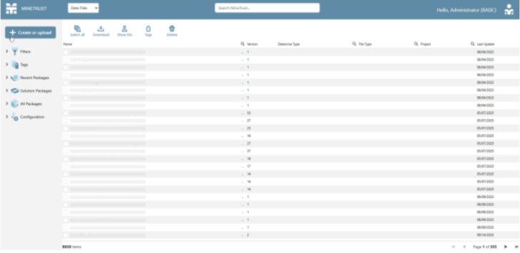
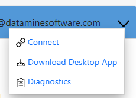
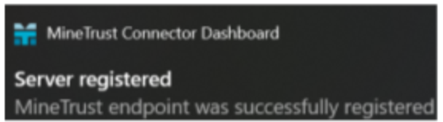

# MineTrust Local PC Configuration

MineTrust relies on a background service that continually checks for project changes and (depending on your settings) synchronizes data with a secure cloud platform for access by an approved audience.

MineTrust depends on **MineTrust Connector** , which must be installed on any local device or server that will be synchronising data with the central instance. The connector facilitates automated, encrypted transfer of project files and supports scheduled synchronisation intervals.

MineTrust also depends on an available **license** , managed centrally via the Datamine Customer Portal. Customers are able to nominate accounts for access. Datamine will facilitate enabling access for those accounts.

Each eligible Datamine product unlocks one named seat and additional seats may be purchased. Products must be currently maintained or on an active subscription.

Note: For more information on MineTrust licensing, database configuration, and next steps to configure endpoint access for your business, contact your local Datamine office.

Before others can start connecting to your MineTrust cloud system, the endpoint must be configured, and all user enrolments completed (via the [Datamine Customer Portal](<https://support.dataminesoftware.com/>)). Datamine can guide you through this phase to complete initial deployment quickly and easily, whichever deployment option you choose.

The end result is a Customer Portal account that can be used to log into the MineTrust Online host to get started. More on this below.

Once everything is ready to go, setting up local user machines is straightforward:

  * Install the **MineTrust Connector** locally:

    1. Log into <https://minetrustonline.com/> with your Customer Portal credentials (see above).

    2. Once signed in, you'll see files loading into the main window:

;>)

Note: If you are presented with an error message saying 'MineTrust not authenticated' then it is probable that your Datamine Customer Portal account has not been correctly configured within the MineTrust environment. In this case you will need to contact a MineTrust administrator in order to configure access to your account.

    3. Expand the corner menu and select **Download Desktop App** :

    4. Wait for the download to complete.

    5. Unzip the downloaded archive.

    6. Launch the .exe included in the archive and complete the installation steps.

    7. If prompted, restart your PC.

**MineTrust Connector** is now installed and running.

    8. Back in the web browser, expand the same menu as before, but this time select **Connect**.

    9. At this point, you may see a popup asks if it can open the local instance of "the Datamine.MineTrustConnector.Service" application. Click **Accept**.

Note: After clicking 'Connect', you may also receive a notification saying that MineTrust Connector needs authorisation in order to run - this appears as a notification in the Windows tooltray. If so, click on the notification and you are prompted to authenticate once more with your Datamine Portal Account. This step allows the MineTrust Connector Service to access the target environment using your Customer Portal user account. In short, it tells MineTrust Connector which credentials to use to access the online information and data.

    10. Enrolment on the environment is complete and successful once you receive the following notification:

;>)

You can now start [creating MineTrust-enabled projects and synchronizing existing projects](<../COMMON/Activity-Open-MT-Project.md>) and sharing data securely and safely within your organization.

Related topics and activities

  * [MineTrust](<MineTrust-Online-Overview.md>)
  * [MineTrust-Enabled Projects](<MineTrust-Aware-Projects.md>)

  * [Open MineTrust Project](<../COMMON/Activity-Open-MT-Project.md>)

  * [Create a MineTrust-Enabled Project](<../COMMON/Project%20Wizard-Activity-CreateMT.md>)

  * [MineTrust View-Only Mode](<View-Only-Mode.md>)

  * [MineTrust Connector Dashboard](<MineTrust-Dashboard.md>)

  * [Project Wizard: MineTrust Settings](<../COMMON/Project%20Wizard_MineTrust.md>)

  * [Project Wizard ](<../COMMON/ProjectWizard.md>)