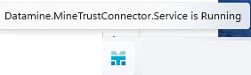
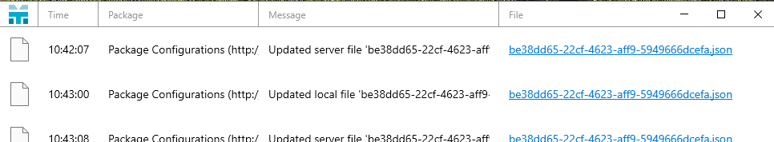

# MineTrust Connector Dashboard

Once **MineTrust Connector** is installed, and your product supports remote synchronization, you can connect to a configured MineTrust endpoint and start sharing project data with other users. See [MineTrust-Enabled Projects](<MineTrust-Aware-Projects.md>).

After initial set up, the **MineTrust Dashboard** appears in your Windows tooltray. You can hover over the icon to see the status of the connection service, for example:

Right-clicking the icon displays the following options:

  * **Restart service** Restart the MineTrust service. This will disconnect the active connection, restart the service then attempt to reconnect to the previously configured MineTrust endpoint.

  * **Close application** Stop the MineTrust service and sever the active connection. Data synchronization will halt. At this point, you can only restart the connection service via the MineTrust Connector Dashboard Start menu commands (see below).

Left-clicking the icon displays the most recent connection activities for the current MineTrust Connnector session, for example:

;>)

This view is automatically updated as communications occur between your workstation and MineTrust Online. Each event is described by the following parameters:

  * _Time_ The time of the communication event.

  * _Package_ The name of the transmitted data package and its destination URL).

  * _Message_ The server or local response to the transmission event.

  * _File_ A link to the local version of the data package.

### Start Menu Options

Once installed, you can access the MineTrust Connector Dashboard options using the Windows Start menu. Type in "MineTrust Dashboard" into the search panel to access the app.

From here, you can **Open** (run) the MineTrust Connector utility if it has been stopped. Once running again, the MineTrust icon reappears in the Windows tooltray (see above).

**Note** : If you **Uninstall** the MineTrust Connector app, you will no longer be able to synchronize data with MineTrust online.

Related topics and activities

  * MineTrust Connector Dashboard
  * [Project Wizard: MineTrust Settings](<../COMMON/Project%20Wizard_MineTrust.md>)

  * [Project Wizard ](<../COMMON/ProjectWizard.md>)