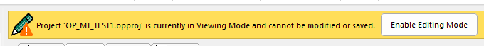
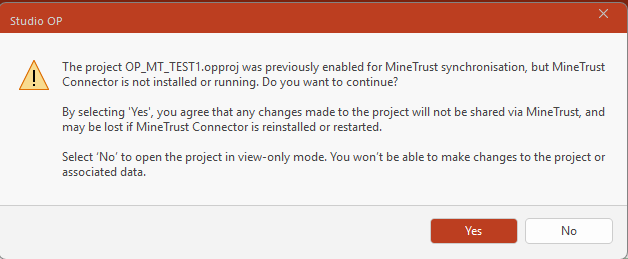
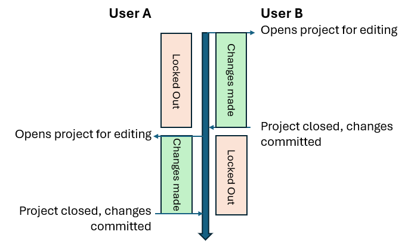

# MineTrust View-Only Mode

MineTrust projects operate in one of two modes:

  * Full access mode All licensed functions are available.

  * View-only mode Data can be viewed but not edited.

View-only mode is the default mode for a MineTrust-enabled project, regardless of the [configuration of the local PC](<MineTrust-Configure-PC.md>).

When opening a project that is synchronised with MineTrust, the project is launched in **View Only Mode** by default. This mode lets you inspect and review the project without modifying (and subsequently locking) files, ensuring that multiple users can access the same project simultaneously without unintended data loss.

**View Only Mode** doesn't lock everything down - you can still do the following:

  * Load and unload data within the project (these files aren't yet a part of the managed MineTrust package, so loading and unloading them won't do any harm.

  * Modify visual properties, including:

    * Formatting styles (line, symbols, opacity and so on).

    * Legends.

    * Filtering and selection tools.

Note: Filters and legends are created temporarily and are not saved in View Only mode.

This lets you see what you're working with in a variety of ways before optionally committing to editing mode (see below).

  * Navigate and explore the 3D workspace, including selecting and querying objects.

By default, MineTrust projects open in **"view-only" mode** even if MineTrust is locally installed and MineTrust Connector service is running. This is to prevent accidental data changes. You can tell this by looking at the top of the primary 3D window, where a banner appears:

;>)

You will also see an icon in the top right corner of the application:

When you open the project for editing, the project and contents (known as the "MineTrust package") is 'locked', meaning other MineTrust users can't access it whilst you're busy with it. This lock is released when you close the project, or decide to stop synchronizing data.

Where MineTrust is not available on the local PC (either because the MineTrust endpoint isn't available or hasn't been configured correctly, or the MineTrust Connector service is not running, you are presented with the following:

;>)

  * Clicking **No** opens the project in **view-only mode**. In this mode you can still:

    * Load and unload data within the project.

    * Modify visual properties, including:

      * Formatting styles (Line, Symbols, Opacity, and so on)

      * Legends

      * Filtering and selection tools

    * Navigate and explore the 3D workspace, including selecting and querying objects.

Note: Filters and legends are created temporarily and are not saved in View Only mode.

  * Clicking **Yes** opens the project as a standalone, unshared clone of the project. In this case, your changes aren't shared with others and are only performed in isolation. 

This is, essentially, creating an offline copy of the shared project.

In summary:

MineTrust-Enabled Project? | MineTrust Configured? | Open and View-Only? | Open and Edit?  
---|---|---|---  
No | No | No | Yes  
No | Yes | No | Yes  
Yes | No | Yes | No  
Yes | Yes | Yes | Yes  
  
## Data Synchronization

How and when is data synchronized between the MineTrust cloud store and the local machine?

MineTrust project changes are made during a project session, whilst the project is 'locked' from access by other users (other than in MineTrust View-Only Mode). This makes sure your changes are batched up and committed in a single operation for others to benefit from.

For example, consider the following timeline showing two Studio users make changes to the same project in a MineTrust enabled organization:

;>)

In summary, opening a MineTrust-enabled project for editing locks it, and closing the project (or stopping synchronization) unlocks it, automatically synchronizing changes.

Related topics and activities

  * [Open MineTrust Project](<../COMMON/Activity-Open-MT-Project.md>)

  * [Create a MineTrust-Enabled Project](<../COMMON/Project%20Wizard-Activity-CreateMT.md>)

  * MineTrust View-Only Mode

  * [MineTrust Local PC Configuration](<MineTrust-Configure-PC.md>)

  * [MineTrust Connector Dashboard](<MineTrust-Dashboard.md>)

  * [Project Wizard: MineTrust Settings](<../COMMON/Project%20Wizard_MineTrust.md>)

  * [Project Wizard ](<../COMMON/ProjectWizard.md>)