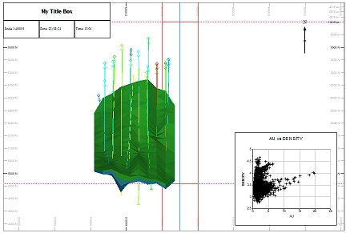
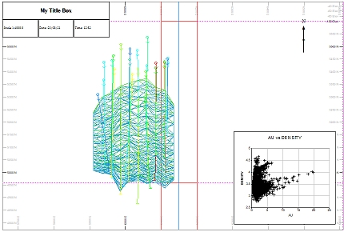
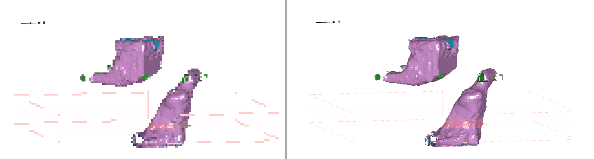

# 3D Overlay Groups

Overlays are representations of 3D data. A data object can be represented by one or more overlays.

In a basic sense, data represents the form of something, whilst its overlay describes how it is displayed. You can represent the same object in different ways, and this can be useful to ensure your audience understands what they are looking at.

Overlays of 3D data are displayed in plot sheet **[projections](<alignviewwithsection.md>)**. There are two types of projection in plots windows: 2D and 3D. See [Projection Overlay Types](<Projection%20Overlay%20Types.md>)

;>)

An example of a 3D overlay group within a projection of a plot sheet (and other plot items)

;>)

A 2D overlay group in a similar sheet, for comparison

3D overlays are very similar to their 3D window counterparts and can be formatted by right-clicking the appropriate item in the 3D Overlay Group folder and selecting the relevant [Properties](<../COMMON/Formatting%203D%20Objects.md>) option. In fact, the right-click menu displayed in this situation is the same as displayed in the [Sheets](<../VR_Help/SheetsOverview.md>) or Project Data bar's 3D folder for the same object overlay, and the formatting options available are identical to the 3D window options.

**Tip** : For more information on a particular properties panel, press <F1> with the relevant panel displayed to show context-sensitive help.

The quickest way to add a 3D overlay group as a projection within a plot sheet is to [create a plot sheet from 3D data](<../COMMON/Plot%20Overlays%20From%20Type.md>), but there are other options available to add a 3D overlay group to an existing projection.

### Add a 3D Overlay Group

To add a 3D overlay group to an existing plot sheet projection:

To add a 3D overlay to a plot projection, you will need to load the 3D data to be rendered, then create a 3D Overlay group, and finally populate that group with one or more overlays.

  1. Display the plot sheet you intend to modify, using the Plots window. This will contain at least one projection.
  2. In the Sheets or Project Data control bar, expand the Plots folder.
  3. Expand the projection's folder.
  4. Expand the Overlays folder.
  5. If a 3D Overlays Group item does not appear in the list of available overlays
     1. Right-click the Overlays folder item and select Insert....

The **[Plot Item Library](<plotitemlibrary.md>)** (PIL) appears.

     2. Select 3D Overlay Group from the Plot Item Library and click OK.  

  6. Right-click **3D Overlay Group** and select **Create from Loaded Data**.

The **3D Objects** screen displays.

  7. Choose the data objects from which to create plot sheet overlays.
  8. Click OK to render the object(s) using their default 3D window formatting options.

**Tip** : Default formatting can be [set using 3D display templates](<../COMMON/3D_Window_Templates.md>).

  9. Format the rendered 3D objects using their respective Properties screen:
     1. Right-click the overlay name that has appeared in the 3D Overlays collection.
     2. Select **Properties**
     3. Format the visual properties of the object.

### 3D Overlay Group Display Resolution

You can set the resolution (pixels per inch) of any 3D overlay group. This might be useful to reduce the amount of data you need to send to a printer or plotter, for example.

In the image on the left below, a 3D overlay group has been set to a deliberately low resolution (15 ppi). The same plot sheet is shown on the right at 150 ppi:

;>)

**Note** : The maximum display resolution for a 3D overlay group is 300 ppi.

The following procedure lets you change the resolution of all 3D Overlays in a collection. If you want to render mixed resolution 3D overlays on a plot, you will need to create a new 3D Overlays group first.

To change the display resolution for a 3D overlay group:

  1. Using the Sheets or Project Data control bar, expand the Plots folder to display a list of plot sheets.
  2. Expand the appropriate plot sheet folder, and the projection folder.
  3. Expand the Overlays folder and right-click 3D Overlay Group.
  4. Choose **3D Overlay Group Properties**.

The **3D Overlay Group Properties** screen displays.

  5. Set **Pixels per Inch** to any value from 1 to 300.

  6. Click **OK**.

The overlay group is redrawn with the new resolution.

Related topics and activities

  * [The View Hierarchy](<../COMMON/View%20Hierarchy.md>)

  * [Viewing Plots](<Plots-view-changes.md>)

  * [Sections and Projections](<alignviewwithsection.md>)

  * [Projection Overlay Types](<Projection%20Overlay%20Types.md>)