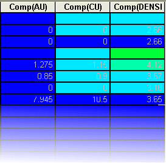

 |  Column Wizard - Composited Fields Adding a column containing composite values.  
---|---  
  
# Composited Fields

### To access this dialog:

  * In the Tables window, right-click and select Format.

  * In the(table) dialog, select theColumnstab.

  * In theColumns in Viewwindow, clickAdd....

  * The [Column Wizard](<Add%20Columns%20Wizard.md>)dialog is launched.

The Composited fields screen, part of the ColumnWizard, is used to create a new composited data field based on a selected data column, and defines how the compositing calculation is performed. This screen is only shown if the field (or fields) selected in the [Select Fields](<Add%20Columns%20Wizard%20-%20Data%20Columns.md>) screen of the ColumnWizard can be composited.

For more information on calculating composite values, see composited field calculations.

The following procedure describes how to create a composited column in a table, and display it as a histogram:

##  

## Creating a Composited Column in a table View

  1. In the Tables window, load an Assays table.

  2. Open the Table view by selecting View | Data Tables from the menu. Select a log table. With the table in memory, right-click the table and select Format.

  3. Insert a new column into the table by opening the Format | Columns dialog and pressing the Add button

  4. In the (table) dialog, select the Columns tab, and click Add.

  5. In the ColumnWizard, choose to add a Data Column and click Next.

  6. Select an Assay column, and click Next.

  7. Choose one of the compositing methods - normally length weighted for assay results (default).

  8. Select Filled histogram as the display style, and select End.

  9. In the (table) dialog, click Apply.

  10. A new column (or columns) is displayed in the table - the prefix "Comp" is used to denote that it is a composited data column, for example:  
  

Field Details:

The following fields are available on this screen:

Composited Fields: this read-only list shows all fields selected on the [Select Fields](<Add%20Columns%20Wizard%20-%20Data%20Columns.md>) screen that can be composited. Settings made on this screen apply to all selected fields.

Compositing Mode: Select the compositing method from one of the following options:

  * General: compute weighted average or dominant text depending on field type (numeric or text).

  * Weighted average: compute weighted average of numeric values.

  * Dominant text value: compute the dominant text value in the composite.

Weighting Method: select a compositing weighting method from one of the following options:

  * Length: weight values by length of sample.

  * Length x SG: weight values by the length x Specific Gravity of samples. If the Specific Gravity value of any sample in the composite is absent, the weighting method for that composite will revert to length weighting.

Convert absent data to zero...: select this check box to convert absent data values in the composited field to zero. Absent data values will otherwise be ignored in the calculation of the composite value.

 |  Related Topics  
---|---  
| [The Column Wizard](<Add%20Columns%20Wizard.md>)[  
Column Wizard - Select Column Type](<Add%20Columns%20Wizard%20-%20Select%20Column%20Type.md>)[  
Column Wizard - Select Fields](<Add%20Columns%20Wizard%20-%20Data%20Columns.md>)[  
Column Wizard - Select Style](<add%20columns%20wizard%20-%20column%20styles.md>)