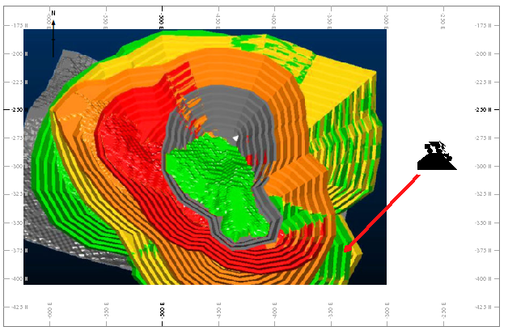

# Anchor Ribbon

The **Anchor** ribbon provides commonly-used settings to manage [locatable plot items](<Locatable%20Plot%20Items.md>).

For example, in the image below, a symbol has been 'located' to a fixed point on the sheet (the section of the projection is horizontal, and the projection view is aligned orthogonally with it). The symbol appears with an arrow pointing to the nominated 3D location:

;>)

The **Anchor** ribbon's coordinate fields can now be used to adjust the location of the arrowhead, or you can pick a location using the cursor. 

You can adjust the plot item by dragging it anywhere on the plot sheet (even outside the associated projection).

If you subsequently change the projection (say, by panning) the behaviour of the plot item is determined by its **Item Position** setting. See below for more details.

### Interactive Anchor Point Positioning

By default, a new anchor point is set to 0,0,0. This may be outside your projection, so you won't see where it's pointing. To change this, you can disable [Page Layout Mode](<PageLayoutMode.md>) and click **Pick** to select any location within the current project.

Doing this automatically updates the **X** , **Y** and **Z** fields. You can also adjust these fields manually to get a more precise anchor point location.

It is also possible to set up a locatable plot item using the **Properties** control bar. See [Locatable Plot Items](<Locatable%20Plot%20Items.md>)

### Formatting Options

Use the Style group to change the appearance of the arrow connecting your plot item to a location.

Activate Connector | Show or hide the connecting arrow.  
---|---  
Pick | Select the location of the anchor point in the projection (left-click). This updates the XYZ coordinate fields.  
XYZ | Coordinates of the anchor point.  
Arrow Size | The size of the arrow head.  
Line Width | The width of the arrow.  
Item Position | Either _Fixed_ , meaning the plot item does not change position when the projection is panned or rotated, or _Relative_ , meaning the plot item distance from the anchor point is maintained when the projection view changes.  
Colour | Choose a colour for the connecting arrow.  
  
Related topics and activities

  * [Locatable Plot Items](<Locatable%20Plot%20Items.md>)

  * [Plot Items](<LogPlotitems.md>)