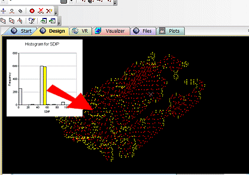
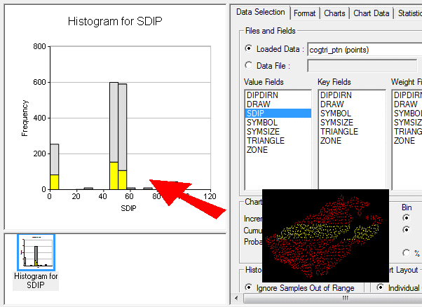

 |  Histogram Charts Creating and editing Histogram charts  
---|---  
  
# Creating and Editing Histograms

This help page is divided into the following sections:

  * Histogram Charts as Sheets or Plot Items

  * The Histogram Dialog

  * What Charts Types can be Displayed?

  * Single and Multiple Charts

  * Printing Charts

  * Histograms and Live Data Selections ("Stacked Histograms")

  * Step-by-step guides

Histogram Charts as Sheets or Plot Items

Histogram charts can be created either as chart Sheets in the Plots window or inserted as Plot Items into existing Plot or Log sheets. "Chart" plot items are a useful way of representing any table in memory (that is, any 'object') or physical file on a local or network system, using a specified chart index and value. One or more charts can be created from a single data source in order to create a set of histograms on a single sheet.

A wide variety of chart formatting options are available; you can create a chart based on a combination of value fields. Key fields can be used, if required, to display data divided into the selected key categories.

In addition to key field selection, values can be weighted using additional charting parameters.

## The Histogram Dialog

The Histogram dialog controls all aspects of histogram definition, formatting and creation.

The dialog consists of two functional areas: a preview area on the left and a control area on the right.

### The Preview Area

The preview area is used mainly for previewing the current settings for the chosen histogram. It will also allow you to use drag and drop to position components such as:

  * The chart title box.

  * The chart legend box.

  * The statistics box.

The amount of information your chart will eventually display depends on selections made in both the preview area and the Statistics tab. Note that statistics are only available for Individual charts, not Compound charts - these settings are defined in the Data Selection tab in the control area on the right.

The preview area also allows the 3D display to be modified; right-clicking and dragging within the chart area will alter the view direction. [More...](<Chart_Histogram_Preview.md>)

### The Controls Area

The control area on the right is divided into a number of tabs:

  * Data Selection: Define the histogram data source, chart types, layout and parameters. [More...](<Chart_Histogram_DataSelection.md>)

  * Format: Control the model, bin size, grid, axes and color parameters. [More...](<Chart_Histogram_Format.md>)

  * Charts: Lists the available charts and gives access to the chart and model parameters. [More...](<Chart_Histogram_Charts.md>)

  * Chart Data: Tabulates the summary bin data for the selected histogram. [More...](<Chart_Histogram_ChartData.md>)

  * Statistics: Displays the summary statistics for the selected histogram's Value field. [More...](<chart_histogram_statistics.md>)

## What Histogram Charts Types can be Displayed?

Your application supports the following basic chart types for both Normal and Log values; Frequency or %Frequency:

  * Incremental Histogram a graphical display of tabulated frequencies, shown as bars. It illustrates the proportion of values which fall into a series of designated categories or bins:  
  

  * Cumulative Histogram a graphical representation that accumulates all the cases in all of the bins up to the specified bin. As above, these are represented as bars:  
  

  * Probability Plot a graphical representation used for assessing how closely the distribution approximates a normal (Gaussian) model. The straightness of the line is an indicator of the relationship between the distribution of the data set and the normal model:  
  
  

 |  A wide variety of formatting options are available for all chart types. Find out more about model fitting, [here...](<Chart_Histogram_FitModel.md>)  
---|---  
  
## Single and Multiple Charts

By default, when you create a new chart sheet (or insert a chart as a plot item - see "Histogram Charts as Sheets or Plot Items" above), either a single or multiple histograms can be defined.

The Histogram dialog offers the choice of creating multiple individual charts (representing multiple data subsets) or a single, compound chart showing all results in one view. A compound chart will, by definition, always be a single 'page', however, multiple charts are handled by a single chart 'object' in memory using independently accessible pages. For example, if the Individual Charts option is selected in the Histogram dialog, and the Value and Key fields that have been selected give rise to four separate charts (for example, if one CU Value Field is selected, and one LITH Key Field containing four unique values), these charts will be created separately, and can be accessed individually using the Charts tab.

When this chart is added either as a plot item or a sheet, this information is maintained, but only the chart that was selected (in the Charts tab) is shown:

In this configuration, the chart object is displaying one of several 'pages'. You can access other pages and set other display formats (including a tabular, multi-chart display) using the Histogram properties dialog. This can be accessed by right-clicking a chart object and selecting Histogram Properties...

With the [Histogram properties](<Charts_Properties.md>) dialog in view, you can alter the Columns and Rows properties to fit more (or less) charts onto the screen. For the 6-chart arrangement used throughout this section, setting the Columns to '3' and the Rows to '2' will permit all graphics to be shown on screen (note that the Pages property will automatically be altered to '1'):

## Printing Charts

Once a chart view has been configured to your liking in the Plots window (either as a single- or multiple-chart component), selectPrintfrom theProjectmenu. For compound charts, a single page will be printed in all cases, however, if multiple chart components are in view (for example, you are showing the first 3 out of 6 possible charts in a 1 x 3 table), when the Print dialog is opened, it will default to print the Selection \- in this case, charts 1-3 inclusive. There will be two pages available for printing, which can be printed individually, or you print all pages.

Histograms and Live Data Selections ("Stacked Histograms")

Histogram charts are designed to reflect the status of selected/unselected data. Point data that is selected in another window, for example, if represented as part of a histogram chart, will be shown in the selected highlight color. You can run through the following general procedure to see how data selection on a chart is reflected in the data displayed in the 3D window.

  1. Load your data into memory, ensuring the data is visible in the 3D window.

  2. Activate theReportribbon and selectCharts | Histogram

  3. In the Histogram dialog, select the loaded file from the Loaded Data drop-down list (the Data File option to load data directly from disk, but you will not be able to perform any data selection).

  4. Select one or more value fields, key fields and/or weight fields.

  5. Select the type of chart you wish to display (Incremental, Normal distribution etc.)

  6. Select any further parameters or layout options.

  7. Click Apply to generate one or more histograms.

  8. Move the Histogram dialog so that either the Design or 3D windows can be seen.

  9. Click on any bar of the histogram that has a value over zero.

  10. The representative proportion of data that relates to that bar will be highlighted in the data display window.  
  
For example, the following points file has been used to generate a simple normal distribution histogram showing the unique SDIP directions for each point (this file was produced using Studio's COGTRI process) - an inset view of the selected histogram bar has been transposed onto the image:  
  

  11. The process works similarly in reverse, you can show how data selected in either the Design or 3D windows is reflected in the chart. In this case, selected points may only represent a portion of a 'bin', so a stacked histogram is displayed, e.g.:  
  
  
  

Step by step guides

## Creating a New Histogram Chart Sheet

Create a new histogram chart sheet using the following steps:

  1. Open the Plots window.

  2. Activate theReportribbon and selectCharts | Histogram

  3. Define the required parameters in the various tabs of the Histogram dialog, click OK.

## Inserting a Histogram Chart as a Plot Item

Create a new histogram chart plot item within an existing sheet using the following steps:

  1. In the Plots window, select the required plot sheet tab.

  2. Activate theManageribbon and selectInsert | Plot Item (top level button)

  3. In the Plot Item Library dialog, select [Histogram] and click OK.

  4. In the Histogram dialog, define the required parameters in the various tabs, click OK.

| In order to create a histogram chart, as a minimum, the Files and Fields parameters on the Data Selection tab have to be defined before OK is clicked.Note that you must also have a sheet projection selected before you attempt to insert a plot item.  
---|---  
  
## Editing an Existing Histogram Chart

In order to edit an existing histogram chart sheet or plot item, use the following steps:

  1. In the Plots window, select the required plot sheet tab.

  2. Double-click on the histogram chart.

  3. In the Histogram dialog, modify the required parameters in the various tabs, click OK.

|  Related Topics  
---|---  
| [Histograms - Data Selection](<Chart_Histogram_DataSelection.md>)[  
Histograms - Format](<Chart_Histogram_Format.md>)[  
Histograms - Charts](<Chart_Histogram_Charts.md>)[  
Histograms - Chart Data](<Chart_Histogram_ChartData.md>)[  
Histograms - Statistics](<chart_histogram_statistics.md>)[  
Histograms - Fit Model](<Chart_Histogram_FitModel.md>)[  
Histograms - Preview](<Chart_Histogram_Preview.md>)[  
Scatter Plot Charts](<Chart_ScatterPlot.md>)