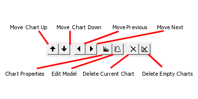

 |  Histograms - Charts Managing histogram charts, their properties and model parameters  
---|---  
  
# Histogram Charts tab

### To access this dialog:

  * Open the [Histogram](<Chart_Histogram.md>) dialog, select the Charts tab.

The Charts tab lists the available histogram charts and is used to select or delete charts and access the Chart Parameters and Fit Model dialogs.

Field Details:

The Charts tab is contains the following fields:

Charts Toolbar

  * Move Chart Up/Down: for multiple chart entries, you can use these buttons to sort the order in which charts are listed. Selecting one of the up or down arrows will move the selected item in the corresponding direction.  
  
As charts can be added to a plot sheet as a multi-page component, it is often useful to sort the charts into a sensible order. If charts are to be displayed in a table form (that is, showing several charts simultaneously), this order will also dictate the left-right and top-bottom ordering of the chart previews on the plot sheet. Find out more about chart properties, [here...](<Charts_Properties.md>)

  * Move to Previous/Next Chart: select (and preview) the previous/next chart in sequence.

  * Edit Chart Properties: edit the global display parameters used to display the chart that is selected, using the [Histogram Properties](<Chart_Histogram_ChartProperties.md>) dialog.

  * Edit Model Properties: fit a standard deviation model to the current data series (using one or more distribution components), using the [Fit Model](<Chart_Histogram_FitModel.md>) dialog.

  * Delete Current Chart: removes the current chart from the table. Note that this operation cannot be undone, but all missing charts can be replaced by regenerating them.

  * Delete Empty Charts: this button will force any charts that contain zero data to be deleted from the table.

Chart List: this group contains a table listing histogram chart in the following columns:

  * CHART: a simple read-only index field representing the unique numerical identifier (UID) for the chart.

  * CHART ID: a unique alphanumeric description of the chart and will be in the following format:  
  
Scatter plot of #X Axis# vs #Y Axis#, #Key Field 1# #Key Value 1#, #Key Field 1# #Key Value 2#, #Key Field 2# ....  

  * #KEY FIELD n#: a column will be displayed for each key field identified on the Data Selection tab. Each row in the Charts list will represent a unique combination of these values.

## Using the Charts tab

 |  The Charts toolbar is only available when the Individual Charts option was selected on the [Data Selection](<Chart_Histogram_DataSelection.md>) tab. It is not displayed if the Compound Charts option was selected.  
---|---  
  
The number of histogram charts that are listed depends on how many distinct data series resulted from the selections made in the Data Selection tab. For example, if one Value is matched against one Key Field, and the selected Key Field contained two unique values, two charts would be generated.

If a Compound chart is selected on the [Data Selection](<Chart_Histogram_DataSelection.md>) tab, individual rows representing data series are still shown in this list. In this situation, selecting a row in the table will have no effect. However, where Individual Charts have been generated, selecting each data row will automatically update the preview panel to show the chart that is relevant to the selection as shown in the example below:

Fig 1: Multiple charts selection: Each row of the table displays information about the parameters that define the data range.

|  Related Topics  
---|---  
| [Histograms](<Chart_Histogram.md>)[  
Histograms - Data Selection](<Chart_Histogram_DataSelection.md>)[  
Histograms - Preview](<Chart_Histogram_Preview.md>)[  
Histograms - Chart Parameters](<Chart_Histogram_ChartProperties.md>)[  
Histograms - Fit Model](<Chart_Histogram_FitModel.md>)