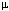

 |  Histograms - Fit Model Fitting a model to histogram data  
---|---  
  
# Fitting a Histogram Model

### To access this dialog:

  * In the [Histogram](<Chart_Histogram.md>) dialog, [Charts](<Chart_Histogram_Charts.md>) tab, select a chart from the list,

  * Click Edit Model Properties .

The Fit Model dialog is used to define histogram model parameters for the selected cart.  

 |  The model is a superimposed theoretical normal (or lognormal) distribution curve calculated from the histogram chart's data.  
---|---  
  
Field Details:

The Fit Model dialog contains the following fields:

Parameters:

  * Mean: the model distribution's mean parameter.

  * Standard Deviation: the model distribution's standard deviation parameter.

  * Model: select this option to display the model distribution for the selected chart.

  * Log Normal Model: select this option to display a lognormal (and not a normal) model distribution.

  * Restore Defaults: click this button to display the default parameters and settings.

## Histogram Models

The theoretical distribution by default has the same mean and variance as the sample data. This is one way to show how close the sample histogram is to the theoretical normal (or lognormal) gaussian distribution. The graphic below shows a normal model as both a histogram (left) and a probability plot (right) together with the sample histogram and probability plot. The theoretical model is a straight line in the probability plot.

The graphic below shows a normal distribution with a mean of  and a standard deviation of ơ. It also shows the proportion of samples lying within each standard deviation from the mean.

 |  The Fit Model option is only available for charts showing a single data set - it is not possible to fit a distribution model to a compound chart. The distribution model for a given graph can be overlaid using the Fit Model function, and the Probability Plot option can be selected to determine how the values (or logarithms of those values) deviate from this model.  
---|---  
  
.

 |  Related Topics  
---|---  
|  [Histograms](<Chart_Histogram.md>)[  
Histograms - Data Selection](<Chart_Histogram_DataSelection.md>)[  
Histograms - Preview](<Chart_Histogram_Preview.md>)[  
Histograms - Chart Parameters](<Chart_Histogram_ChartProperties.md>)[  
Histograms - Chart Data](<Chart_Histogram_ChartData.md>)