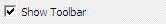
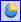
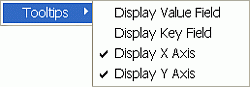

 |  Histograms - Preview Using the Histogram preview panel  
---|---  
  
# Previewing Histogram Data

### To access this area:

  * Double-click an existing Histogram plot item or sheet. The Histogram Preview area is permanently fixed on the left side of the [Histogram](<Chart_Histogram.md>) dialog.

The Histogram dialog's preview area is used to select and preview a chart.

## The Preview Toolbar

The preview area has a dedicated toolbar which can be displayed by selecting the Show Toolbar check box at the bottom of the dialog:

Once enabled, the toolbar is revealed, and can be repositioned as required by dragging and dropping.

The Preview toolbar contains the following functions:

Save as Image: saves the current chart image to a standalone image file. Files can be saved in .bmp, .jpg, .jpeg, .tiff, .gif or .emf formats.

Copy to Clipboard: copies the contents of the preview area to the clipboard. This information can be pasted into any external application that supports the pasting of image metadata. For more information on how to paste into external applications, please refer to the relevant documentation for the system in context.

Print: allows you to send the displayed graph to any supported local or network printing device. Note that this function will launch your system's proprietary print control dialog, and you should refer to your system documentation for more details on how to set up particular printing formats for your hardware.

Print Preview: allows you to preview your hardcopy output using the Print Preview dialog. More...

Select Colors: displays a list of presets that allow you to customize the appearance of your chart. Note that this menu also includes an Edit Palette... option which is used to define a new palette, using the Color Collection Editor dialog.

Select Chart: where a compound chart has been created (as chosen by the Compound Chart option on the Data Selection tab), this icon will display all charts that are included in the compound chart. Selecting a chart in this list displays the Chart Series Style dialog, allowing you to format the graph display in more detail. Note that if multiple charts have been generated, only one chart is selectable.

3D Mode: enables and disables 3D chart mode. If this option is enabled, you can rotate the chart in the preview area by dragging the mouse with the right-button held down. If the option is disabled, a 2D flat view is set automatically and no rotation can be performed.

Show/Hide Legend: The chart legend is displayed by default - you can disable it by selecting this toggle button.

 |  Note that all chart formatting controls are chart-independent. Swapping from one chart to another using the [Charts](<Chart_Histogram_Charts.md>) tab, for example, will automatically update the settings to be relevant to how they were last set for the chart in question.  
---|---  
  
 |  If a chart legend is displayed, you can double-click the legend item's legend block or label in the preview panel to open up the[Chart Series Style](<Charts_ChartSeriesStyle.md>)dialog or[Legend Properties](<Charts_LegendProperties.md>)dialog respectively, for further formatting options.  
---|---  
  
## Performance Mode

When working with large data sets, the speed performance of the Histogram dialog e.g. while generating and refreshing histogram chart previews, can be increased by selecting the Performance Mode option. This is located below the Chart Thumbnails and Preview Panes:

Once selected (ticked), the chart thumbnails and the histogram chart plot item is temporarily hidden; these can again be displayed by turning this option off.

## 2D or 3D?

Histograms can be displayed as either 'flat' (orthogonal) items or as isometrically rotated graphics. By default, all histograms are generated in the flat mode, but this can be altered by selecting the 3D Mode icon  in the Preview Toolbar and then using click-and-drag on the histogram chart in the preview pane to adjust the rotation angles:

 |  There are limits to the amount of rotation that can be performed. It is not possible, for example, to rotate a graph more than 45 degrees horizontally about the origin.  
---|---  
  
## Context Menu Options

Right-clicking in the preview area displays the following context menu:

Field Details:

Tooltips:

 |  These are displayed in a tooltip popup, in the preview pane, when the cursor is hovered over a histogram bar point .  
---|---  
  
Display Value Field: show/hide the value field name. This is the Value Field defined in the Data Selection tab.

Display Key Field: show/hide the key field name and value. This is the Key Field defined in the Data Selection tab.

Display X Axis: show/hide the X Axis data value (shown by default). This is the X Axis defined in the Data Selection tab. The values displayed will include the lower and upper bin values for a normal scale, lower and upper untransformed values for a log scale.

Display Y Axis: show/hide the Y Axis data value (shown by default). This is the Y Axis defined in the Data Selection tab.

Interactive Data Selection

If drillhole or points data is selected in the Histogram dialog as a loaded data object then the preview panel's functions are expanded to allow you to 'link' to this data in the Design window. This connection allows you to select an interval in a graph and have that selection of data automatically highlighted in the 3D window.

Note that this interactive selection is not implemented for wireframe, block model or string data.

| 

  * TheHistogramdialog is modeless - this means you can still access other application functions with the dialog in view. This is particularly useful if you wish to open the3Dwindow for interactive data highlighting.
  * To make data selection clearer - set the display of the Drillhole or Point data to aFixed Colorthat matches the background. Then, any data selection will reveal only the data values that are relevant. The others are 'hidden'.

  
---|---  
  

It is possible to select more than one interval using the <CTRL> key - all selected data is highlighted:

## Compound Charts

A single chart can contain one or more histograms as illustrated in the graphic below which shows AU histograms for two different rock types. A compound chart is displayed by selecting the Compound Chart option in the Charts Layout area on the Data Selection tab of the Histogram dialog.

The chart for each data set can be edited independently using the Select Chart icon on the preview panel's toolbar. This displays the Chart Series Style dialog that can be used to change a wide variety of formatting options for each set.

|  Related Topics  
---|---  
| [Histogram - Introduction](<Chart_Histogram.md>)[  
Histogram - Data Selection](<Chart_Histogram_DataSelection.md>)[  
Histogram - Format](<Chart_Histogram_Format.md>)[  
Histogram - Charts](<Chart_Histogram_Charts.md>)[  
Histogram - Chart Data](<Chart_Histogram_ChartData.md>)[  
Histogram - Color Collection Editor](<Chart_Histogram_ColorCollectionEditor.md>)[  
Charts - Print Preview](<Charts_PrintPreview.md>)