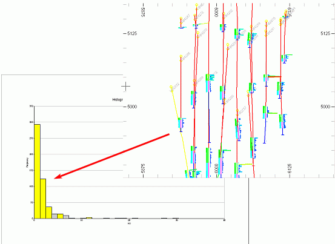

 |  Histogram - Viewing Linked Data Viewing linked histogram data  
---|---  
  
# Viewing Linked Histogram Data

 2

3D data objects which have been loaded, displayed in the Design and/or 3D windows and used to create a histogram chart in the Plots window, can be selected in one window and the selection viewed in another. This data selection and viewing across windows can be done in both directions i.e. selected in a Histogram Chart and viewed in Design/3D or selected in Design/3D and viewed in a Histogram Chart.

 |  This data selection and viewing across windows cab be used to:

  * validate exploration and modelled data e.g. searching for outliers.
  * determination ore category positions.

  
---|---  
  

## Viewing Selected Data in a Histogram Chart Sheet

The following steps require that a 3D object has already been loaded and also used to generate a histogram chart:

  1. In the 3D window, select the required data e.g. drillhole samples from a particular horizon in one or more drillholes.

  2. Check that the selected items are highlighted yellow.

  3. In the Plots window, select the corresponding Histogram Chart sheet.

  4. Look for the highlighted histogram bars.

## Viewing a Selected Histogram Chart Bar

The following steps require that a 3D object has already been loaded and also used to generate a histogram chart:

  1. In the Plots window, Histogram Chart sheet, double-click the chart to open the Histogram dialog.

  2. In the Histogram dialog, select the required histogram bars.

  3. Check that the selected items are highlighted yellow.

  4. In the 3Dwindow, look for the highlighted data items.

 |  In order for data selection to be visible in another window, the Enable automatic redraw option needs to be set (Home ribbon, Project | Settings dialog, Design tab).  
---|---  
  
 |  Related Topics  
---|---  
|  [Histograms \- Data Selection](<Chart_Histogram_DataSelection.md>)[  
Histograms - Format](<Chart_Histogram_Format.md>)[  
Histograms - Charts](<Chart_Histogram_Charts.md>)[  
Histograms - Chart Data](<Chart_Histogram_ChartData.md>)[  
Histograms - Statistics](<chart_histogram_statistics.md>)[  
Histograms - Fit Model](<Chart_Histogram_FitModel.md>)[  
Histograms - Preview](<Chart_Histogram_Preview.md>)[  
Scatter Plot Charts](<Chart_ScatterPlot.md>)