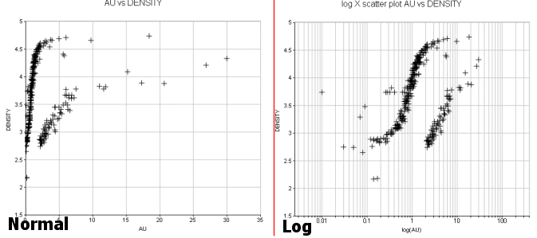

 |  Scatter Plots Creating and editing scatter plots  
---|---  
  
# Creating and Editing Scatter Plots

Scatter Plots as Sheets or Plot Items

Scatter plots can be created either as chart Sheets in the Plots window or inserted as Plot Items into existing Plot or Log sheets. "Chart" plot items are a useful way of representing any table in memory (that is, any 'object') or physical file on a local or network system, using a specified chart index and value. One or more scatter plots can be created from a single data source in order to create a set of scatter plots on a single sheet.

A wide variety of chart formatting options are available; charts can be created based on a combination of axis fields. Key fields can be used to display data divided into key categories. You also choose from either normal or logarithmic distribution options independently for each axis, e.g. the following images show a standard scatterplot to show the relationship between grade x density on the left, and a log plot equivalent on the right:  
  

## The Scatter Plot Dialog

The Scatter Plot dialog controls all aspects of scatter plot definition, formatting and creation.

The dialog consists of two functional areas: a preview area on the left and a control area on the right.

### The Preview Area

The [preview area](<Chart_ScatterPlot_Preview.md>) is used mainly for previewing the current settings for the chosen chart; charts can be selected by clicking on a thumbnail in the lower pane. It is also possible to reposition items in the chart using drag-and-drop. Examples of chart components are:

  * The chart title box.

  * The chart legend box (if displayed - see below)

  * The statistics box (if any have been selected for display using the Statistics tab)

The amount of information your chart will eventually display depends on selections made both in the preview area and the Statistics tab.

 |  Statistics are only available for Multiple charts, not Compound charts - these settings are defined in the Data Selection tab in the control area on the right.  
---|---  
  
The preview area also allows the 3D display to be modified; once the 3D Mode icon  in the Preview Toolbar is toggled on, right-clicking and dragging within the chart area will alter the view direction.

### 

### The Controls Area

The control area on the right is divided into the following tabs:

  * Data Selection: define the scatter plot data source, layout and summary. [More...](<Chart_ScatterPlot_DataSelection.md>)

  * Format: control the color, symbol, regression line, grid, axes and annotation parameters, . [More...](<Chart_ScatterPlot_Appearance.md>)

  * Charts: list the available charts and access chart properties. [More...](<Chart_ScatterPlot_Charts.md>)

  * Statistics: displays the summary statistics for the selected scatter plot's X and Y axis data fields. [More...](<Chart_Scatterplot_Statistics.md>)

## Single and Multiple Charts

By default, when a new scatter plot sheet is created (or inserted as a plot item - see "Scatter Plots as Sheets or Plot Items" above), either a single or multiple scatter plots are displayed.

The Scatter Plot dialog offers the choice of creating multiple individual charts (representing multiple data subsets) or a single, compound chart showing all results in one view. A compound chart will, by definition, always be a single 'page', however, multiple charts are handled by a single chart 'object' in memory using independently accessible pages. For example, if the Multiple Charts option is selected in the Scatter Plot dialog, and the X Axis, Y Axis and Key fields that have been selected give rise to multiple charts (for example, X and Y axes represent CU grade vs. Density, and a selected NLITH key field - which in itself contains 4 distinct values - gives rise to four variants of this chart), those charts are listed independently in the Charts tab:

In this configuration, the chart object is displaying one of several 'pages'. Other pages can be accessed and other display formats set (including a tabular, multi-chart display) using the Chart Properties dialog. This can be accessed by right-clicking a scatter plot chart in a sheet and selecting Scatter Plot Properties...

With the Scatter Plot properties dialog in view, the Columns and Rows properties can be altered to fit more (or fewer) charts onto the screen. For the 6-chart arrangement used throughout this section, setting the Columns to '3' and the Rows to '2' will permit all graphics to be shown on screen (note that the Pages property will automatically be altered to '1'):

Creating a New Scatter Plot Sheet

Create a new scatter plot sheet using the following steps:

  1. Open the Plots window.

  2. Using theManageribbon, selectInsert | Sheet | Point/Line Plot

  3. Define the required parameters in the various tabs of theScatter Plotdialog, clickOK.  

Inserting a Scatter Plot as a Plot Item

Create a new scatter plot item within an existing sheet using the following steps:

  1. In the Plots window, select the required plot sheet tab.

  2. Using theManageribbon, click the top levelPlot Itembutton

  3. In the Plot Item Library dialog, select [Scatter Plot] and click OK.  
  
  

  4. In the Scatter Plot dialog, define the required parameters in the various tabs, click OK.

| In order to create a scatter plot chart, as a minimum, the Files and Fields parameters on the Data Selection tab have to be defined before OK is clicked.  
---|---  
  
## Editing an Existing Scatter Plot Chart

In order to edit an existing scatter plot chart sheet or plot item, use the following steps:

  1. In the Plots window, select the required plot sheet tab.

  2. Double-click on the scatter plot chart.

  3. In the Scatter Plot dialog, modify the required parameters in the various tabs, click OK.  

## Printing a Chart

Once a chart view has been configured in the Plots window (either as a single- or multiple-chart component), it can be printed as follows:

  1. SelectPrintfrom the [Project button](<../COMMON/Ribbon_File_Button.md>) drop-down menu

  2. In the Print dialog, define Printer, Print Range and Copies settings, click OK.

| For compound charts, a single page will be printed.In all cases, however, if multiple chart components are in view (for example, you are showing the first 3 out of 6 possible charts in a 1 x 3 table), when the Print dialog is opened, it will default to print the Selection \- in this case, charts 1-4 inclusive. There will be two pages available for printing, which can be printed individually, or you print all pages.  
---|---  

|  Related Topics  
---|---  
| [Histogram Charts](<Chart_Histogram.md>)[  
Scatter Plots - Data Selection](<Chart_ScatterPlot_DataSelection.md>)[  
Scatter Plots - Format](<Chart_ScatterPlot_Appearance.md>)[  
Scatter Plots - Charts](<Chart_ScatterPlot_Charts.md>)[  
Scatter Plots - Properties](<Chart_ScatterPlot_ChartProperties.md>)[  
Scatter Plots - Statistics](<Chart_Scatterplot_Statistics.md>)