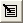

 |  Scatter Plots - Chart Properties Editing individual scatter plot chart properties  
---|---  
  
# Scatter Plot Properties

### To access this dialog:

  * In the [Histogram](<Chart_Histogram.md>) dialog, [Charts](<Chart_Histogram_Charts.md>) tab, select a chart item from the list,

  * Click Edit Chart Properties .

The chart Properties dialog is used to define the selected chart's Display, Models, Titles, Legend, Comments, Grid and Bin Averaging parameters.

Field Details:

Display:

  * Display Statistics: tick this box to display a summary statistics box on the chart, containing those statistics selected in the [Statistics](<Chart_Scatterplot_Statistics.md>) tab.

Models: this group contains the controls for the regression analysis lines:

  * Polynomial Regression: select this option to fit and draw a polynomial regression line.

  * Color Palette drop-down: select the required color for the polynomial line, if the Polynomial Regression option is selected.

  * Order of Polynomial: define the order of the polynomial function (default '1').

  * Diagonal: select this option to draw a Y=X line.

  * Color Palette drop-down: select the required color for the diagonal line, if the Diagonal option is selected.

 |  The regression analysis coefficients and statistics are displayed in the [Charts](<Chart_ScatterPlot_Charts.md>) tab, Regression Analysis pane. These values are updated when either the Polynomial Regression or the Order of Polynomial parameter is modified and Apply is clicked.  
---|---  
  
Titles: this group contains the title and axes label controls:

  * Title: accept the default or type in a custom description; select a font size from the drop-down.

  * X Axis: accept the default or type in a custom description; select a font size from the drop-down.

  * Y Axis: accept the default or type in a custom description; select a font size from the drop-down.

  * Chart ID: this read-only field represents the automatically-generated index description for the chart.

Legend: tick this box to display a legend box:

  * Title: accept the default or type in a custom description; select a font size from the drop-down.

Comments: tick this box to display comments in a text box:

  * Comments: type in comments; use <Enter> to define multiple lines.

Grid: tick this box to define custom grid parameters:

  * Minimum: X and Y axes minimum values

  * Maximum: X and Y axes maximum values

  * Grid interval: X and Y exes grid interval

 |  The scatter plot 'grid' is determined automatically from the selected data columns and ensures that all data values for the chart in question are displayed within the preview area.  
---|---  
  
Bin Averaging: tick this box to display average value data points, using the defined bin settings:

  * X Axis: select this option to use X axis bin averaging; define X axis Minimum and Bin width values

 |  Original points falling below the defined Minimum will not be used to generate average points.  
---|---  
  * Y Axis: select this option to use Y axis bin averaging; define Y axis Minimum and Bin width values

 |  Original points falling below the defined Minimum will not be used to generate average points.  
---|---  
  * Display Original Points: tick to additionally display the original data points

  * Join Average Points: tick to sequentially connect, in either X or Y, depending on the above selection, the average points with line segments

  * Save Average Points File: tick to save the average points to file; this option enables the filename box and browse button

  *  : define a points file. Opens the [Project Browser](<../COMMON/ProjectBrowser.md>) dialog.

 |  Average points will not be generated and displayed for those bins that do not contain original data points.  
---|---  
  
 |  Related Topics  
---|---  
|  [Scatter Plot Charts](<Chart_ScatterPlot.md>)[  
Scatter Plots - Data Selection](<Chart_ScatterPlot_DataSelection.md>)[  
Scatter Plots - Format](<Chart_ScatterPlot_Appearance.md>)[  
Scatter Plots - Charts](<Chart_ScatterPlot_Charts.md>)[  
Scatter Plots - Statistics](<Chart_Scatterplot_Statistics.md>)