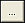
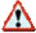
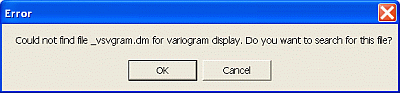

 |  Scatter Plots - Data Selection Selecting data to display in a scatter plot  
---|---  
  
# Scatter Plots - Data Selection

### To access this dialog:

  * Open the [Scatter Plots](<Chart_ScatterPlot.md>) dialog, select the Data Selection tab (shown by default).

The Data Selection tab is used to define the scatter plot data source, axes types and layout parameters.

Field Details:

Files and Fields: this group contains the data source controls:

  * Loaded Data: select this option and an item from the drop-down list to use an object currently loaded in memory.

  * Data File: select this option and use the browse button to select a Datamine file on your local or network system.

 : browse and select a Datamine file that has been added to the project. Opens the [Project Browser](<../COMMON/ProjectBrowser.md>) dialog.

 : refresh/reload the data file.

  * X Axis/Y Axis: select a data column for each of the X and Y axes.

 |  These fields represent the chart's X and Y axes and do not necessarily need to represent actual XY coordinates, if present, for the underlying data. If required, coordinate fields can also be used for generating a scatter plot.  
---|---  
  * Key Field: all fields, both alphanumeric and numeric, in the selected dataset are listed in the Key Fields column. This is an optional field and up to 5 fields may be selected. Multiple selections or de-selection can be made using the cursor and <Ctrl> key. The selection of a key field causes a separate data range (and, if Multiple Charts is selected, a separate chart) to be created for each different value within that field or combination of fields.

 |  In addition to the charts generated for each Key Field(s) value, the first chart in the series is a non Key Field chart containing all data.  
---|---  

Normal/Log: this group contains the X and Y data and axis scale types:

  * Normal - Normal : both X and Y axes are displayed with normal data values and scales i.e. not logged.

  * Normal - Log : X axis data and scale normal; Y axis data and scale logged.

  * Log - Normal : both X and Y axes are displayed with normal data scales i.e. not logged.

  * Log - Log : both X and Y axes are displayed with log data and scales.

 |  How are Values Treated for Log Chart Types? For the purposes of chart generation, all values (i.e. those for the selected Value Fields), which are <= 0 (zero) or absent (-), are ignored. This means that the number of effective samples is reduced. Logarithmic values are calculated to base 'e'.  
---|---  
  
Layout: this group contains the layout controls:

  * Multiple Charts: select this option to generate a separate chart for each data set defined by the selection(s) made in the Files and Fields section above. Where key fields are not selected, only one chart will be generated; if a key field has been selected, a subset data series will be generated for each unique value within that field. Where multiple key fields have been selected, a chart series will be generated for every combination of unique key field values.  
  
If Multiple Charts is selected, each chart will be listed independently on the Charts tab. Each chart will have its own thumbnail and can be displayed individually in the Preview Area.  
  
The chart's properties can be edited to facilitate the display of these multiple charts in a tabular arrangement. [More...](<Charts_Properties.md>)

  * Compound Chart: select this option to generate a chart that contains more than one individual chart. Compound charts will be constructed from the same chart-generation rules as their multiple chart equivalents, but only one chart will be created.  

 |  A common use for a compound chart would be to compare the scatter plots of a single Y Axis and X Axis field pair for different Key Field values. For example, to compare the the scatter plots of Cu-Au for different rock types.  
---|---  
  
 |  Selecting multiple key fields can affect the time taken to generate each chart series (and, if Multiple Charts, is selected, each chart). For example, if X and Y axis fields generate 50 distinct data points on the chart, and 2 key fields are selected, each containing 10 fields, the total number of data ranges that will be generated will be 10 x 10 = 100. This would correspond to 50 x 100 = 5000 data points. If a third key field was selected, containing 20 unique values, the total of data points represented by each chart would be 5000 x 20 = 100000 points.  
---|---  

  * Delete Empty Charts: tick this box to delete any scatter plot charts that have no data points (default ticked).

Summary: this read-only section of the panel shows a summary of the main parameters used to create the scatter plot chart:

  * Maximum number of charts: based on the selections made above, this information denotes the number of individual charts that will be created; each chart has its own thumbnail in the Preview Area.

## XY Axes or Coordinates?

The scatter plot X and Y axes can be used to represent non spatial as well as spatial data. For example, the following montage shows a plan view of static drillhole data, with several drillholes highlighted in the Design window; note how the corresponding points that are highlighted in the Scatter Plot dialog correlate to the physical positions of sample positions (connecting lines in the scatter plot view are drawn for demonstration purposes only):  
  
  
  
A more common use of the scatter plot, however, would be to compare one numeric data field with another with each field represented by either the X or Y axis. For example, the following scatter plot was generated according to data held in a block model data file processed by Datamine's NPV Scheduler application. The production cost was set as the Y axis and the X axis was set to the pushback number. The result shows, on a cell-by-cell basis, that the production costs increase for each pushback number:  
  

 |  When a project file is opened which contains charts that make used of linked files (and not loaded data) and the linked file(s) cannot be located (perhaps because it is unavailable, has been renamed or moved), the following error message is displayed:  Clicking OK will then display the Open dialog which is used to browse and select the required file(s).  
---|---  
  

Using the Data Selection Tab

  1. After opening the [Scatter Plots](<Chart_ScatterPlot.md>) dialog for either a new or existing scatter plot chart, select the Data Selection tab.

  2. In the Files and Fields group choose whether to base the scatter plot on Loaded Data (that is, data already in memory) or values held in a physical Data File.

  1.      * For Loaded Data: use the drop-down list to select from the objects currently loaded into memory.

     * For a Data File, use the browse button to select the desired file on the local system or network.

  3. Select one X and one Y value (multiple selections are not permitted) from each of the respective lists.

  4. Optionally select one or more key fields if you want multiple charts (or a compound chart) to display a data range for every unique key field value or combination of values.

  5. Select Apply or OK to update the preview area and the plot item/sheet within the Plots window.

 |  Related Topics  
---|---  
|  [Scatter Plot Charts](<Chart_ScatterPlot.md>)[  
Scatter Plots - Format](<Chart_ScatterPlot_Appearance.md>)[  
Scatter Plots - Charts](<Chart_ScatterPlot_Charts.md>)[  
Scatter Plots - Statistics](<Chart_Scatterplot_Statistics.md>)