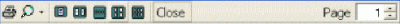

# Chart Preview  
  
To access this screen:

  1. Display the Histogram, Scatter Plot , Variogram or Stereonet screen.

  2. Ensure the toolbar is visible (Show Toolbar)

  3. Click Print Preview.

Preview your chart sheet before it is printed.

Once a chart view has been configured, select File >> Print. 

For compound charts, a single page is printed in all cases, however, if multiple chart components are in view (for example, you are showing the first 3 out of 6 possible charts in a 1 x 3 table), when the File >> Print screen is opened, it will default to print the Selection \- in this case, charts 1-3 inclusive. There will be two pages available for printing, which can be printed individually, or you print all pages.

The preview toolbar contains the following options:

From left to right, the preview can be:

  * printed

  * resized (magnified)

  * one or pages selected for a combination preview

  * closed

  * changed to another page of a multi-page preview page set.

Note: This facility is used for printing out the single chart preview only. It is not possible to print out multi-chart tables using this facility. This is achieved using the main File >> Print screen.

Related topics and activities

  * [Histogram - Preview](<Chart_Histogram_Preview.md>)

  * [Scatter Plot - Preview](<Chart_ScatterPlot_Preview.md>)