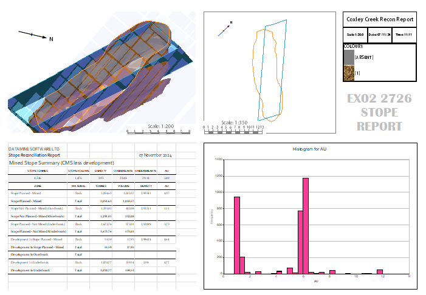

# Clipping Plots Data  
  
It can be useful to show a slice of data in a plot projection. 

You do this by 'clipping' data in related to a section plane. The section plane can be in any orientation, but there can only be one per projection. There can be multiple projections on a plot sheet, however.

See [Sections and Projections](<alignviewwithsection.md>).

At one extreme, clipping data results in a display of lines representing the intersection of data with a 3D section. At the other, no data is clipped. You can choose the amount of data that is clipped (or actually, how much is left in view) by changing a projection's properties. The section width is also known as the 'section corridor' and you can control the amount of data displayed in front of and behind the section (independently, if required).

Clipping is a purely visual function; no data is modified, only the view that is presented on your plot sheet. 

There are many applications for displaying clipped data in a plots, with the most obvious being to display a cross section through one or more loaded 3D object overlays, to show their relationship. Say, you could display the intersection of a designed stope against the surveyed results.

In the image below, for example, a stope reconciliation report plot shows a projection (top right) where all data in front of the sections passing through the designed volume and surveyed volume is clipped (there's some transparent block model cells there too, but ignore those).

;>)

The projection at top centre shows the same data, but displayed orthogonally to the section, and with a very thin 'section corridor'.

**Note** : Wireframe data can also be rendered using an Intersection mode, which doesn't use the typical clipping functions but shows the wireframe where it precisely crosses the section. This simulates the thinnest clipping section corridor you can create. See [Wireframe Properties: General](<../VR_Help/Wireframe_Properties_Dialog.md>).

The display of drillhole data and 3D objects may be restricted within the limits of the section definition. The clipping limits are independent of the view direction, although this is only apparent when the view direction is not perpendicular to the section azimuth.

In summary: data displayed in a projection can be clipped in the plots window in relation to a defined 3D plane, known as the 'section'. 

### Apply Plot Clipping

To clip data in a projection (using projection properties):

**Note** : [Page Layout mode](<PageLayoutMode.md>) can be active or inactive for this activity.

  1. Display a plot sheet with at least one [2D or 3D](<Projection%20Overlay%20Types.md>) projection.

  2. Right-click the projection and choose **Properties** (this may be called "3D Projection Properties", "West-East Projection Properties" or similar, and suffixed with the projection name, for example, "West East Projection Section 8428143.64 N Properties").

The **Projection Properties** screen displays. See [Projection Properties](<projection%20properties.md>).

  3. Make sure the projection section is in the right place (check the **Section Orientation** , **Section Definition** and **Section Table** groups)

  4. Scroll down to the **Section Clipping** group.

  5. Set Apply Clipping to _Yes_.

  6. Change the Front Clip value to the distance in front of the section, beyond which data is clipped.

  7. Change the Back Clip value to the distance behind the section, beyond which data is clipped.

  8. Decide if Secondary Clipping is shown (this means that clipped data is displayed using lightweight formatting). See [Secondary Clipping](<../VR_Help/Secondary_Clipping.md>) (the same principles apply in the **3D** and **Plots** windows).

Data in the projection is clipped.

**Note** : Adjusting the **Width** of clipping forces the clipping distance to be split equally between front and back values, so take care not to adjust the overall width if independent settings are required.

**Note** : Where a projection has been created based on 3D window data, using the create-plot-view command, and front or back clipping has been disabled, the unclipped side of the section will show an arbitrarily high value as this is needed to emulate 'no clipping' in the plot sheet.

To clip projection data using ribbon functions:

  1. Display a plot sheet with at least one [2D or 3D](<Projection%20Overlay%20Types.md>) projection.

  2. Select the projection. 

Two ribbons display; **Projection (Section)** and **Projection (View)**.

  3. Display the Projection (Section) ribbon.

  4. Use the **Primary Clipping** and **Secondary Clipping** command groups to clip data in relation to the active section.

See [Sections and Projections](<alignviewwithsection.md>).

Related topics and activities

  * [Viewing Plots](<Plots-view-changes.md>)

  * [Sections and Projections](<alignviewwithsection.md>)

  * [Add a Sheet or Projection](<insertsection.md>)

  * [Section Definition](<CustomSections.md>)

  * [Aligning Plot Sections](<alignsection.md>)

  * [Master Sections](<MasterSection.md>)

  * [Projection Properties](<projection%20properties.md>)