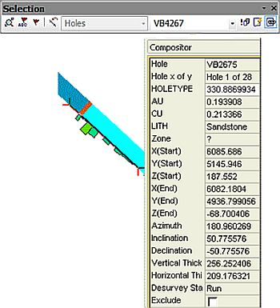

 |  The Compositor Tools Using the Drillhole Compositor tools  
---|---  
  
# The Compositor tools

###  

### To access these tools:

  * Activate the Sample Analysis ribbon and select the Interactive Compositor command. This command is available to 3D windows, the Plots window and the Logs window.

The drillhole Compositor tools are useful for investigating summary information for a selected drillhole interval in Plots, Logs or Tables and additionally saving the selected interval to an intersections table. They consist of the Selection toolbar and [Compositor control bar](<../COMMON/Compositor%20Control%20Bar%20Overview.md>) functions. The compositor can also be used in the 3D window.

The suite of tools provides a mechanism for:

  * [Selecting intervals](<SelectingSamples.md>) interactively and displaying composite results.

  * Sliding composite or composite limits up and down the hole and observing composite values.

  * In the Compositor control bar, selecting intervals by "Hole Name" and "From" and "To" depths, and displaying the composite results.

  * Locating any interval on any hole on any section by synchronizing views from the compositor.

  * Viewing the selected composite synchronized in different windows e.g. a Plots window section and 3D windows.

  * Saving composited intervals to an intersections table with any selection of composite result fields.

  * Compositing samples over lithological domains.

  * Compositing drillholes over fixed downhole lengths.

Example Result Types  
---  
  
  * Length weighted grades
  * Length @ grade
  * Length x grade
  * Dominant lithology
  * Specific gravity
  * Vertical and horizontal thickness
  * From-to depths
  * Start, mid and end coordinates
  * Azimuth, inclination and declination

  
  
The Compositor control bar can be in two ways:

  1. By first selecting intervals with the pointer in say the Plots window, and displaying the properties of the current hole selection in the Hole Name, From, To and results field boxes.

  2. By editing the From and To fields, to select the interval, in the Compositor Properties window then clicking Synchronize to apply and view.

 |  Related Topics  
---|---  
| [Customizing compositor output](<Customizing_Compositor_Output.md>)[  
Selecting Intervals](<SelectingSamples.md>)[  
Selecting and saving intersections](<SaveIntersections.md>)[  
Synchronizing views](<Synchronizing%20Linked%20Views.md>)   
[Compositor Control Bar](<../COMMON/Compositor%20Control%20Bar%20Overview.md>)