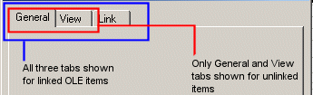

 |  Configure Document Plot Item Configuring embedded document plot items  
---|---  
  
# Configure Document Plot Item

### To access this dialog:

  * In the Plots or Logs window, ensure Page Layout Mode is active (theManageribbon andLayout | Layout Mode), right-click an embedded OLE plot item to select Document | Configure....

 |  To configure any embedded OLE plot item, it is necessary to be in Page Layout Mode before an item is right-clicked.  
---|---  
  
This dialog contains the following tabs:

  * General

  * View

  * Link (Linked Items Only)

## Configuring an Embedded Document

Once an OLE item is embedded, regardless of whether it is linked or not, it can be Configured, although the options for doing so will differ in each case; linked files support additional linking options. In either scenario, the resulting Configuration dialog will display a tabbed arrangement of functions:

  * Linked (live) items: three tabs will appear in the Configuration dialog; General, View and Link.

  * Unlinked (snapshot) items: only two tabs will appear; General and View.

General Tab Details:

This tab will be present regardless of whether the associated item is linked or unlinked, and contains the following fields:

Object Description: this read-only description denotes the type of object being investigated. If it is linked, the description will always have a "Linked" prefix followed by the full description of the object type. If an unlinked object, only the full description of the object type is shown, e.g.:  
  

Type: the description of the associated object type.

Size: the size of the imported file, if known (note that some OLE formats do not support the transfer of this information, in which case, the description for this field will be 'Unknown'.

Location: if the object is linked to a physical file on your system, this field will show the full path to the file that contains the source information. If the object was created as a new object, or the object link has been deleted, this path will refer to the location of the application project directory associated with the active project.  

View Tab Details:

This tab will be present regardless of whether the associated item is linked or unlinked, and contains the following fields:

Appearance: Embedded document plot items can be shown as embedded content (viewable) or as an icon. An icon selection will prevent any external data from being displayed directly in the plot item (instead, relying on you to right-click the icon and select Document | Open in order to view the content in its native application). For animated content, it is necessary to show a link to an external file, as an icon. For other formats, you can choose whether to display the data in full, or in iconic form. You can also change the icon used in the plot view by clicking Change Icon...

Scale: not all documents will support this field, so it may be disabled for particular file types. If available, you can determine the scale of the embedded item, either relative to its original size, or to the size it is currently scaled to.  

Link Tab Details:

This tab will be only be shown if the item being investigated is linked to an external source file:

Linked To: this field displays the full path to the file containing the data that is displayed in your section plot. You can, if you wish, change the source of this information by clicking Change Source.... Care should be taken with this option, however, as if you elect to change to an unsupported file type, the next time the object is opened or updated, you will be warned of a linking error on your document. Ideally, you should endeavour to restrict source swapping to files of the same basic type.

Update: there are two choices; Automatically or Manually.

  * Automatically: this will ensure that all linked OLE items are updated each time a project is loaded. Note that saving an external file does not automatically trigger an update of the plot item view. Automatically updated projects can still be updated within a session by clicking the Update Now button on this screen (see below).

  * Manually: loading a project will not trigger an automatic update of embedded (and linked) OLE plot items, instead, items will need to be updated individually and manually using the Update Now option on this screen (see below).

Last Update: shows the date and time of the last update for the selected object (note that this information is not supported by all embedded document types).

Open Source: opens the external copy of the source file, using the system default application. This is the same as right-clicking an embedded and linked OLE plot item and selecting Document | Open....

Update Now: refreshes the contents of the embedded document plot item with the contents of the linked external file. Any changes made between this and the previous update will be reflected in the embedded data.

Break Link: converts the current 'live' document plot item into a 'snapshot' item - meaning that there is no further association between the embedded content and the external file.

 |  Once the link to an external file has been broken, you cannot reinstate it within the current plot item. The only way to reintroduce the 'live' item is to delete the current plot item, and re-embed a new instance of the linked document. For more information on inserting document plot items, see [Inserting Documents](<Inserting%20OLE%20Objects.md>).  
---|---  
  
 |  Inserting documents into plot sheets involves the use of an industry-standard framework commonly referred to as 'OLE'. OLE stands for "Object Linking and Embedding". This standard (known as a "compound document standard" as it allows for the creation of documents built up using disparate underlying technologies), developed by Microsoft Corporation, enables you to create objects with one application (such as Microsoft Excel or Word) and then link or embed them in a second application (such as Studio 3). Embedded objects retain their original format and, optionally, maintain the link to the application that created them. For more information on OLE plot items, see [Inserting OLE Objects](<Inserting%20OLE%20Objects.md>).  
---|---  
  
 |  Related Topics  
---|---  
|  [Inserting Documents](<Inserting%20OLE%20Objects.md>)[  
Inserting Documents - Insert Object Dialog](<Insert_OLE_Object_Dialog.md>)