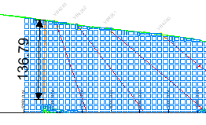

# Dimension Arrows

 |  Dimension Arrows Enhancing your plot with dimension arrows  
---|---  
  

Dimension Arrows are plot items that are used to enhance the selected plot sheet, giving an indication of the real-world measurements, defined by the lengths of the arrows. Dimension arrows can be used to indicate a distance or dip in 2D (in the plane of the sheet's section) or 3D by snapping to data points. Plot sheets can contain multiple dimension arrows. Plot item information is stored within the project file, attached to the sheet in which it was created. This information is not available in other sheets.

## Adding a New Dimension Arrow

  1. In the Plots window, ensure the Page Layout mode is NOT set (if active, select theManageribbon andLayout Mode)

  2. Select the section view that you wish to enhance.

  3. Using theManageribbon, selectDimension Arrowfrom thePlot Itemdrop-down list

  4. Define a series of points on your section (using the cursor or a digitizer) to determine the start and end of the overlay string. If digitising, the points that are entered can be relevant to any known reference points on the hardcopy plot, and the revealed on-screen distance used to determine the accuracy of the digitiser's calibration.

  5. You will see cross-hairs on screen representing the position of digitized vertices. When complete, right click and select Apply (to create an open string) or End & Close Line (to automatically create closed string) , and a line spanning these markers will be created, labelled with the represented real-world distance.

## Dimension Arrow Units

The following procedure assumes that at least one Dimension Arrow has already been created:

  1. If not already displayed, enable the Properties control bar by selecting theViewribbon'sActivatemenu, thenProperties

  2. Select the Dimension Arrow (left-click).

  3. In the [Properties](<../COMMON/properties%20control%20bar%20overview.md>) control bar, check that the Units property parameter is set to [Yes] .

  4. Dimension overlay units are now enabled. To disable them, set the Units property back to [No].

 |  The displayed Dimension Arrow units are picked up from the settings defined in the Home ribbon | Tools | Options dialog's Data tab.  
---|---  
  
### Rotate a Plot Item

Plot items that display a green rotation symbol after selection can be rotated. 

To rotate a plot item:

  1. Select the Manage ribbon and enable **Layout Mode**.

  2. Ensure the **Lock** toggle on the plot item's ribbon is not active. If it is, deactivate it. If the **Lock** toggle is active, the height and width (and rotation) cannot be changed.

  3. Left click to select a plot item.

The resize and rotate controls display, for example:

  4. Left click and drag the green rotate control.

  5. Release the left mouse button to redraw the control at the new orientation.

**Tip** : Small plot item resize handles can blend into each other. **[Zoom in](<Zooming.md>)** to see each resizer more clearly.

 |  Related Topics  
---|---  
|  [Insert Dimension Arrow Dialog](<InsertDimensionArrow_Dialog.md>)