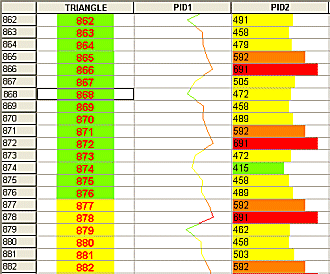

 |  Format Column Display Format Column Display Style  
---|---  
  
# Format Columns Display

The Columns tab, part of the [Format Table Display](<tablefiltersortdialog.md>) dialog, is used to configure how data is presented in a table sheet. By default, when a table is created, the corresponding values relating to the values of the table's underlying data object (defined when the table was created) are represented by text values.

This dialog can be accessed by right-clicking a column in the table view and selecting Format

Format changes will be applied to all values in a table column.

You can use this screen to amend the format of this presentation by associating colors, graph styles and alignment options. Table column values can be represented in a variety of formats, including line graphs, histograms, line traces etc.

There are a series of sub-tabs available on this screen, each dealing with a specific area of data formatting. The actual tabs displayed will depend on the style template selected, for example, the Graph/Color tab will not be displayed if the [Text] template is chosen as it is not relevant:

  * Style Templates: choose a basic style for the contents of the selected column. [More...](<Format_Column_Style_Dialog.md>)

  * Text: configure the text options. [More...](<Format_Column_Text_Dialog.md>)

  * Alignment: control the alignment of text or graphics within table cells. [More...](<Format_Column_Alignment_Dialog.md>)

  * Border: format cell borders. [More...](<Format_Column_Borders_Dialog.md>)

  * Graph/Color: if available, allows you to determine the methods used for displaying graph data. [More...](<Format_Column_Graph_Dialog.md>)

  * Trace: format how a trace is shown in the table column. [More...](<Format%20Column%20Trace%20Dialog.md>)

# Changing Column Display Styles

  1. Select a field name from the Columns in View box.

  2. Select a display Style from the Style Templates tab.

  3. Choose Apply to view changes.

 |  Related Topics  
---|---  
| [Formatting columns (Tables)](<FormatColumn.md>)[  
Formatting columns](<FormatHoleColumn.md>)[(Sections)](<FormatHoleColumn.md>)[(Plots)](<FormatHoleColumn.md>) [Formatting Hole Sets](<HoleSets.md>)