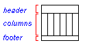
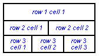

 |  Formatting Log Headers/Footers Editing the format and contents of the log header and footer  
---|---  
  
# Format Log Header and Footer

To access this screen:

  * Display the [Log View Properties](<Log-View-Properties.md>) screen and select the **Header** tab.

A log sheet is a special type of title block used to display scaled hole logs. Like a title block, a log sheet can be completely customized by changing its size, number and size of rows and cells, and, the contents of each cell.

The cells in the header and footer may contain fields specific to the project, the sheet or the hole being viewed, and are automatically updated whenever these parameters change. For example, you may insert cells containing the hole name, and easting, northing and elevation of the hole collar; when the Next or Previous commands are chosen to display another hole, these hole fields are immediately updated by the program.

You must be in **Page Layout** mode to select, edit, move and re-size the log sheet.

You can also choose the **Format Header** and **Format Footer** commands from the **Log** toolbar.

## To display the properties of the log sheet

  1. Double click inside the log sheet with the pointer to display the **Log view** dialog.

  2. Edit the options on the **Frame** tab to change the width, height, line width, color of text and lines, font style, maximum font size and transparency of the log sheet. These properties apply to the entire log sheet.

 |  The size of text in each cell is automatically set by the program based on the maximum font size set on the **Frame** tab (press the **Font** button). For the best results, choose the font size that best suits the largest cell and the program will auto-size the text in the other, smaller cells.  
---|---  
  
## To edit the contents of a cell 

  1. Double click inside the log sheet with the pointer to display the **Log View** dialog.

   
  
Select the **Header** tab.
  2. Select the cell you wish to edit in the preview box by entering the **Row** and **Cell** numbers.
  3. For the appropriate **Row** and **Cell** number press the **Contents** button, then select a **Category** and a **Field**.
  4. Press the **Apply** button
  5. The fields available in log sheet cells include information specific to the hole currently displayed e.g. hole name, collar coordinates, hole length and collar table fields.

## To re-size rows and cells in a header or footer

  1. Select the row or cell with the pointer.

  2. Click-and-drag one of the re-sizing handles on the cell borders.

## To add a new row to a header or footer

  1. Double click inside the log sheet, choose the **Header** tab.

  2. Select the row number below where you wish to insert a new row.
  3. Choose the **Insert** button in the **Row** box. 
  4. Select the most appropriate type from the **Plot Item Library**.
  5. Press **Apply** , a row with a single cell is inserted above the selected row.

## To delete a row in a header or footer

  1. Double click inside the log sheet, select the **Header** tab.

  2. Select the row number you wish to delete. Press the **Delete** button. All the cells in that row are deleted.

## To add a new cell to a row

  1. Double click inside the log sheet to display the **Log View** dialog.

  2. On the **Header** tab, select the **Row** number you wish to add a cell to.
  3. Select the **Cell** number after where you wish to add a new cell
  4. Choose the **Insert** button in the **Cell** box. 
  5. Select a type from the **Plot Item Library**
  6. Select a **Category** and a **Field** and select **Apply**. 
  7. A single cell is inserted to the left of the selected cell.

## To delete a cell

  1. Double click inside the log sheet. Select the **Header** tab

  2. select the **Row** number and then the **Cell** number you wish to delete.

  3. Choose the **Delete** button in the **Cell** box and press **Apply**.

 |  Related Topics  
---|---  
|  [Adding and removing column titles](<FormatLogViewTitle.md>)[  
Formatting columns](<FormatLogColumn.md>)[  
Changing sheet and view properties](<SectionViewProperties.md>)[  
Title block](<TitleBlock.md>)