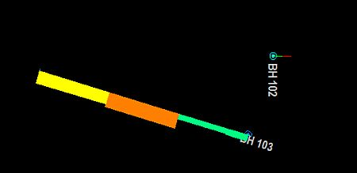

 |  Formatting Drillholes Formatting the display of downhole data  
---|---  
  
# Formatting drillholes

The desurveyed hole traces (for both static and dynamic holes) that fall within the plotting and clipping limits of the section view are initially displayed using the default format settings. The primary grade (Grade_1) and lithology sample information are also displayed, again using default format settings.

The display format of the hole trace, including hole name annotation, trace color, line style, line thickness and marker symbols for collars, entry and exit points and end-of-hole can be changed at any time.

Downhole column data can be displayed in a number of styles including text, line graph, histograms and color or pattern filled bars. Any hole data field from any downhole log table can be displayed and independently offset and formatted. For more information about changing the format of downhole columns, or adding and removing columns.

Drillholes, Object Filters, Columns and Column Filters

Drillhole data objects are often coupled with 'downhole column' data to provide more information about the drillhole data. This could be in the form of a histogram, listed grade values, braces, bar charts etc. Downhole columns are formatted separately (using the [Format Column Dialog](<Format%20Column%20Display%20Dialog.md>)) from the actual drillhole data (which uses the [Traces as Holes](<format%20traces%20dialog.md>) dialog).

 |  The various data column styles applied to the drillholes are always visible, no matter what the orientation of the drillhole. In the example below, the upper drillhole is orientated vertically and so the bar graph is displayed 'on edge':    
  
---|---  
  
View Filtering can be applied to any object in memory, including drillholes, to control the data that is displayed at any one time. This is controlled by a filter expression which can be defined by various methods, including the [Data Object Manager](<../COMMON/Data%20Manager%20Dialog.md>) or, to specifically filter drillhole data, using the [filter-drillholes](<../command_help/filter-drillholes.md>) command.

Drillhole segments and downhole columns will always honor this object-level filter. If data does not pass the filter, neither it nor the associated downhole column data will be shown.

However, the situation is slightly more complex where a 'column-specific' filter exists. All downhole columns can be associated with their own filter (using the [Filter tab on the Format Columns dialog](<Format_Column_Filter_Dialog.md>)). In this case, an aspect of the downhole column will only be shown if it passes both the object-level and column-level filters. For example; if a drillhole object was filtered in the Data Object Manager to only show data above the X value 150, only column and drillhole data would be shown above the 150 position. If an AU column was set to show results only where the grade surpasses the 1.0 grade cut-off point, downhole column data would only be shown above 150 in X and where grade values exceed 1.0 ppm.