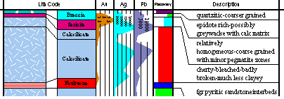

# Formatting Log Sheets

Log sheets consist of header, column and footer sections, the layout and contents of each are fully customizable. The default layout created by the program when a new log view is created contains a useful selection of information about the project and the holes defined in the document.

Formatting commands are available via context menu options and a dedicated **Logs** ribbon.

  * Downhole data columns are scaled vertically by the downhole depth and may describe any interval log or depth log field or computed hole data field. For more information about adding and removing columns see: [Adding and Removing Columns](<AddColumn.md>).

  * Column data can be displayed as text or in a variety of graphical formats. For more information about formatting columns see: [Formatting Columns](<FormatLogColumn.md>).

  * Header and footer sections may be defined with any number of rows and cells per row, containing user defined text or fields supplied by the program. For more information about formatting columns see: [Formatting Header and Footer](<FormatHeader.md>).

  * Table and Field names can be displayed in column title rows above each column. For more information about formatting columns see: [Adding and Removing Column Titles](<FormatLogViewTitle.md>).

  * You can also add images to log sheets according to details held in an external image list. For more information, see [Adding Images to Log Sheets](<Logs_Adding%20Images.md>).

  * Text in log columns can be picked out and formatted for emphasis.

An example of a log sheet display

Note: Much of the hierarchical structure of a particular sheet can be stored in template form. This minimizes the effort required to generate a consistent look and feel across a range of presentation projects by automatically generating a standard arrangement of sheets, projections and, if required, data object overlays. See [Plot Templates](<PLOTS_Plot%20Templates.md>).

Related topics and activities:

  * [Inserting and Editing Plot Items](<LogPlotitems.md>)

  * [Changing Sheet and View Properties](<SectionViewProperties.md>)