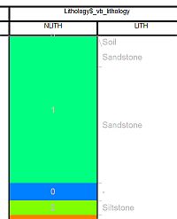
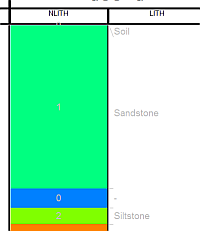
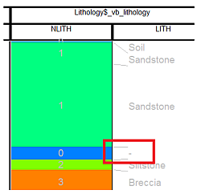
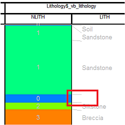

 |  Downhole Formatting:Alignment Aligning downhole columns with samples  
---|---  
  
# Overlay Formatting: Alignment

Note: A Datamine [eLearning course](<https://datamine.learnupon.com/>) is available that covers functions described in this topic. Contact your local Datamine office for more details.

Note: This screen is used for the configuration of both downhole formatting of drillholes and [plot projection overlays](<Plots-overlays.md>).

The information in this article is relevant to both the Log View Properties \- [Columns](<Format%20Column%20Display%20Dialog.md>) tab and the [Format Downhole](<../VR_Help/DH_PropDialog_Columns_Format.md>) dialog (3D window formatting).

In either case, you access this screen by selecting the [Alignment] menu option, which is relevant to the following downhole formatting styles:

  * [Text](<../COMMON/Downhole_Columns_Format_Text.md>)
  * [Bars with Annotation](<../COMMON/Downhole_Columns_Format_Text.md>)
  * [Bars](<../COMMON/Downhole_Columns_Format_Text.md>)
  * [Braces with Annotation](<../COMMON/Downhole_Columns_Format_Text.md>)
  * [Ticks with Annotation](<../COMMON/Downhole_Columns_Format_Text.md>)
  * [Arrows with Annotation](<../COMMON/Downhole_Columns_Format_Text.md>)
  * [Line Graph](<../COMMON/Downhole_Columns_Format_Graphs.md>)
  * [Histogram](<../COMMON/Downhole_Columns_Format_Graphs.md>)
  * [Filled Histogram](<../COMMON/Downhole_Columns_Format_Graphs.md>)
  * [Trace](<../COMMON/Downhole_Columns_Format_Trace.md>)
  * [Angles](<../COMMON/Downhole_Columns_Format_Angles.md>)
  * [External Image File](<../COMMON/Downhole_Columns_Format_Images.md>)

The Alignment menu is used to configure how your downhole formatting is positioned with respect to the sample to which it belongs.

 |  The settings described here apply to the currently active 3D window and all linked external windows. [Independent](<../COMMON/Independent_3D_Windows.md>) windows will be unaffected.  
---|---  
  
#  

## Alignment

This example assumes an existing column/attribute is being modified.

  1. Deselect the Use default alignment option.

  2. For the column that you have specified, use the options in the Horizontal group to specify the alignment of downhole column.   
  
If you are formatting a log view, you can also select a Vertical alignment (not possible for 3D window formatting).

  3. Choose whether you wish to Merge identical records (this can make a dense population of information easier to read) or if you wish to Hide absent records (again, this can tidy up the view).

  4. (Log views only) For narrow intervals and long text columns, select the Offset vertical position to prevent overlaps option.

  5. In theLog View Propertiesdialog, clickApply to view your changes.

## Merging Identical Records

This information applies to both Log and 3D view formatting (log images are shown):

  1. Select a column name which contains multiple records - in the following example, the LITH column contains two records for Sandstone:  

  2. In the Alignment menu, select the Merge identical records option, and click Apply.
  3. Confirm that the two Sandstone records are merged into a single record:  

## Hiding absent records

This information applies to both Log and 3D view formatting (log images are shown):

  1. In the following example, the LITH column contains the '-' character to represent an absent value:  

  2. In the Alignment menu, select the Hide absent records option, and click Apply.
  3. Confirm that the '-' character is no longer displayed:  

 |  Related Topics  
---|---  
| [3D formatting: using the Columns Tab](<../VR_Help/DH_PropDialog_Columns.md>)[3D formatting: Format Downhole Dialog](<../VR_Help/DH_PropDialog_Columns_Format.md>) [Format Log View Columns Page](<Format%20Log%20View%20Columns%20Page.md>) [Positioning Downhole Columns](<../COMMON/concept_positioning_downhole_columns.md>)[Formatting columns (Tables)](<FormatColumn.md>)[  
Formatting columns (Sections) (Plots)](<FormatHoleColumn.md>)[Formatting columns (Logs)](<FormatLogColumn.md>)