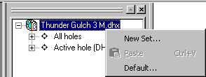

 |  Formatting Hole Sets Creating and formatting sets of holes  
---|---  
  
# Hole Sets

Your application makes it easy to create sets of holes so that the user may choose a subset of holes to display in section, plan or 3D views.

The Holes tab of the workspace window, by default, displays two groups of holes: **All holes** and **Active hole**. Neither of these allows deletion of holes. Both **All holes** and **Active hole** can be used to create a set which can be edited such that only the holes of interest are present.

## Creating a hole set

There are two main methods for creating a hole set, and the method you choose will probably depend upon your preferred way of working:

  * Method 1 \- From the **Format Overlays** dialog.

  * Method 2 \- Using theHolescontrol bar.

## Method 1

  1. Choose the Manage ribbon (Plots, Logs or Tables window displayed) and select Format | Overlays then click the **Hole Set** tab.

  2. Click **New set...** and the **New Hole Set** dialog opens.

You have the choice of using the active hole, all the holes, the holes from a table or the holes from another set as the basis of the new hole set.

If you choose to create the hole set from a table, a dialog listing all loaded tables will facilitate your selection.

Following this, a new set of holes will be added.

## Method 2

  1. In the Holes control bar, select the top-level object and right-click:

  2. Select **New Set...** from the context menu (above).

As in Method 1, you will be asked to select which holes you wish to include in the set.

Following this, a new set of holes will be added to the tree.

 |  Related Topics  
---|---  
|  [Editing Hole Sets](<editing%20hole%20sets.md>)[  
Configuring Logs for Printing](<configuring%20logs%20for%20printing.md>)