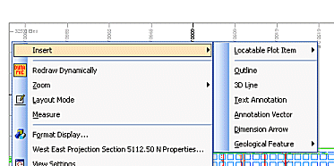

 |  Insert Context Menu Using the right-click Insert options in Plots and Logs sheets  
---|---  
  
# Insert Context Menu

### To access this menu:

  * In the Plots or Logs window, select a sheet or projection and toggle on Normal Mode (toggle on/off using Manageribbon |Layout | Layout Mode), then select Insert...

This context menu is used to select a variety of objects for insertion in a plot or log sheet.

Field Details:

The following options are available:

Locatable Plot Item: inserts a plot item (to be selected from the Plot Item Library) that will be linked to a specific point within a section, or the point where a 3-dimensional line intersects one or more sections.

  * Point: insert a locatable plot item that will only be relevant to the current section, i.e. it will only be visible on the current view section.

  * Line: insert a plot item that can be configured to show up on a series of sections according to an imaginary (two point) line that intersects one or more sections.

[Find out more about locatable plot items...](<Locatable%20Plot%20Items.md>)

Outline: define the type of outline data you are adding. After an outline type has been defined, you will need to specify how this new data is to be held within the current project. This is done using the [Create Line](<createlinedialog.md>) dialog, displayed when Next is selected. [Find out more...](<insertoutlinedialog.md>)

3D Line: create a 3-dimensional line within the current section using the Insert Line dialog. [Find out more...](<InsertLineDialog.md>)

Text Annotation: insert text boxes into the current projection, using the Text Annotation dialog. [Find out more...](<text%20annotation%20dialog.md>)

Annotation Vector: insert an annotation vector (a line along which annotation can be aligned. [Find out more...](<annotationlines.md>)

Dimension Arrow: add a multipoint line to display the distance between specified points. [Find out more...](<Dimension_arrows.md>)

Geological Feature: select from a list of available features to add to your plot:

  * Lithology Outline: create a lithology boundary (e.g. by [snapping to drillhole data](<Digitizing.md>))

  * Stratum: digitize strata. Note that for stratum boundaries, the dominant lithology is automatically calculated, allowing high quality plots to be generated by coloring the boundaries with a suitable legend.

  * Ore Zone Boundary: add an ore zone outline to your plot. [More...](<Inserting%20Ore%20Zone%20Boundaries.md>)

  * Vein: insert a vein indicator.

  * Reef: insert a reef indicator.

  * Polygon Feature: insert a generic polygonal (closed) feature on your plot.

  * Linear Feature: insert a generic linear (open) feature on your plot.

  * Fault: display a fault line.

  * Contact: digitize known contact planes/points.