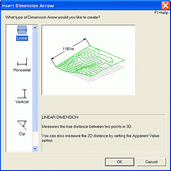
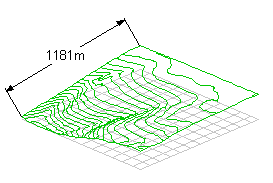
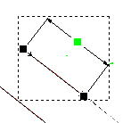
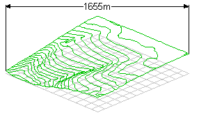
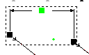
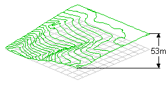
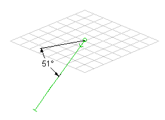
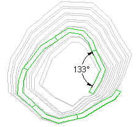
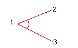

# Insert Dimension Arrow Dialog

 |  Insert Dimension Arrow Dialog How to use this dialog to insert different types of dimension arrows in plot sheets  
---|---  
  
### To access this dialog use one of the following:

  * In the Plots window, select a sheet and toggle on Page Layout mode (toggle on/off using theManageribbon andLayout | Layout Mode), select the sheet projection, right-click and select Insert... ; in the Plot Item Library dialog, select [Dimension Arrow].

  * In the Sheets control bar, right-click a plot sheet's projection, select Insert... ; in the Plot Item Library dialog, select [Dimension Arrow] (this can be performed in either Page Layout Mode or Normal Mode).  

The Insert Dimension Arrow dialog is used to define the type of 'dimension arrow' that will be inserted into a plot sheet projection.

As a plot item, _Dimension Arrows_ are added to the selected projection, and it is possible to have multiple dimension arrows within the same projection. When you define a Dimension Arrow, you can do so to measure distances within the 3-dimensional space represented by the current projection and/or you can measure a 'screen distance' representing the actual (as dictated by your current screen resolution) distance on a 2D flat plane between points.

You can measure both point-to-point distances and angles with dimension arrows.

 |  Note that a Dimension Arrow is not the same as the similar-sound Dimension Overlay. A Dimension Arrow is a plot item that links to two or more points in the current 'scene', for the purpose of recording accurate 2D and 3D measurements of distance and angle, whereas the Dimension Overlay is a feature added to a sheet that is, in effect, a separate 'data object' in memory (and can, thus, be seen in the Design window and Data Object Manager/Format Display dialogs).  
---|---  
  
## Snap Settings and Dimension Arrows

It is recommended that you define the required cursor snap settings before you define your Dimension Arrow. For example, if you wish to snap to specific points on a nominated drillhole overlay only, select View | Snap Settings (Home ribbon) and, in the Snap Settings dialog ensure the Points mode is selected, and the appropriate overlay in the right-hand list (find out more about snap settings...). All of the example animations shown below are performed using a global snap-to-points setting, meaning a left click operation will always position the control point (used to define what to measure) in the position of an existing point, string vertex or wireframe vertex.

## Dimension Arrow Types

The following dimension arrow types are available (refresh the page to replay animations):

Linear: measure the true distance between two points in 3D (world coordinates).  

This command requires you to enter two consecutive points within the current projection. If snapping to other data points (as defined by your Snap Settings) the resulting measurement will be the world distance (in world units) between the snapped data points. When the second point has been specified, you can use the mouse to drag the measurement indicator to one side or the other of the defined measurement line. A third click will set the final position of the measurement indicator and display the calculated measurement.

When a Linear Dimension Arrow has been defined, if you are in Page Layout Mode, it can be selected to reveal the control points for editing, e.g.:   
  

The green control point represents the one used to position the measurement indicator (the line upon which the calculated measurement will be found) and the remaining control points represent the world locations between which a measurement is being taken. You can left-click and drag any of these points to edit the current dimension arrow.

Horizontal: measures the horizontal (XY) distance between two points in 3D, ignoring any differences in elevation.

This version of the command will also require two points to be entered in succession. When the second point has been specified, you can use the mouse to drag the measurement indicator up or down. A third click will set the final position of the measurement indicator and display the calculated measurement.

When a Horizontal Dimension Arrow has been defined, if you are in Page Layout Mode, it can be selected to reveal the control points for editing, e.g.:   
  

The green control point represents the one used to position the measurement indicator (the line upon which the calculated measurement will be found) and the remaining control points represent the world locations between which a measurement is being taken. You can left-click and drag any of these points to edit the current dimension arrow.

Vertical: measure the vertical distance between two points in 3D.

This version of the command will also require two points to be entered in succession. When the second point has been specified, you can use the mouse to drag the measurement indicator left or right. A third click will set the final position of the measurement indicator and display the calculated measurement on the vertical measurement indicator.

Dip: measure the dip between two points and the horizontal (XY) plane in 3D.

This option, the first of two angle measurement options, requires two separate points to be entered. These two points define the 'slope' that will be measured from the horizontal plane when measuring the dip angle. Note that the dip convention that will be reported (that is, whether the dip is reported as a positive or negative value when the angle dips below the horizontal plane) can be determined using the Format Dimension Arrow dialog after the Dip Dimension Arrow has been created. The default is to show positive dip values sloping downwards.

It is important that you define the points in the correct order, with the first point representing the position of the horizontal axis that will be formed to make the angle determined by the second point. See the above animation for an example.

Angular: measure the angle between 3 separate points defined in 3D.

This option allows you to define the true 3-dimensional angle formed between 3 points in the 3d 'world'. These points must be defined in a precise order; the 'vertex' of the angle is measured first, followed by the remaining two points to define axes from the first point, e.g.

| 

  * By default, all of the dimension arrow types will report measurements as taken from the 3D 'world', meaning that any rotation of the view will not affect the measurements that are displayed. However, you can subsequently convert any of your arrows to 2-dimensional 'screen' measurements using the Format Dimension Arrow dialog, which will be automatically adjusted when the view is oriented. Also, see below for a 2D/3D comparative example.
  * When you are creating dimension arrows, it is possible to use the right-mouse button to go back one step in the design process. If no steps are available to undo, the operation is cancelled.

  
---|---  
  
| 

  * Adding and editing plot item dimension arrows does not obscure the label, unless the control point is being moved.
  * The control point in the centre of the length of the arrow does sit in the middle of the label when the item is selected or being edited, but does not hinder the user and obviously needs to visible so that you know where that control point is.

  
---|---  
  
|  Related Topics  
---|---  
| [Dimension Arrows](<Dimension_arrows.md>)