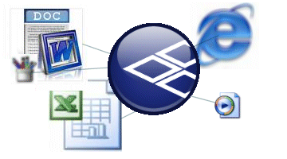
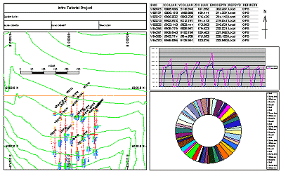
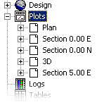
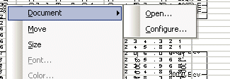

 |  Inserting External Objects Embedding external documents as plot items  
---|---  
  
# Inserting External Documents into Plot Sheets

Your application provides a variety of proprietary plot items that you can add to your plot views to enhance a particular presentation. These items, although not directly 'built' from the same data format as, say, a geological block model or wireframe, they can report the contents of loaded objects of this type. Plot items can be static (for any items that will remain 'as constructed' no matter which underlying data is present) or dynamic (meaning that the information reported by the item can change according to certain aspects of the operating environment - such as a change of data object, or projection, or section and so on).

Plot items that are available include title boxes, legend preview boxes, log sheets, embedded database table views, clip art, north arrows etc. (for more information on these proprietary types, see [Inserting and Editing Plot Items](<LogPlotitems.md>)).

Inserting documents into plot sheets involves the use of an industry-standard framework commonly referred to as 'OLE'.

What is OLE?

OLE stands for "Object Linking and Embedding". This standard (known as a "compound document standard" as it allows for the creation of documents built up using disparate underlying technologies), developed by Microsoft Corporation, enables you to create objects with one application (such as Microsoft Excel or Word) and then link or embed them in a second application (such as Studio 3). Embedded objects retain their original format and, optionally in your application, maintain the link to the application that created them.

Plan section view showing embedded content

Why is OLE Support an Advantage?

The facility to embed the contents of any application that supports object link embedding opens up many possibilities for anyone designing professional plots. The main advantages of this facility include the ability to:

  * utilize existing corporate data, held in industry-standard documentation formats, within your plot sheets without having to convert or transpose the contents. Changes to the external file can be represented automatically in the plot.

  * make use of the native functionality of external applications, such as the depiction of pie charts, scatter graphs, sound clips and images etc.

  * use your application's export facility to create files of an intermediate format, understood by both Datamine and external applications - allow data from one to be represented by the tools of the other, then re-embedded into a plot sheet (for example, you could export the grade values at the sample centres along a particular downhole column as a comma-separated file, load this into excel and format it as a pie chart, then re-embed the worksheet into a plot view).

  * take a snapshot of data held in an OLE-friendly format and simply embed it into your plot, severing all ties with the external data (for example, as a chronological report of a particular aspect of an engineering project).

Note that although many formats are supported for OLE import, only static content (non-animated) can be shown directly in the Plot section view - although animated content such as movie clips and Flash files can be displayed as icons, to be opened manually in the default application.

OLE plot items are embedded using the same procedure as any other plot item - using the Plot Item Library. The Plot Item Library can be accessed by several routes throughout the system, however, for the addition of OLE items, it is important that they are added at 'Section Level'; you can access the plot item library at other levels, for example, you can add a Hole Log Frame to a plot overlay, or a north arrow to a particular projection, and you can only add an OLE item to a section.

What this means is that OLE items are associated with sections in the object hierarchy. For more information on how your application organizes its data for display, see [View Hierarchy](<../COMMON/View%20Hierarchy.md>).

Moving and Resizing Plot Items

Plot items can be edited by dragging the resizer components shown when the Plots window is in Page Layout Mode (if this mode is not active, you will see a dotted line around highlighted screen components - this mode is toggled using theManageribbon andLayout Mode).

  * By default, objects will 'snap' to neighbouring items to allow you to align things more easily. You can override this behaviour by holding down the <CTRL> key during resizing.

  * You can maintain the aspect ratio of a plot item by holding down the <SHIFT> key during resizing using one of the corner sizer bars (using one of the central bars will automatically alter the aspect ratio regardless).

To insert an OLE item into a particular section:

  1. Open the Plots window, and display the sheet that you wish to add an OLE object to.

  2. Open the Sheets control bar.

  3. Expand the Plots folder to show all available sections, e.g.:  
  

  4. Right-click the sheet description corresponding to the sheet that is currently displayed.

  5. Select Insert...

  6. Select [Document] from the Plot Item Library.

  7. In the Insert Document dialog, select either an object type and follow the remaining Microsoft dialogs to import your object, or select a file in an OLE-friendly format to insert. For more information see [Insert Document dialog](<Insert_OLE_Object_Dialog.md>). Also, refer to the following notes:

Linked (Live) and Unlinked (Snapshot) Documents

There are two key decisions that need to be made when embedding an external document, and these decisions will be reached according to what role the OLE object will need to play in your presentation:

  * Embed an empty document and configure it, or embed a file?   
  
If the data you wish to display is in a complete state, as an external file, and this format is OLE-friendly, you can embed a file by locating it in Insert Document dialog, using the Create from File option. Remember that this option will associate the embedded content with the default viewer for that file types, as dictated by your particular system. Any subsequent configuration of that object will be performed using the default viewing application.  
  
If you are aware of the type of data that is to be represented but linking to live data is not essential you may wish to create a new, empty OLE object and configure it at a later date. This achieved using the Create New option in the Insert Document dialog, then configuring the empty placeholder as described in the following section.  
  
A hybrid of these options could be performed when you wish to link to live data, but this data is not currently available. In which case, you could link to an empty document, and specify it using the Create from File option. The document could then populated at a later date, and the project updated.

 |  You can only link to documents if you specify a file during the insert object procedure, using the Create from File option. You must also ensure the Link checkbox is selected. Data that is not linked at this stage cannot be linked to a file at a later date.  
---|---  
  * Is the embedded content a "snapshot" or a "live" document?  
  
Snapshot (unlinked) files   
  
If you only wish to record a particular object at a particular moment in time, and that the underlying data changing in future will not be relevant to your presentation, it is likely that dynamic linking between the embedded object and the external file will not be necessary. Note that you cannot associate a non-linked object with a data source after it has been embedded - once it becomes embedded, even though it is still associated with the external application and can be edited as such, it is native to the project.  
  
Live (linked) files  
  
However, if the external file is constantly updated, or is likely to be in the future, for example, in the case of an output file from another process, you can embed a dynamically linked document that will allow you to refresh your object with the click of a button, loading in the latest underlying data whether that is a database table, picture, graph or other format. Dynamically linked objects are also updated automatically when a project is loaded if such items are contained within it. Linked objects can be updated as required during a session, and can even be linked to an alternative data source after initial embedding. You can also break a link at any time, resulting in a snapshot document as explained above.  
  
Linked data is just that; a direct link is forged (and maintained) between the external source file and the embedded view of it - any changes to the external document, either via your application or by editing the file externally, will result in a corresponding view update the next time the project is loaded, or manually updated (using the [Configure Document dialog - Link tab](<ConfigureOLEObject.md#Link>)).

 |  If you elect to embed content reliant on a 3rd party application, regardless of whether the content is linked, if that application is removed from the local system, you will still be able to open the project to which the embedded items are associated. However, any attempt to configure the file using the now-non-existent application will give rise to a 'Class not Registered' error on opening the project.  
---|---  
  
Once an object is embedded, it will appear in your plot view and can be right-clicked to view (and, in some cases, edit) its properties and [drawing order](<Format_Drawing_Order_Dialog.md>), as with any other plot item. However, if you wish to configure your OLE item, you can do so by following the instructions in the next section.

Embedded objects show in the Sheets control bar with the description "Document". Selecting a document item will automatically highlight the selected object in the plot view with a hatched line border (with resizers if Page Layout mode is active).

 |  Documents become part of a section when they are embedded, and as such, cannot be saved individually - they will be saved within the currently active project file when the project is saved. You cannot save or export embedded document objects in the same way as, say, a loaded block model file.  
---|---  
  
Configuring and Opening Document Plot Items

Embedded documents can only be configured or opened for viewing/editing if Page Layout mode is active:

  * To activate Page Layout Mode, use theManageribbon andLayout Mode toggle in the Plots window.

When in Page Layout mode, you can right-click any embedded document item to view its context menu. All items of this type will display a Document top level item, which cascade to reveal two further options; Open... and Configure...:

Note that this menu will appear regardless of whether an object is linked to an external source or is a snapshot (the contents of the resulting dialogs and the subsequent editing behaviour will, however, be slightly different - linked files have more options).

### Opening an embedded Document Item

You would Open an embedded document plot item to either a) view/edit embedded unlinked content using the associated default viewing application (e.g. Excel, Word etc.) to make any necessary changes and 'post' these changes back to the current project, or b) open the associated linked file in the default application to save changes to both the external file and its corresponding view in the Plots window.

All editing/viewing commands available in the associated application are particular to the viewer/editor in question - consult your application's Help file for more details.

 | 

  * You can only link to documents if you specify a file during the insert object procedure, using the Create from File option. You must also ensure the Link checkbox is selected. Data that is not linked at this initial stage cannot be linked to a file at a later date.
  * If you are editing a linked document, it is important that the document is saved when edits are completed, overwriting the original version of the file. If the external document is not saved, or if it is saved to an alternative file name or location, the link between your application and the external file will be lost, and the currently embedded content will become a snapshot, as opposed to a live document.

  
---|---  
  
### Configuring an Embedded Document

Once a document item is embedded, regardless of whether it is linked or not, it can be Configured, although the options for doing so will differ in each case; linked files support additional linking options. In either scenario, the resulting Configuration dialog will display a tabbed arrangement of functions:

  * Linked (live) items: three tabs will appear in the Configuration dialog; General, View and Link.

  * Unlinked (snapshot) items: two tabs only will appear; General and View.

For more information on the Document Configuration dialog, [click here](<ConfigureOLEObject.md>).

 |  Related Topics  
---|---  
|  [View Hierarchy](<../COMMON/View%20Hierarchy.md>)[  
Document Configuration dialog](<ConfigureOLEObject.md>)[  
Insert Document Dialog](<Insert_OLE_Object_Dialog.md>)