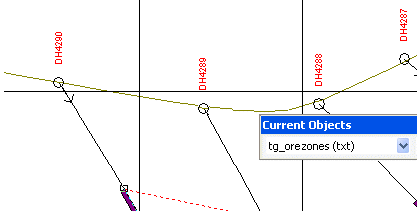
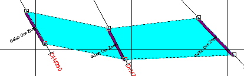
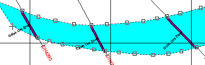

# Adding ore zone boundaries  
  
  1. Create an Intersections table object. See [Displaying intersections](<DisplayIntersections.md>).

  2. Select the Intersections table in the Current Objects toolbar.

  3. Right-click a projection whilst Page Layout mode is inactive and select **Insert >> Geological Feature >> Ore Zone Boundary**.

  4. Starting from one side of the view, click top of an intersection to outline the entire zone:  
  

  5. Continue in sequence across the view and outline the entire zone, repeat and select the base of each intersection, ending at the start point. 

  6. Right-click and choose Apply to finish the outline:  

  7. To insert points into the outline, right click and choose **Edit points** to click on a line segment between two points and drag the inserted point to the desired location. Click again to position.

  8. Repeat until editing is completed and then right-click and choose Apply to exit edit points mode:  

Related topics and activities

  * [Add Plot Features](<Digitizing.md>)

  * [Format 3D objects](<../COMMON/Formatting%203D%20Objects.md>)

  * [Select, Name and Save Intersections](<SaveIntersections.md>)

  * [Display Intersections in Section and Log Plots](<DisplayIntersections.md>)