# Locatable Plot Items  
  
Locatable plot items allow you to associate a [plot item](<LogPlotitems.md>) with a point in 3D space, or to locate plot items at the intersection of a guideline and 3D projection sections. 

Located plot items are useful in that they can be configured to show a 'connector' (enabled by default) to point to a position (highlighting grade values in a given range at a particular sample position, for example). They can also be used to fix a plot item to a particular point in space, so that if that view is panned or rotated, the plot item position (or connector terminus) is maintained. 

If a plot item is **locatable** , selecting it on a plot sheet activates the **[Anchor](<Anchor-ribbon.md>)** ribbon. This provides some easy-to-access tools for managing how the plot item is located. 

### Which Plot Items can be 'Locatable'?

Locatable plot items are either added to your plot as such, or existing plot items can be enhanced to support positional referencing. The following plot item types are supported for this:

  * [Clip Art](<ClipArt.md>)

  * [Title Box](<TitleBlock.md>)

  * [External Document](<Inserting%20OLE%20Objects.md>)

  * [Histogram](<Chart_Histogram.md>)

  * [Hole Log Frame](<../title%20box%20contents%20dialog.md>)

  * [Legend Box](<legendbox.md>)

  * [North Arrow](<NorthArrow.md>)

  * [Profile](<ProfileBox.md>)

  * [Scale Bar](<ScaleBar.md>)

  * [Symbol](<Symbols.md>)

  * [Table](<Table_plot_item.md>)

  * [Text Box](<TextBox.md>)

### "Relative" Locatable Plot Items

The following series of images shows a histogram plot item that has been inserted as a locatable plot item. 

The plot item is of the 'point' variety (more about point and line varieties later), and has been set to show a connecting line between it and the interactively selected point on a specific collar position. The plot is being panned in each image, to the right:

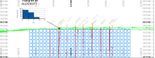

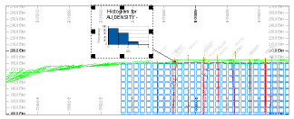

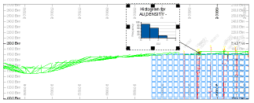

Note how the relative position of the plot item is maintained throughout? This is because the Plot Position property for that item has been set to _Relative_ in the Properties control bar (you can see this for yourself by clicking on the plot item in question and looking at the context-sensitive display.

With the same settings, you can reposition the plot item (ensure **Page Layout** mode is active and select the histogram). Dragging the item to a new position retains the connector 'head' position, for example:

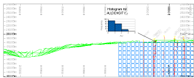

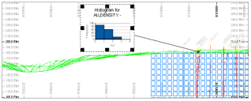

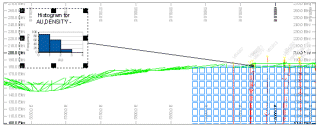   

### Fixed Locatable Plot Items

A fixed locatable plot item behaves slightly differently to its "relative" counterpart; fixed plot items remain in the same screen position when changes are made to the view direction, for example, as a consequence of panning or scaling. In the example below, the fixed plot item is added to the plot in the top left corner. The view is then shifted (panned):

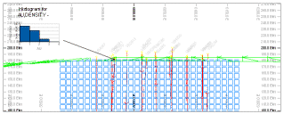

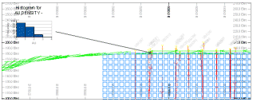

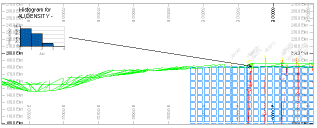

Note how the overall screen position of the plot item doesn't change. These plot items can still be manually dragged to another position, but that position will remain static (fixed) during view direction changes.

### Point & Line Location Types

There are two methods by which a plot item can be assigned a positional reference:

  * A Point on the current section can be referenced. In this situation, the locatable plot item can only be seen if the selected point falls within the visible section (taking any clipping limits into account, e.g.:  
  
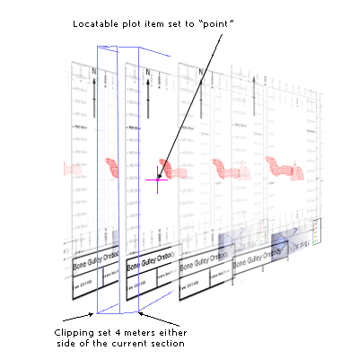  
As the point that has been selected is only visible on the current section, when the next/previous section is displayed (for example, using the back and forward arrows on the Section toolbar), the plot item in question will disappear as the point is no longer visible. A "point" locatable plot item only requires a single XYZ location (see "Setting up the location, below).

  * A two-point Line can also be defined to plot an imaginary line. Where this line intersects any section in view, the locatable plot item will be shown, referenced to that intersection position, for example:  
  
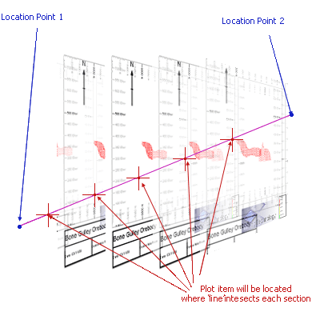

To configure this type of locatable plot item usefully, a **[section definition table](<../VR_Help/Sections.md>)** with at least two sections must be loaded. Typically, these tables are created using the Sheets or Project Data bar menus in reference to a 3D window display. Providing the target projection has been configured to use a section table (**Properties >> Sections Table >> Use section table** = _Yes_), a line-locatable plot item can be added.

The intersection point will be determined regardless of clipping settings.

If a plot item is **locatable** , selecting it on a plot sheet activates the **Anchor** ribbon. See [Anchor Ribbon](<Anchor-ribbon.md>).

### Locatable Plot Item Properties

To support locatable plot items, a set of object properties exist on the Properties control bar.

Location  
---  
Has Location | Is this a locatable plot item or not?  
Location Type | Only displayed if **Has Location** = Yes, set if the location is represented by a fixed point in 3D space (_Point_) or as a 3D line intersecting with other projections in 3D space (_Line_).   
Plot Position | Determines how the plot item is positioned in relation to its associated location, either as a _Fixed_ or _Relative_ position.   
Show Connector | If the plot item is located, and this is set to "Yes", an arrow connects the plot item to the associated position on the current plot. If set to "No" the arrow is not displayed.  
Line Width | If a connector is displayed, this is the width of the arrow.  
Arrow Size | If a connector is displayed, this is the width of the arrow head.  
Line Colour | The colour of a connector line, if one is displayed.  
Location Point 1 (if Has Location = _Yes_)  
X/Y/Z | The absolute position of the locator point in 3D space, or the first point of the line if the **Location Type** = _Line_.  
Location Point 2  
X/Y/Z | If **Location Type** = _Line_ , the world coordinates of the end point of the location line in 3D space.   
  
### Create a Locatable Plot Item

To insert a "point" locatable plot item into a projection (interactive method, recommended):

  1. Display a plot sheet containing at least one [projection](<alignviewwithsection.md>).

  2. Enable [Page Layout Mode](<PageLayoutMode.md>).

  3. Click the plot item to select it. Reposition and scale the item as required.

  4. Disable **Page Layout Mode** (important).

  5. With the plot item selected, activate the **Anchor** ribbon.

  6. Click **Activate Anchor** to toggle it ON.

A connector line appears, this points by default to 0,0,0 (which may be off the projection).

  7. Set the coordinates of the anchor point. You can do this by:

     * Entering coordinates directly into the **X** , **Y** and **Z** fields.

     * Clicking **Pick** and left-clicking a position within the projection.

     * A combination of the above.

Note: Adjusting the **XYZ** coordinate fields will only change the position of the anchor point, regardless of the Item Position setting (see below). The plot item position will never change position during this type of adjustment.

  8. Format your connector Arrow Size and Line Width.

  9. If you want to adjust your anchor point, first choose the Item Position mode:

     * _Fixed_ Changing the anchor point will not reposition the plot item when the project view changes. Only the connector destination changes.

     * _Relative_ Changing the anchor point maintains the current connector alignment and length, and moves the plot item to a new position during projection rotation or panning.

**Note** : This can force the plot item to be moved outside of the projection. You can resolve this by enabling **Page Layout Mode** and repositioning it.

To insert a "point" locatable plot item into a projection (menu method):

  1. Display a plot sheet containing at least one [projection](<alignviewwithsection.md>).

  2. Disable [Page Layout Mode](<PageLayoutMode.md>) (important).

  3. Right-click the projection and select **Insert >> Locatable Plot Item** and either:

     * **At a Point** The plot item will connect to a single 3D world coordinate position (you will define this interactively next).

     * **Along a Line** The Plot item will connect to points where a 3D line intersects the section of any projection. 

  4. If adding a "point" locatable plot item, click within a projection to define the location.

  5. Select the type of plot item to add using the **Plot Item Library**.

A connector arrow appears, linking the plot item to the projection, for example:

;>)

To insert a "point" locatable plot item into a projection (manual method):

  1. Display a plot sheet containing at least one [projection](<alignviewwithsection.md>).

  2. Enable [Page Layout Mode](<PageLayoutMode.md>).

  3. Click the plot item to select it.

  4. Display the **Properties** control bar.

  5. Set a plot item's **Has Location** setting to _Yes_. This enables the **Activate Anchor** toggle on the **Anchor** ribbon.

  6. Define the **Location** group's point or line point properties, including coordinates for point 1 and (optionally) 2. You can do this using the **Pick** button on the ribbon.

See Locatable Plot Items.

**Note** : Plot item locations are set to 0,0,0 by default, but you can easily set your own target position using **Pick**.

  7. Display the **Anchor** ribbon. 

  8. Make sure **Plot Position** is set to _Fixed_.

  9. Ensure the **Toggle Connector** switch is active. If so, an arrow appears point to either the location point for the plot item, or the point at which the location line passes through the projection's section.

  10. Move the plot item onto the sheet where you would like it to appear. The connector arrow continues to point to the correct geographic location.

Related topics and activities

  * [Plot Items](<LogPlotitems.md>)

  * [Plot Item Library](<plotitemlibrary.md>)