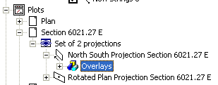
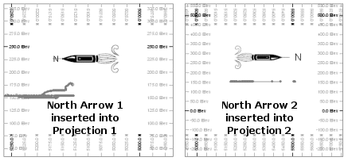
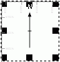
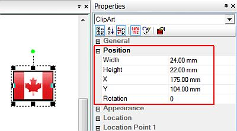
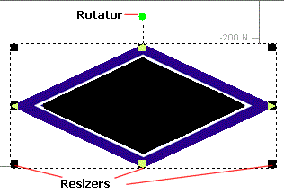

# Plot Items

Plot items, like text boxes, title blocks, tables, legends, bitmaps and scale bars can be inserted into any plot or log sheet. Many of these plot items have smart features which change as other plot and document settings change. For example, a scale bar will change automatically as the plot scale is changed, a north arrow will rotate as a sheets projection orientation is rotated.

This collection of plot items is known as the **[Plot Item Library](<plotitemlibrary.md>)**.

The appearance of selected plot items depends on your current [Page Layout Mode](<PageLayoutMode.md>).

## Selecting Plot Items

Plot items can be selected and controlled independently. Plot items, once selected, display an outline to indicate they are 'active'. The appearance of a selected plot item depends on whether it is selected with **page layout mode** active or not, the **[context menu](<Plot%20Window%20Menus.md>)** provided may also differ, depending on the same mode.

## Plot Item Ribbons

Highlighting a plot item anywhere on a plot displays a dedicated ribbon containing various options for resizing, formatting and managing the contents of the target. All commonly-used properties can be accessed here and is generally the most convenient option for configuring plot items.

The options that appear depend on what you select. For example, selecting a [Title Box](<TitleBlock.md>) plot item displays a ribbon to let you manage the arrangement of cells within it, whilst selecting a **[North Arrow](<NorthArrow.md>)** item displays a different set of controls to determine the arrow's appearance:

;>)

The Title Box ribbon

;>)

The North Arrow ribbon

**Note** : To return to more general plot management functions, activate the **Manage** ribbon. Plot item ribbons only display for as long as the plot item is selected.

**Note** : Deselect a plot item by holding <CTRL> and left clicking it.

## Dynamic and Static Plot Items

One important concept relating to plot items is how the data they contain is updated; data can either be fixed during creation, or it can represent a value or values held within an underlying data object, view area or other component.

  * **Dynamic plot items** are dependent on another data object. This could be the current section definition (this can be displayed in a title box, for example), or values held by a loaded object's database (which could be shown as a table plot item). Your application supports many different types of dynamic plot item, and in some cases, a mixture of both static and dynamic content is possible.  
  
Dynamic plot items must be associated with either an object or a component of the current sheet.

  * **Static Plot Items** do not change, regardless of the functions subsequently performed. Clip Art is one example; you specify which image file to use, format it as you wish and that's it; no changes to loaded data or view/section definitions will affect it.  
  
Static plot items can be added to any area of a sheet.

The concept of dynamic plot items is, in reality, a little more complex that outlined above, so to expand further on the subject:

  * A dynamic plot item can relate to a particular projection (view area), and 'read' data from it. A good example of this is a scale bar - it can be added to a projection (or, to put it in the correct terms, 'inserted at the projection level') whereupon it will be formatted in reference to the scale of the current projection.  
  
You can insert a plot item to a particular level by either right-clicking with page layout mode active (With thePlotswindow displayed, select thePlots Viewribbon andLayout Mode) and selecting Insert to display a version of the Plot Item library, or by expanding the Sheets control bar's Plots folder to view a particular projection - an Insert context menu item is also available.  
  
  
  
It is possible to create a static scale bar also; this type of plot item is not inserted at the projection level, but at sheet level. This plot item can be manually configured to represent any scale - but the contents will not update when any projection is altered. In short, it is a standalone item.

  * A dynamic plot item must be attached to the sheet component for which it is appropriate; if multiple projections exist on a sheet, you can assign the same type of plot item (e.g. a North Arrow) to all of them, and if each are assigned to a particular projection, they will react independently to the view direction that is set for each projection:  
  

  * Dynamic plot items displaying table data are handled slightly differently in that the 'parent' is a loaded data object (and not, say, a projection). In this situation, any changes to the object's data table will be reflected in the inserted plot item.

  * Another form of dynamic plot item refers to data that is held in an external file, and is embedded within the sheet. Excel spreadsheets are one example of this, as are PDF documents. This type of plot item is referred to as a 'Document', and a standalone interface is available to embed this type of item. In this situation, changes to the external file can (if required) by linked dynamically to the external file. See [Inserting External Documents into Plot Sheets](<Inserting%20OLE%20Objects.md>)

## Moving Plot Items

Plot items can be moved when the Plots window is in Page Layout Mode (if this mode is not active, i.e. when Normal Mode is on, you will see a dotted line, without grabs, around selected plot components). This mode is toggled using theManageribbon andLayout Mode.

When in **Page Layout Mode** , an item can be moved after it has been selected (i.e. the item's grabs - the black squares located around the perimeter of the item - are displayed) by using a click-and-drag action when the Move Cursor (a four headed arrow) is displayed. An example of the plot item grabs is shown below:

When moving a plot item with the cursor or stylus:

  * By default, objects will 'snap' to neighbouring items to allow them to be aligned more easily. You can override this behaviour by holding down the <Ctrl> key during moving or resizing.

  * You can maintain the aspect ratio of a plot item by holding down the <SHIFT> key during resizing using one of the corner sizer bars (using one of the central bars will automatically alter the aspect ratio regardless).

  * You can move both parent and child plot items simultaneously by holding down the <Alt> key.

## Resizing Plot Items

Many of the plot items and plot features can be scaled (resized), using the following methods:

  * **Plot Item ribbon** If supported, edit the size properties of a plot item using its ribbon. 

**Note** : Not all plot items expose their size properties on their ribbon.

  * Properties Control BarThis involves selecting the plot item when in Page Layout Mode (or Normal Mode) and ensuring that the [Properties](<../COMMON/properties%20control%20bar%20overview.md>) control bar is displayed.

This control bar lists all stored properties for the selected plot item. The example below shows a selected Clip Art plot item in Page Layout Mode and its associated Position parameters in the Properties control bar:  
  
  
  
All Position properties can be edited. Press <Enter> for the edits to be applied.

  * Interactively In Page Layout Mode, selected plot items can be resized (and rotated \- see below) interactively using mouse movement (and optional keyboard modifiers). When a plot item is selected (left-clicked), a series of resizer grabs are displayed. The item can be resized using a click-and-drag action when a _resize cursor_ is displayed (a two headed arrow). In addition, for those items that can be rotated, a green rotator symbol is also displayed:  
  
  
  
To resize a plot item, either left-click and drag one of the corner resizer grabs, to set both height and width simultaneously, or one of the other resizers to restrict scaling to a particular direction.

When resizing a plot item interactively:

    * By default, objects will 'snap' to neighbouring items to allow them to be aligned more easily. You can override this behaviour by holding down the <Ctrl> key during resizing.

    * You can maintain the aspect ratio of a plot item by holding down the <Shift> key during resizing using one of the corner resizers (using one of the central bars will automatically alter the aspect ratio regardless).

## Rotating Plot Items

All plot items can be rotated, either during or after insertion, when in Page Layout Mode. Only plot items with a green rotation symbol can be rotated. This is done by using a click-and-rotate action on the rotation symbol when the rotation cursor (curved two headed arrow) is displayed. This symbol is shown below associated with a Scale Bar:

Releasing the left mouse button will set the plot item with the new orientation.

**Note** : With regards to the Plots window (and to a lesser extent, the Logs window), much of the hierarchical structure of a particular sheet can be stored in _template_ form. This minimizes the effort required to generate a consistent look and feel across a range of presentation projects by automatically generating a standard arrangement of sheets, projections and, if required, data object overlays. See [Plot Sheet Templates](<PLOTS_Plot%20Templates.md>).

## Copying and Pasting Plot Items

The Sheets control bar and, if your product has one, the **Project Data** control bar can be used to copy and paste or move plot items from one sheet or projection to another. To access the copy command, right-click on the selected plot item. 

When an item is selected the copy command will copy it to the clipboard. The item is then available to be pasted into other locations. The paste special command can be used to copy only certain characteristics of the plot item such as the width, height, position and format. This is useful for aligning plot items.