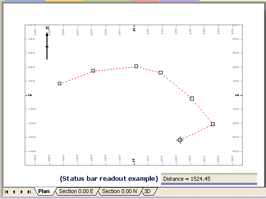

# Measuring Plots

To access this command:

  * In the Plots window, toggle off [Page Layout Mode](<PageLayoutMode.md>), right-click on a sheet and select Measure.

The Measure command is used to measure distance by drawing a measurement string (line or polyline) on a plot sheet's projection plane.

Measurement is achieved by digitizing a 2D string, including as many points as are necessary. The resulting cumulative distance measurement is shown after each mouse click. The line that is shown on screen during digitizing is temporary; it will not be visible in your presentation (and is removed after the measurement operation is complete).

Once a measurement string (line or polyline) has been drawn, you can use the right-click context menu to access measurement mode-specific commands.

These commands are only available when a measurement is being performed, and they are:

  * Stop MeasuringCancel measurement mode and return to Static Page mode.

  * ContinueContinue digitizing a measurement string in the selected projection.

  * Strata ModeAdjust how points are added to the boundary when digitized.

    * If **checked** , the top and bottom points of a stratum are added in turn. 

**Note** : If snapping points to drillhole samples, points are added in pairs at the top and bottom of each selected sample.

    * If **unchecked** , points are added to the boundary in a perimeter fashion.

ZoomScale the view of the active projection.

View SettingsDisplay the [View Settings](<../COMMON/Section%20Definition%20Dialog.md>) screen to change the view definition for the selected section. See [Sections and Projections](<alignviewwithsection.md>).

Related topics and activities

  * [Sections and Projections](<alignviewwithsection.md>)

  * [View Settings](<../COMMON/Section%20Definition%20Dialog.md>)