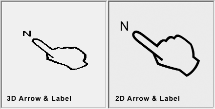
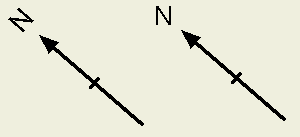

# North Arrow Plot Item

To add a north arrow plot item to a plot sheet: 

  * **Plots** window >> **Manage** ribbon **> > Plot Item** and select _North Arrow_ from the **[Plot Item Library](<plotitemlibrary.md>)**.

  * **Plots** window >> **Manage** ribbon **> > Plot Item >> North Arrow**.

North arrows are smart plot items that automatically adjust to changes in the view direction of a **[plot section](<alignviewwithsection.md>)**. 

To insert, move or re-size a north arrow you must be in Page Layout mode which can be toggled using the **Manage** ribbon.

  * You can add a North Arrow to a particular section. This arrow will automatically face north, according to the world coordinates associated with a particular projection. If the view direction changes, so does the arrow direction.

  * You can add a Grid Arrow, that is, an arrow plot item that will align with 'grid north'. This direction is based on the local coordinate system of the grid in question (which, in turn, supports a custom alignment with the world coordinate system), you could potentially use this option to add a non-north arrow to your plot (for example, you could show magnetic north and grid north, for example, as shown in the image below).  
  

Once an arrow is added to a plot, its dimensions and formatting are controlled independently of the underlying projection or grid. If a projection is scaled, but the overall view direction is maintained, there is no change in appearance for the associated arrow plot item. All Arrow view formatting options are found on the North Arrow Properties screen.

When a new arrow is added, the North Arrow Properties screen is displayed. This screen is used to configure the appearance of the arrow to be added, or to edit an existing arrow item.

**Note** : This plot item can be drawn before or after other plot items, say to ensure it is shown on top of another one, using the **Drawing Order** tab. See [Drawing Order](<Format_Drawing_Order_Dialog.md>).

## Plot Item Ribbons

Highlighting a plot item anywhere on a plot displays a dedicated ribbon containing various options for resizing, formatting and managing the contents of the target. All commonly-used properties can be accessed here and is generally the most convenient option for configuring plot items.

The options that appear depend on what you select. For example, selecting a [Title Box](<TitleBlock.md>) plot item displays a ribbon to let you manage the arrangement of cells within it, whilst selecting a **North Arrow** item displays a different set of controls to determine the arrow's appearance:

;>)

The Title Box ribbon

;>)

The North Arrow ribbon

**Note** : To return to more general plot management functions, activate the **Manage** ribbon. Plot item ribbons only display for as long as the plot item is selected.

**Note** : Deselect a plot item by holding <CTRL> and left clicking it.

### 2D and 3D North Arrows

North arrows are comprised of two components; the arrow itself (which may be any shape of pointer, it doesn't have to be an arrow) and a **Caption**. The label is "N" by default but it can be anything.

Each component can be displayed independently in either 2D or 3D format.

  * **3D** north arrow components align with the section's view direction. The azimuth between 2D and 3D versions of a north arrow will match, but the 3D version may or may not be shown orthogonally to the screen.

  * **2D** north arrow components are always represented as a 'flat' image, oriented to the correct azimuth for the north direction.

### Add a New North Arrow 

To add a new north arrow to a plot and configure it:

  1. If the borth arrow is to be used to indicate geographic North (as opposed to a "Grid Arrow", see further above), configure the section (projection) on your plot sheet so that its view direction is appropriate for the report.

  2. Activate the **Manage** ribbon and select **Insert >> Plot Item >> North Arrow**.

A default north arrow is added to the top left corner of the target section and the **North Arrow** screen displays.

  3. Choose if the **Arrow** component of the north arrow is to be 2D or 3D (see "2D and 3D North Arrows", further above). Check **3D** to display the arrow in 3D, otherwise a flat image is used instead, oriented to the correct azimuth.

  4. To display the north arrow lines in a thicker format, check **Bold**.

  5. Expand the **Style** menu to pick a graphic for your arrow.

The preview on the left updates to show the selected graphic in the format defined so far.

  6. Adjust the **Size** of the arrow graphic.

The preview adjusts to show the actual size of the plot item to be applied.

  7. Adjust the **Aspect** ratio of the plot item, essentially making it wider or narrower.

  8. Pick the **Colour** of the plot item. This doesn't have to be the same as the label.

  9. Decide if the **Label** is to be shown in **3D** or not. As with the arrow, 3D labels align with the view direction of the section, otherwise they are shown flat to the screen.

  10. Choose if the label always appears upright. By default, text is shown 'upright'. For example, the image below shows a 2D north arrow in a 3D projection. The left image shows the arrow as it would be rendered with Keep Upright unchecked. If checked, the right image displays:  
  

  11. Choose a label Font.
  12. Decide what text appears for the label. By default, this is "N" but you can edit Caption to whatever you want.

  13. Choose the Size of your label by adjusting the slider to update the preview.

  14. Choose the Colour of your label text.

  15. Define a label Offset. This represents the distance between the 'origin' of the arrow and the text to be displayed. 

### Edit a North Arrow

To edit an existing north arrow on a plot sheet:

  1. Display the plot sheet containing the north arrow.

  2. Double-click the north arrow to display the **North Arrow** screen.

  3. Configure the north arrow using the same controls as for new north arrows (see above).

### Move or Resize a Plot Item

To move or resize an existing plot item:

  1. Select the Manage ribbon and enable **Page Layout Mode**.

  2. Click to select the plot item. 

Resize boxes appear around the plot item.

  3. Ensure the **Lock** toggle on the plot item's ribbon is not active. If it is, deactivate it. If the **Lock** toggle is active, the height and width (and rotation) cannot be changed.

  4. To resize the plot item (and if supported, proportionally resize contents) drag one of the control points to a new position.

**Tip** : To retain the original aspect ratio of the plot item during resizing, hold down **CTRL**.

  5. To move the plot item, position the mouse inside the plot item until the cursor changes to a four-way arrow. Then, left-click and drag the plot item to a new position on the sheet.

**Note** : If a plot item is parented to another item, it can still be repositioned outside the boundary of its parent. For example, a title box associated with a projection can be positioned anywhere on the plot sheet, even outside the projection.

**Tip** : When moving a plot item, it will attempt to 'snap' to nearby objects. Override this behaviour by holding down SHIFT.

### Rotate a Plot Item

Plot items that display a green rotation symbol after selection can be rotated. 

To rotate a plot item:

  1. Select the Manage ribbon and enable **Layout Mode**.

  2. Ensure the **Lock** toggle on the plot item's ribbon is not active. If it is, deactivate it. If the **Lock** toggle is active, the height and width (and rotation) cannot be changed.

  3. Left click to select a plot item.

The resize and rotate controls display, for example:

  4. Left click and drag the green rotate control.

  5. Release the left mouse button to redraw the control at the new orientation.

**Tip** : Small plot item resize handles can blend into each other. **[Zoom in](<Zooming.md>)** to see each resizer more clearly.

Related topics and activities

  * [Plot Items](<LogPlotitems.md>)

  * [Plot Item Library](<plotitemlibrary.md>)

  * [Drawing Order](<Format_Drawing_Order_Dialog.md>)