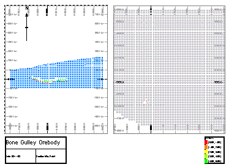
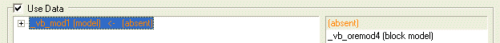
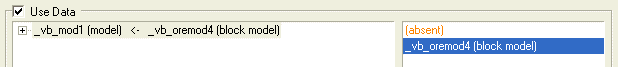
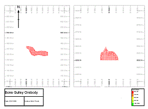
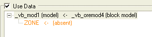
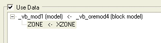
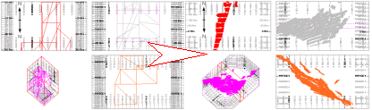

# Map Plot Template Data

Plot templates are an efficient way of introducing standard content to your plot or log views. They can minimize the work required in generating a framework presentation project.

Data mapping is an important part of plot templates; although optional (you can use templates to store plot layout information only if you want), mapping loaded data to a template makes generation of standard plots and logs easy.

Mapping relates to the way that data stored within a template is used to configure the view of currently loaded plot or log data. Say you had a view of a wireframe shown in four different projections, representing different views through the data body. As these views cover the full panorama of the wireframe, you may find it useful to present other wireframes in a similar way. By storing a template, the view directions of each projection are stored and applied when that template is inserted into your project, providing a wireframe object exists in memory and it is mapped to the original object.

For example, in the following plot sheet, a block model file has been loaded into memory. The model is displayed in two projections; the right hand projection shows a top-down view of the model cells at a scale of 1:1000, and the left hand projection shows a North-South section through the orebody:

Other plot items have been added too - a title box, legend, image and table view. Of particular note is the table view, which relates to the block model data set - even though this isn't a view of a 3D object, as far as the plot template is concerned, it is still a view of the data and, as such, can be mapped to loaded data.

Next, a new session is started and a different block model loaded into memory. By inserting the previous template the .dmtpl file is loaded and the Insert Sheet Template screen displays. 

The initial preview shows no data as the template cannot 'find' the original block model file that was used to create the template. At this point, you can either:

  * **Reload** the original block model file by selecting the model file name in the data list (bottom left of the import dialog) and clicking Reload Original - note that this would simply re-implement the data setup in place when the original template was created. See "Reloading Files", below, for more information.

  * **Map** the new block model to the original; this is achieved by ensuring Use Data is active, and then selecting the original model file as referenced by the template, e.g.:  
  
  
  
Once selected, a list of all data types in memory that match the type of the one selected (in this case, block models) are listed in the column to the right. Only models of a corresponding type will be listed, and the list will always be headed with an [absent] option - selecting this option denotes that no mapping is to take place. A match will automatically be made if an object in memory matches the file name referenced by the template. In the example above, the model names are different, so no automatic matching is possible and the left hand template object is mapped to [absent].  
  
Manual mapping is achieved by selecting a valid entry on the right, e.g.:  
  
  
  
Once an object is mapped, and providing the Show Preview check box is selected, a thumbnail of the mapped data object is shown in the preview pane, e.g.:  
  
  
  
Compare this to the image above - note how the orientations of the model are the same in both projections.

**Note** : Templates support multiple file types. Template objects do not have to be Datamine files; they can, in fact, be any file in memory that has been imported. For example, if a text file was inserted into a plot (see [Inserting Documents](<Inserting%20OLE%20Objects.md>) for more information on how to do this) at the time a template was created, this reference could be mapped to any text file in memory when subsequently imported.

### Mapping Template Object Fields

In addition to mapping data objects, plot sheet templates support an even more granular approach to data mapping; field mapping.

This involves mapping field data found in the data object referenced by the _template_ against actual fields of data objects in memory (providing the object in memory is of the same type as the one in the template). 

For example, supposing a ZONE field in a block model file is represented by the column description 'ZONE', and the model is coloured with a legend that interprets the ZONE field in various intervals. Creating a template with this model and legend loaded would impart all information relating to the data object columns (along with the legend instructions used to format its display) to the template file.

When a sheet template is imported, your application checks the contents of your current object 'memory' to see if a file of the same name and type (as that in the original template) exists. If this is the case, all object and field mapping will be performed automatically, providing matches can be made. In the case of a different block model being loaded when the template was added, no automatic mapping can be performed, instead, you will be able to map the new object to the template object as described in the previous section, e.g.:  
  

Assuming the ZONE field in the template object does not exist in the new model in memory (in this case, the zone field is represented by a 'XZONE' column), you will be able to map between the template and memory object fields by expanding the template object in the left hand list, e.g.:

Note how the ZONE field is mapped to [absent]. This is because no ZONE field can be found in the mapped model (it has an XZONE field instead). Selecting the "ZONE <\- (absent)" line transforms the right hand list to show all data columns belonging to the mapped object (in this case _vb_oremod4 (block model)). To map the ZONE template field to the XZONE object field, select [XZONE] in the right hand list. This updates the mapping on the left:  
  

Once mapped (and providing the Show Preview check box is enabled) the thumbnail of the sheet that will be created is updated to show the effect of the new mapping instruction. In this way, any field that is referenced by the imported template can be mapped to any field in an object of the same type that currently exists in memory.

**Note** : You can only map fields between objects of the same type (wireframe-wireframe, string-string etc.)

### Fully Mapped, Partially Mapped, Unmapped

There are three possible results from mapping:

  * Your plot sheet is Fully Mapped: the template to be imported has been successfully mapped (in terms of all data objects referenced, and all fields within those objects) to data in memory. This can either be the result of automatic mapping (where template object/field names and memory object field names match) or after manual mapping has been performed (as described in the previous sections)

  * Your plot sheet is Partially Mapped: in this situation, some of the template data objects and/or fields have been mapped to objects in memory, but some remain mapped to the [absent] option. Partially mapped templates may not render all data in memory in the manner dictated by the original template data objects.

  * Your plot sheet is Unmapped: if template objects are not mapped (either assigned to [absent], or if **Use Data** is unchecked), they will not be used during template import, and the data items normally resulting from mapping will not be created.

Related Topics and Activities

  * [Plot Sheet Templates](<PLOTS_Plot%20Templates.md>)
  * [Create Plot Template](<PLOTS-template-create.md>)
  * [Insert Plot Sheet using a Template](<PLOTS_Insert_from_Template.md>)
  * [Sheet Templates](<PLOTS_Plot%20Templates.md>)