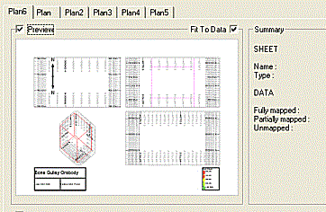

# Insert Plot Sheet using a Template

Plot templates are an efficient way of introducing standard content to your plot or log views. They can be used to minimize the work required in generating a framework presentation project which can be re-used in the future.

Applicable to both Plot and Log views, templates are stored in a proprietary format (.dmtpl) which can be read by your application, Downhole Explorer or Present applications. The amount of information stored in a plot template is entirely up to you; a very simple template may contain information relating to the overall page size and orientation only whereas a more detailed version could include specific layouts for a series of projections, data views such as tables and legends, header and footer formats for title bars and other mapped data (mapping will be explained in more detail later, but for now; mapping is the process by which the data that was used by the sheet upon which the template was originally based is related to the data that will be shown when the template is loaded 'over' new data objects).

The ImportSheet Template dialog will represent one or more selected templates as a tab (you can open and view as many templates as are required, but this will have connotations regarding how they are updated - see "Managing Multiple Templates" later).

Key principles:

  * Sheet templates can be used to both store layout/formatting information as well as 'hooks' for data objects in memory (see "Data Mapping", below)

  * Visualization information such as projection view direction or section position can be stored within a template.

  * If a plot template includes data mapping information, you can only map items to objects currently in memory.

A preview of the sheet that will be imported is shown in the top-left of the import dialog (if this is required). The preview will automatically update according to selections made on screen. You can turn the preview off by clearing the Preview checkbox. This might be useful if you find that the preview is taking too long to redraw a representation of large data objects.

By default, the sheet adjusts its view to fit the data that is being used. You can turn this feature off by clearing the Fit To Data checkbox.

A summary window shows the current status of the sheet. It displays the name and type of the sheet it is going to create, and information about the data that is being used by the sheet.

To insert a new plot sheet using a (single) template:

  1. If you plan to map data objects to your template, load the objects you wish to represent. 

**Note** : Load data using any of the data import routines, or by dragging and dropping into the **3D** or **Plots** windows, or from a Project Files or Project Data control bar.

  2. Check or uncheck a **Preview** of the plot sheet to be created. If checked, this preview is updated each time a change is made within the **Import Sheet Template** screen. Each element of a template is rendered.

**Tip** : For particularly complicated designs, unchecking Preview can speed up the template configuration process.

  3. Choose whether to fit the currently loaded data objects to suitable plot sheet projections using **Fit to Data**.

When a template is created, loaded data object extents are recorded in world coordinates in the template. When the template is used with another object in memory, with potentially different world coordinates, data may not be centred in a particular projection. 

     * If **Fit to Data** is checked, your application will automatically 'rescale' the contents of each projection so that data is 'fitted' to each boundary. This is a useful way of preserving view direction settings when a template is applied whilst maintaining a focus on the mapped data object. In essence, each projection is 'zoomed to all' loaded data if this option is enabled.

     * If **Fit to Data** is unchecked, loaded data will be represented in the preview (and the resulting plot sheet if confirmed) using the projection coordinates saved to the template. For data within a small coordinate area, this may be fine.

  4. Review the template **Summary**.

Summary statistics are displayed. These relate to the template and the extent to which data object mapping will be applied once the template is imported. The **Name** of the template relates to the file name in use when the template was imported. The name is important as it dictates the name of the section or log name after import (this can be changed after import if need be).

Also displayed are the DATA statistics; these report the extent to which **[data mapping](<PLOTS-template-mapobjects.md>)** is performed during template application. The following mapping results are possible:

     * Fully Mapped: the template to be imported has been successfully mapped (in terms of all data objects referenced, and all fields within those objects) to data in memory. This can either be the result of automatic mapping (where template object/field names and memory object field names match) or after manual mapping has been performed (as described in the previous sections)

     * Partially Mapped: in this situation, some of the template data objects and/or fields have been mapped to objects in memory, but some remain mapped to the [absent] option. Partially mapped templates may not render all data in memory in the manner dictated by the original template data objects.

     * Unmapped: if template objects are not mapped (either assigned to [absent], or if the Use Data check box is disabled), they will not be used during template import, and the data items normally resulting from this mapping will not be created.

  5. By default, if an object was present in a sheet's projection when the template was saved, information relating to that object name (and any fields currently being used for data presentation purposes) are stored in the template. 

Once imported, an attempt is made to 'find' an object currently in memory matching the same object reference, and if one is found, further attempts will be made to match fields toriginally used for data display purposes, such as those used by display legends (also imported with the template if not found in memory at the time of import). 

Additionally, if the template refers to underlying data objects (such as inserted table views, for example), those data objects will also be matched if possible. If data matching is _not_ possible (for example, there are no data types in memory that match those specified by the template, or if an object of a particular type is found but no field within it can be matched, manual mapping may be necessary.

  6. Map data objects between the template and loaded data objects. See [Map Plot Template Data](<PLOTS-template-mapobjects.md>).

  7. To import a data object without leaving the Import Sheet Template(s) screen:

     1. Select an item in the **Use Data** menu.

     2. Click **Import New**.

     3. Use the **Data Source Drivers** screens to import data.

  8. when a new template is imported (and providing data object information is contained within), an attempt will be made to find a data object in memory that matches the one referenced by the template. Data mapping can be used to map objects and fields to other objects in memory, but if you wish to load the actual object in situ when the template was saved, click Reload Original. This button will only be effective if:

     * The file referenced by the template still exists with the same name, and in the same location as when the template was originally saved. If not, you will be prompted to search for it.

     * The file does not already exist in memory (in which case the Reload Original button will be disabled.

     * The top-level object description (and not a used field) is selected in the Data Mapping Panel.

  9. Click **OK** to insert a new plot sheet using the select template and (if provided) data mapping settings.

To insert a plot sheet using data from multiple plot templates:

You can select multiple template (.dmtpl) files when inserting a new plot sheet. If multiple items are selected, the resulting Import Sheet Template screen is out in a tabbed arrangement e.g.,

In this situation, data mapping tasks will be performed, if possible, on _all loaded templates_. 

For example, if template 1 was originally created with wireframe 1 in memory (and coloured according to the SURFACE field with a custom legend), and template 2 was created with the same wireframe / legend in memory but with different projection layouts, data mapping changes made with regard to the wireframe object would cause the mapping instructions held by _both_ templates to be updated.

The same principle applies to both object- and field-level data mapping; if the data object or field is referenced by more than one template being previewed, edits will be made to both template instructions.

If you wish to perform unique mapping instructions between templates that reference the same data objects, they will need to be loaded independently before saving a distinct template.

Related Topics and Activities

  * [Plot Sheet Templates](<PLOTS_Plot%20Templates.md>)
  * Insert Plot Sheet using a Template
  * [Map Plot Template Data](<PLOTS-template-mapobjects.md>)