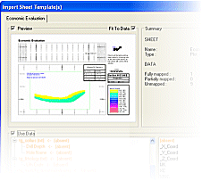
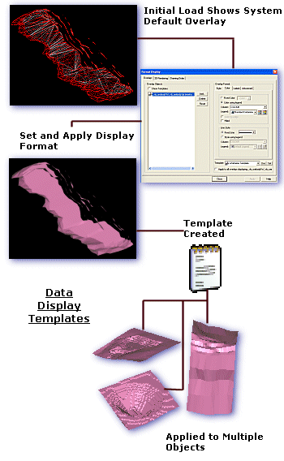

# Plot Sheet Templates

## What are Plot Sheet Templates?

**Note** : Create a plot or log sheet using a template by activating the **Manage** ribbon (the **Plots** window must be displayed) and **Sheet >> From Template**.

Plot templates, also known as "sheet templates" or "plot sheet templates" are an efficient way of introducing standard content to your plot or log views. They can minimize the work required in generating a presentation that is consistent with corporate or departmental standards.

The Import Sheet Template(s) screen

Sheet templates are stored in a proprietary format (.dmtpl) accessible by other Studio applications. 

The amount of information stored in a template is up to you; a simple template may set the page size and orientation whereas a more detailed template can define a series of projections and other data views such as tables and legends, header and footer formats for title bars and mapping loaded data objects to particular template overlays.

**Tip** : The **Sheets Templates** screen is resizeable.

When inserting a new plot or log sheet using a template, you can select one or more .dmtpl files. 

The [Insert Plot Sheet using a Template](<PLOTS_Insert_from_Template.md>) screen displays a tab for each selected template. If using multiple templates, subsequent data mapping will consider all selected templates (see "Managing Multiple Templates", below).

Key principles:

  * Sheet templates can be used to both store layout and formatting information as well as 'hooks' for data objects in memory (see "Data Mapping", below).

  * Visualization settings such as projection view direction or section position can be stored in a template.

  * If a plot template includes data mapping information, you can only map items to loaded data objects. 

A preview of the sheet to be imported is shown. The preview automatically updates according to selections made. You can turn the preview off by unchecking Preview . 

By default, the preview sheet adjusts its view to fit the data that is being used. You can turn this feature off by unchecking Fit To Data.

A summary window shows the current status of the sheet. It displays the name and type of the sheet it is going to create, and information about the data that is being used by the sheet.

Data Display Templates allow you separate style and content in your projects; a template contains all the data display instructions (simple or complex), and can be stored either in memory for use within the current project, or can be transferred to an external file for use in another project (although there are implications for this approach, which is discussed below).

Data display templates can be used to:

  * Apply the same display format to multiple objects in memory (subject to limitations, see below).

  * Apply the same display format to objects in different projects (subject to limitations).

  * Automatically create an overlay or overlays each time data of a particular type is loaded into memory.

Data display templates are saved with the current project file, so is available the next time a project file is loaded. You can also elect to save template information to an external template (.tpl) file for subsequent import into any project.

##  Display Template Restrictions

When a display template includes information that is specific to a type of data, or a specific data object, restrictions apply. 

This could be the case if, for example, a block model display template is set up so that a particular legend is used to display the presence of a particular g/t of gold. This type of template could be re-used with the same object, of course, but if an attempt were made to apply it to another block model file, with no AU data column, data would not be drawn as expected - in fact, the default display method would be used for drawing the second block model. This is because it was not possible to match the information in the default template with the contents of the incoming file, resulting in a display format 'failure'.

The same applies when using a template within a range of objects of the same data type. As your application permits a large degree of flexibility with regards to the data columns that can be included in an object's database, it is still important that, when defining a default template for use on multiple objects, the objects that are affected must be of an internal structure that is relevant to the template being applied. If a particular field is referenced, for example, in a specified legend, that field must be present on the 'receiving' object for any display format other than the default to be drawn. Similarly, if a legend is of the ranged variety, the values that are encompassed must also be complimentary to the object in question; if a legend dictates that CU grades between 0.90 and 1.15 is coloured green, for example, and the template that 'contains' the legend is applied to another block model which only has CU grades below 0.8, the display of the data is shown in the default legend (or if an absent value color is specified, that is used instead).

There are ways around this situation: you can define your legend values in terms of percentages of a total range, or you can create a 'master' legend that will more than cope with grades across a multitude of block model files. The extent to which you standardize your display templates depends very much on your requirements - if you wish to adopt a standard display format for all current projects, it may be necessary to devise an all-encompassing display template beforehand by studying the underlying data of data objects across the range.

## Sheet Templates and 3D Display Templates

Sheet templates should not be confused with 3D Display Templates:

  * Sheet templates are used to store plot- and log-specific sheet layout/data mapping instructions, and are used to automate some of the task of creating a new presentation item. If specified, Sheet templates will contain all information stored by a Display template.

  * Display templates are more general in nature, and are used to control the display of object overlays in the Plots window. These templates are global, in that once applied to an overlay of an object, all renditions of that object (in any window or projection) will be updated automatically. 

See [Data Display Templates](<../COMMON/Data%20Display%20Templates.md>).

## Create a Plot Sheet Template

You create a template using an existing plot sheet. All aspects of the sheet can be stored in a template, including page format, projections (2D and 3D), loaded data objects and plot items.

If you plan to map data objects to a template in the future (say, you are producing a field mapping report and want to map face data to specific plot projections), you'll need to load representative data first. Other loaded data can then be mapped to the template when you create a plot sheet using a template (see below).

Plot sheet templates are created using the **Manage** ribbon's **Export >> Template** function.

See [Create Plot Template](<PLOTS-template-create.md>).

## Insert a Plot Sheet using a Template

Once a template has been saved, you can create a new plot sheet using the template's directions for page size, loaded data objects, projection settings and plot items.

You insert a new plot sheet using a template using the **Manage** ribbon's **Sheets >> New Sheet >> From Template** function.

See [Insert Plot Sheet using a Template](<PLOTS_Insert_from_Template.md>).

## Map Plot Template Objects

You can reference both objects and object fields in a template. This allows you to map loaded data to references in the template and ensure data is represented in a consistent and approved way.

See [Map Plot Template Data](<PLOTS-template-mapobjects.md>).