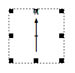
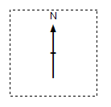

# Page Layout Mode  
  
To access this setting:

  * Activate the **[Plots](<../COMMON/Window_PLOTS_Overview.md>)** window and the **Manage** ribbon. The **Sheet Layout >> Layout Mode** toggle enables or disables page layout mode.

Page Layout Mode is an important concept when using the Plots window.

  * If **Page Layout** mode is **active** , you can resize and reorganize your plot sheet contents. This is really useful when preparing a particular layout. 

  * If **Page Layout** mode is **inactive** , plot sheet items, including projections, can't be moved around or resized. You cannot access View Settings if page layout mode is inactive.

Some plots functionality can be accessed regardless of the layout mode status. For example, you can access the properties of a projection by right-clicking it in either mode.

### Selecting Data 

If **Page Layout** mode is **active** , selecting a plot sheet item reveals 'grab points' around the edge of the picked item, for example:

Dragging any of the grab points resizes the item. Clicking and dragging from inside the item's boundary allows it to be repositioned without resizing.

However, if **Page Layout** mode is **inactive** , selecting an item in a plot sheet reveals a dotted line around the edge to highlight its selection, for example:

Related topics and activities

  * [The Plots Window](<../COMMON/Window_PLOTS_Overview.md>)

  * [Plots Window Menus](<Plot%20Window%20Menus.md>)

  * [Plot Items](<LogPlotitems.md>)