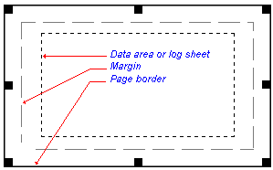

 |  Page Size/Orientation Changing Page Settings  
---|---  
  
# Changing page size, orientation and margins

There may be requirements to work to standards that require different page sizes and layouts for different views. For example you may choose an [A2] sheet for the plan view, [A3] for EW section views and [A4] for log plots. When the view is first created, the default page size and orientation is used.

You can change the page to any non-standard size with the pointer in Page Layoutmode by clicking in the space between the page border and the data area, or, you can use the Projectbutton |Page Setup command to select a standard page size and edit the page margins.

Whenever the page size is changed with the Page Setup command, you will be asked if you want the plot items on the page to be rescaled. Choose No if you wish to leave the data area frame and grid, title block, scale bar and other plot items in their current positions, or choose Yes if you want the program to rescale the plot items to fit the new page size.

 |  Much of the hierarchical structure of a particular sheet can be stored in template form. This minimizes the effort required to generate a consistent look and feel across a range of presentation projects by automatically generating a standard arrangement of sheets, projections and, if required, data object overlays. [Find out more about Plot Templates...](<PLOTS_Plot%20Templates.md>)  
---|---  
  
 |  Related Topics  
---|---  
| [Zoom in and out  
Pan page up and down](<Zooming.md>)