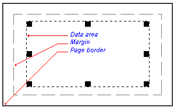

 |  Data Area Frame and Grid Editing the data area frame and grid  
---|---  
  
# Formatting the Data Area Frame and Grid

Each section view or plot sheet contains a data area frame which defines the plotting limits for 3D data objects. The data area frame is initially positioned at the page margins but may be independently moved relative to the page:

For more information about changing the page size and margins see:

[Page size, orientation and margins](<PageSetup.md>)

## To change the size and position of the data area frame

  1. Activate theLayout Modetoggle on theManageribbon.

  2. Click inside the data area to select.
  3. Click and drag the frame using the displayed handles.

The coordinate grid border is drawn on the data area frame. Use the right-click **Format Display** command to control the appearance of the coordinate grid. The options on the **Grid** tab will allow you to:

  * Turn off or on the grid border.

  * Turn off or on the grid lines.
  * Turn off or on the grid labels.
  * Change the label style.
  * Set the decimal places displayed in the grid labels.

  * Change the grid line spacing.
  * Change the starting reference for grid lines.

By default, objects will 'snap' to neighbouring items to allow you to align things more easily. You can override this behaviour by holding down the <CTRL> key during resizing.

You can maintain the aspect ratio of a plot item by holding down the <SHIFT> key during resizing using one of the corner sizer bars (using one of the central bars will automatically alter the aspect ratio regardless).

 |  Much of the hierarchical structure of a particular sheet can be stored in template form. This minimizes the effort required to generate a consistent look and feel across a range of presentation projects by automatically generating a standard arrangement of sheets, projections and, if required, data object overlays. [Find out more about Plot Templates...](<PLOTS_Plot%20Templates.md>)  
---|---  
  
 |  Related Topics  
---|---  
|  [Page size, orientation and margins](<PageSetup.md>)[  
Printing reports and plots](<aboutprinting.md>)