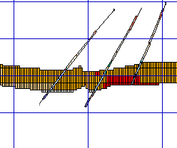
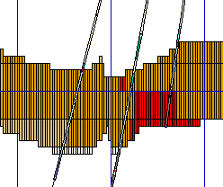

# Projection Exaggeration Settings

Set, edit and disable vertical (**Z**) and horizontal (**X** and Y) exaggeration in a [Plots](<../COMMON/Window_PLOTS_Overview.md>) window [projection](<alignviewwithsection.md>). 

For example, a change in the Z exaggeration from 1.0 to 3.0 changes the view from this:

To this:

Enter a value for a major world axis (where 1 means 'no exaggeration' and 2 means 'double exaggeration). If **Dynamic** is checked, the projection view updates automatically, otherwise click **OK** or **Apply** to update the view.

Related topics and activities

  * [View Settings](<../COMMON/Section%20Definition%20Dialog.md>)

    * [Section Definition](<CustomSections.md>)

    * Projection Exaggeration Settings

    * [View Rotation Settings](<Plots-ViewSettings-Rotate.md>)

    * [Size/Scale](<../COMMON/view%20settings%20scale%20dialog.md>)

    * [Section Width Settings](<Plots-ViewSettings-SectionWidth.md>)

  * [Sections and Projections](<alignviewwithsection.md>)

  * [Projection Overlay Types](<Projection%20Overlay%20Types.md>)

  * [Add a Sheet or Projection](<insertsection.md>)

  * [Section Definition](<CustomSections.md>)

  * [Clipping Plots Data](<ClipView.md>)

  * [Zoom, Scale & Pan](<Zooming.md>)

  * [Align Sections](<alignsection.md>)