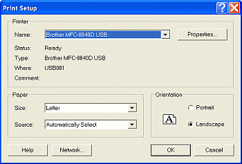
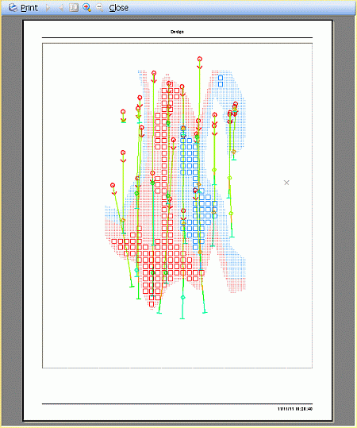
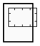
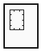
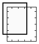
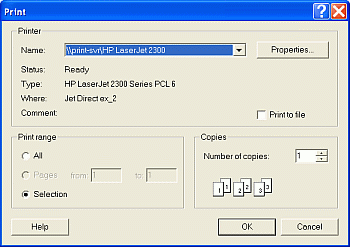

 |  Print Setup, Preview and Printing Windows Printing in Studio 3StudioRM  
---|---  
  
# Print Setup, Preview and Printing

Print Setup

Print Preview

Printing

## Print Setup

Use the Projectbutton to access thePrint Setup command to select the printer device and match the page size and page orientation to the selected view.

Setting up the printer, paper and page orientation uses the standard Windows Print Setup dialog shown below:  
  

## Print Preview

Use the Projectbutton|Print Preview command to view pages prior to printing.

 |  This print preview command can be used for all of the Studio3 windows.  
---|---  
  
When this command is run, a preview of all the currently displayed data in the selected window, will be used to generate and display a print preview, as shown below:  

### The Print Preview toolbar

The following toolbar is displayed in the header bar of the preview window:

The toolbar contains the following buttons:

  * Print \- print the displayed page(s). This opens the Windows Print dialog (see section below)

  * Next Page \- move to the next page; this is available if multiple pages are available for preview

  * Previous Page \- move to the previous page; this is available if multiple pages are available for preview

  * Toggle One/Two Page Display \- toggle between displaying one or two pages simultaneously; this is available if multiple pages are available for preview

  * Zoom In \- zoom in to the displayed page

  * Zoom Out \- zoom out of the displayed page

  * Close \- close the preview without printing.

 |  This toolbar may have a different look, but contain the same functions, depending on the window that is being used to generate the preview.  
---|---  
  
### Using Preview to Identify Page Setting Errors

Preview Appearance |  Remedy  
---|---  
 |  Change page orientation  
 |  Select a smaller page size  
 |  Change to a larger page size  
  
## 

## Printing

Use Projectbutton command to print the selected view using the current page and printer settings. You can print the current log or section of the selected view, or all logs and sections defined in the view, or specify a range of logs or sections to print.

The Print command uses the standard Windows Print dialog shown below:

## 

 |  Related Topics  
---|---  
| [Printing tables](<PrintTable.md>)[  
Changing page size, orientation and margin (section and log views)](<PageSetup.md>)