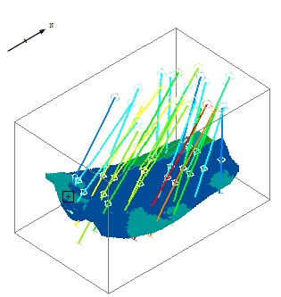

# Projection Overlay Types  
  
A projection within a plot sheet can be either of the static or dynamic type:

  * A static projection represents the legacy functionality of Plots windows and can be formatted using the functions of the Format Display screens. It may also be referred to as a "2D" projection.
  * A dynamic projection contains a group of 3D data object overlays. This type of projection can be formatted using 3D Properties screens that are identical to those supporting **3D** window objects. It is also called a "3D" projection.

Both projection types can be generated using the [create-plot-view](<../command_help/create-plot-view.md>) command and you can add a 3D Overlay Group to either. Where a projection has been generated based on 3D window content (and this includes generation of both 2D and 3D plot overlays) an attempt is made to honour the current 3D object overlay formatting settings and also view-specific information, including clipping that may be applied to the source 3D window overlays.

A comparison of static and dynamic plot projections:

| Dynamic / 3D Projection | Static / 2D Projection  
---|---|---  
create-plot-view overlays created | 3D overlays (in a 3D Overlays Group collection containing multiple overlays) | 2D Overlays (one overlay per visible object)  
View direction adjustment controls | Interactive/dynamic cursor control, [Projection Properties](<projection%20properties.md>) dialog, context menu options | Plot | View ribbon controls, Interactive/dynamic cursor control, [Projection Properties](<projection%20properties.md>) dialog, context menu options  
Overlay formatting tools | (3D) [Object Properties](<../COMMON/Formatting%203D%20Objects.md>) dialogs, same as 3D window sheets. | [Format Display](<../COMMON/format%20display%20dialog_overlays.md>) dialog options (according to data type selected).  
Transparency support |  Yes |  No  
Can the projection update the primary 3D window? |  Yes, using the projection context menu option 3D Projection | Copy To | 3D View... |  Yes, using the projection context menu option 3D Projection | Copy To | 3D View...  
Can the projection inherit a view definition from other views after creation? |  Yes, using the projection context menu option 3D Projection | Copy From option. You can copy a view definition from any 3D window or 3D section definition. |  Yes, using the projection context menu option 3D Projection | Copy From option. You can copy a view definition from any 3D window or 3D section definition  
Drawing order adjustment support |  Independent ordering of object overlays is not possible; the entire overlay group order can be set, but not individual overlays within it. |  Independent ordering of object overlays is possible  
Section and Clipping Controls |  Projection contents are updated using the Section Properties dialog. |  Projection contents are updated using the Projection Properties dialog.  
Interactive projection view controls | Yes, see below | Yes, see below  
  
Otherwise, dynamic and static projections are supported by similar functionality. As a projection, each type can be copied, positioned and otherwise managed using generic projection-level controls. These functions are available on the Manage ribbon and context-sensitive menu options in both the Plots window and Sheets/Project Data control bars.

Either projection type can be used in conjunction with other Plots window data (plot items, logs etc.).

### Plot Overlays - Interactive Controls

Adjusting the view direction of a plot overlay (dynamic or static) is similar to adjusting the view in a 3D window.

  * Hold down <SHIFT> and left-click and drag inside the projection to rotate the view interactively. The definition of the projection will be updated automatically. This is a simple way to fine tune the display of 3D objects in your report layout.
  * Use the mouse wheel to zoom into our out of the view (this will affect the selected projection, or the view of the plot sheet if no projection is selected).
  * Use the quick key combination "za" to fit everything in the selected projection to its confines. Essentially, this maximizes the view of all visible data.
  * Use the quick key combination "zx" and drag a rectangle to zoom into a particular part of a projection. This is useful if you want to magnify a specific data portion.
  * Hold down the right mouse button and drag to pan the view of data within the projection.
  * You can also use your middle mouse wheel, if you have one, to zoom the view in and out in real time.

As well as these dynamic options, you can also use the Plots >> View ribbon controls to adjust the projection properties. For example, you can pan the data inside your projection using Pan options.

**Tip** : To use your current view projection in the primary 3D view using the projection's right-click menu. In **[Page Layout](<PageLayoutMode.md>)** mode select 3D Projection >> Copy to >> 3D View. This option is also available for static view projections.

Related topics and activities

  * [About 3D Windows](<../VR_Help/VR_Introduction.md>)

  * [Formatting Overlays](<../COMMON/Formatting%203D%20Objects.md>)

  * [Introducing the Plots Window](<../COMMON/Window_PLOTS_Overview.md>)

  * [Plot Window Menus](<Plot%20Window%20Menus.md>)

  * [Plots from 3D Data](<../COMMON/Plot%20Overlays%20From%20Type.md>)

  * [View Hierarchy](<../COMMON/View%20Hierarchy.md>)