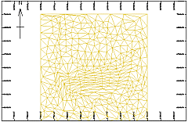
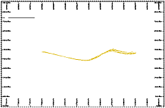
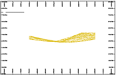
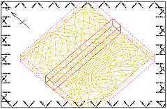

 |  Projection Wizard Dialogs Creating a custom plot sheet using the Projection Wizard  
---|---  
  
# Projection Wizard

### To access these dialogs:

  * Select the Plots window, activate the Manage ribbon, then select Insert | Sheet | Plot | Custom,

  * Then in the [Plot Item Library](<plotitemlibrary.md>) dialog, select [Projection Wizard], click OK.

The Projection Wizard dialogs are used to create horizontal, vertical, inclined and 3D view plot sheets by selecting the section type, defining one or more of the orientation, midpoint, width and view direction parameters.

After a new custom plot is defined, it is displayed as a new sheet in the Plots window, available via a new, automatically labeled tab, located along the bottom of the window.

The Projection Wizard uses one or more of the following dialogs to define and create a plot, in this order:

  * Projection Type

  * Section Orientation

  * Projection Plane

  * Section Midpoint

  * Section Clipping

  * View Direction

## Projection Type Dialog

This dialog is used to define one of four projection types. The following options are available:

  * Plan:  
  
  
If a Plan type is selected, the projection is oriented in a horizontal plane; the plot sheet is created automatically and the wizard is then closed.

  * Section:  
  
  
If a Section type is selected, the orientation is then defined in the following Section Orientation dialog.

  * Vertical Projection:  
  
  
If a Vertical Projection type is selected, the orientation of the vertical plane is defined in the following Projection Plane dialog.

  * 3D View:  
  
  
If a 3D View type is selected, the azimuth and dip of the view is defined in the View Direction dialogs.

## Section Orientation Dialog

This dialog is used to define the orientation of the section. The following options are available:

  * North-South

  * South-North

  * West-East

  * East-West

  * Horizontal

  * Vertical

  * Inclined

The following steps are used to define a section:

  1. In this dialog, specify the orientation of the section, click Next.

  2. In the Section Midpoint dialog, select the section Mid-point position (along the axis defined by the previous selection), click Next.

  3. In the Section Clipping dialog, specify the clipping width, click Finish.

## Projection Plane Dialog

This dialog is used to define the orientation of the vertical projection. The following options are available:

  * North-South

  * South-North

  * East-West

  * West-East

  * Other

Specify the orientation of the vertical projection and then click Next to create the plot. The section mid-point and clipping width are automatically defined.

## Section Midpoint Dialog

This dialog is used to define the mid-point position (X or Y coordinate) of section. Depending on the section orientation, the following options are available:

  * Mid-point Easting (X coordinate)

  * Mid-point Northing (Y coordinate)

Specify the mid-point of the section and then click Next to create the plot. The section clipping width is automatically defined.

## Section Clipping Dialog

This dialog is used to define the clipping width associated with the section. The clipping width is the total width of the clipping, which is divided equally in front and behind the section plane. For example, a 100m clipping width has a front and back clipping, each 50m in width. Only data falling within the clipping limits is displayed.

Specify the clipping width of the section and then click Finish to create the plot.

View Direction Dialogs

These dialogs are used to define the view direction (azimuth and dip) of a 3D View type. The following steps are needed to create the plot:

  1. Define the view direction's Azimuth , click Next.

  2. Define the view direction's Dip , click Finish.

 |  With regards to the Plots window (and to a lesser extent, the Logs window), much of the hierarchical structure of a particular sheet can be stored in template form. This minimizes the effort required to generate a consistent look and feel across a range of presentation projects by automatically generating a standard arrangement of sheets, projections and, if required, data object overlays. [Find out more about Plot Templates...](<PLOTS_Plot%20Templates.md>)  
---|---  
  
 |  Related Topics  
---|---  
|  [  
Custom sections](<CustomSections.md>)