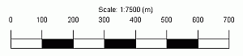
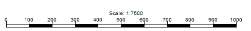

# Scale Bar Plot Items

To add a scale bar plot item to a plot sheet: 

  * **Plots** window (and select a projection) >> **Manage** ribbon **> > Plot Item** and select _Scale Bar_ from the **[Plot Item Library](<plotitemlibrary.md>)**.

  * **Plots** window (and select a projection) >> **Manage** ribbon **> > Plot Item >> Scale Bar**.

Scale bars are useful plot items that help your report viewers understand the magnitude of the data they are viewing. 

Scale bars are linked to a [plot projection](<alignviewwithsection.md>). A scale bar automatically adjusts to show a scale that is appropriate for the current projection. For example, adding a scale bar to a projection with a scale of 1:7500 adds a default scale bar to the top left of the project, like this:

If **[Page Layout](<PageLayoutMode.md>)** mode is active, the scale bar can be shrunk and stretched interactively. It will reform itself to show a scale-appropriate mesure bar. For example, stretching the bar above but reducing its height results in something similar to this:

The scale is still appropriate for the data it represents.

**Note** : This plot item can be drawn before or after other plot items, say to ensure it is shown on top of another one, using the **Drawing Order** tab. See [Drawing Order](<Format_Drawing_Order_Dialog.md>).

## Plot Item Ribbons

Highlighting a plot item anywhere on a plot displays a dedicated ribbon containing various options for resizing, formatting and managing the contents of the target. All commonly-used properties can be accessed here and is generally the most convenient option for configuring plot items.

The options that appear depend on what you select. For example, selecting a [Title Box](<TitleBlock.md>) plot item displays a ribbon to let you manage the arrangement of cells within it, whilst selecting a **[North Arrow](<NorthArrow.md>)** item displays a different set of controls to determine the arrow's appearance:

;>)

The Title Box ribbon

;>)

The North Arrow ribbon

**Note** : To return to more general plot management functions, activate the **Manage** ribbon. Plot item ribbons only display for as long as the plot item is selected.

**Note** : Deselect a plot item by holding <CTRL> and left clicking it.

### Add a New Scale Bar

Once a projection exists on a plot sheet, you can add a scale bar to it.

To add a new scale bar to a projection on a plot sheet:

  1. Display the plot sheet and projection to which you intend to add a scale bar.

  2.   3. Select the outer border of the projection to set that object as the 'parent' for the plot item.

  4. **Manage** ribbon **> > Insert >> Plot Items >> Scale Bar**.

A new scale bar with default formatting is added to the top left corner of the target projection and the **Scale Bar** screen displays.

  5. Choose if your scale bar is to display scale as a series of boxes (as shown in the introduction) or to simply show vertical scale markers (if **Ticks** is enabled):

     * **Check****Bars** to display scale as a series of concurrent rectangles. If selected, you can also choose to display alternating Filled shapes (again, as shown further above).

     * **Uncheck****Bars** to display the scale bar as a line marker with ticks (see below), for example:

  6. Decide if scale values and markers are displayed:

     * **Check****Ticks** to show values and markers. If enabled, you can then show or hide the scale values by toggling **Labelled**.

     * **Uncheck****Ticks** to remove values and scale markers. This could be used in conjunction with Bars, for example, to show only alternating coloured blocks to indicate scale, without textual values or scale markers.

  7. The interval between bars and ticks is, by default, configured automatically. You can override these default settings to show a Fixed Interval.

  8. Set the precision of scale values (by default, only whole numbers are shown) by checking **Fixed Decimal Places** and specifying a precise number, or selected **Auto Decimals (Max)** and setting the maximum number of decimal places that can be displayed.

**Warning** : An excessive number of decimal places may cause some bars and ticks to be hidden on the scale bar.

  9. By default, the scale bar is entitled with its scale (and that of its parent projection). You can hide this **Scale Label** if you wish. If checked, define:

     * **Prefix** The text that prefixes the projection scale. By default this is "Scale: ".

     * DecimalsThe number of decimal places to show after the scale denominator. 

     * **Suffix** If a suffix is required (say, the measurement unit), enter it here.

  10. Set the **Height** and **Width** of the scale bar, in world measurement units.

**Tip** : Adjust the scale bar size dynamically, whilst in **Page Layout** mode (see below).

### Edit a Scale Bar

To edit an existing scale bar on a plot sheet:

  1. Display the plot sheet containing the scale bar.

  2. Double-click the north arrow to display the **Scale Bar** screen.

  3. Configure the scale bar using the same controls as for new scale bars (see above).

### Move or Resize a Plot Item

To move or resize an existing plot item:

  1. Select the Manage ribbon and enable **Page Layout Mode**.

  2. Click to select the plot item. 

Resize boxes appear around the plot item.

  3. Ensure the **Lock** toggle on the plot item's ribbon is not active. If it is, deactivate it. If the **Lock** toggle is active, the height and width (and rotation) cannot be changed.

  4. To resize the plot item (and if supported, proportionally resize contents) drag one of the control points to a new position.

**Tip** : To retain the original aspect ratio of the plot item during resizing, hold down **CTRL**.

  5. To move the plot item, position the mouse inside the plot item until the cursor changes to a four-way arrow. Then, left-click and drag the plot item to a new position on the sheet.

**Note** : If a plot item is parented to another item, it can still be repositioned outside the boundary of its parent. For example, a title box associated with a projection can be positioned anywhere on the plot sheet, even outside the projection.

**Tip** : When moving a plot item, it will attempt to 'snap' to nearby objects. Override this behaviour by holding down SHIFT.

### Rotate a Plot Item

Plot items that display a green rotation symbol after selection can be rotated. 

To rotate a plot item:

  1. Select the Manage ribbon and enable **Layout Mode**.

  2. Ensure the **Lock** toggle on the plot item's ribbon is not active. If it is, deactivate it. If the **Lock** toggle is active, the height and width (and rotation) cannot be changed.

  3. Left click to select a plot item.

The resize and rotate controls display, for example:

  4. Left click and drag the green rotate control.

  5. Release the left mouse button to redraw the control at the new orientation.

**Tip** : Small plot item resize handles can blend into each other. **[Zoom in](<Zooming.md>)** to see each resizer more clearly.

Related topics and activities

  * [Plot Items](<LogPlotitems.md>)
  * [Plot Item Library](<plotitemlibrary.md>)

  * [Drawing Order](<Format_Drawing_Order_Dialog.md>)