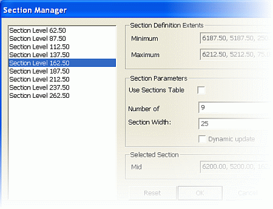

 |  Section Manager Dialog Creating multiple sections using the section manager  
---|---  
  
# Section Manager Dialog

The Section Manager dialog is used to generate a set of parallel sections for the selected plot sheet, using either a loaded section definition file or a set of defined parameters.

Field Details:

Section List: displays a read-only list of the currently defined set of parallel sections, based on the selected sheet's section midpoint coordinates, defined Number of and Section Width parameters.

 | 

  * The first time this dialog is opened for the selected plot sheet, the section list is generated using a set of default parameters.
  * Selecting a different section in this list using the cursor, other than the default mid-section highlighted, sets that as the new section midpoint, but does not regenerate the list. The list is only then regenerated using this new midpoint if either the Number of or the Section Width parameter is modified and Apply is clicked or if Dynamic update was already ticked.

  
---|---  
  
Section Definition Extents:

Minimum: the minimum X, Y and Z extents of the section set (including the section width).

Maximum: the maximum X, Y and Z extents of the section set (including the section width).

Section Parameters:

Use Sections Table: select this check box to populate the Section Manager with the contents of the currently loaded section definition file. If no file is loaded, you will be prompted to load one when the box is ticked. If you elect to do so, a file browser is displayed to allow you to locate the required section definition file.

Number of Sections: accept the default or type a new value defining the total number of required sections.

are removed, from the beginning of the list, with the alternating process repeating for each section removed.

Dynamic Update: select this option to automatically recalculate the Section List and Section Definition Parameters when changes are made in the Section Manager.

Section List:

Mid Point: displays the mid point of the currently selected section.

Reset: click here to reset all lists and parameters using default values.

Apply: click this button to recalculate the Section List and Section Definition Parameters based on the currently defined Number of and Section Width parameters and apply this set to the plot sheet.

| The set of parallel sections is generated using the following parameters and method:

  * the selected Plot sheet's section midpoint coordinates define the control point for the set
  * the number of sections is defined by the Number of parameter
  * the distance between adjacent sections is defined by the Section Width parameter
  * the selected Plot sheet's section becomes the middle section of the set
  * half the number of sections are positioned above (increasing coordinate direction)
  * the other half are positioned below (decreasing coordinate direction) this middle section.

  
---|---  
  
| Selecting other sections will either update automatically (if Dynamic Update is selected) or will update after the Apply button is clicked (if Dynamic Update is not selected). , a list of default sections, at regular section intervals will be displayed in the selection list:  
---|---  
  

## Generating a New Set of Parallel Sections

  1. First, determine a suitable mid point (X, Y and Z coordinate) and orientation (Azimuth, Dip) for the middle section of the planned section set.

  2. In the Sheets control bar, select the required Plot sheet.

  3. Right-click on the Projection item, select Projection Properties.

  4. In the Projection dialog's Properties tab, define the Section Mid-point and Section Orientation parameters using the values from step 1, click OK.

  5. In the Section Manager dialog, untick Dynamic update.

  6. Define the Number of and the Section Width parameters so that the listed sections cover the required extents, click Apply, check the results.

  7. Click OK.

|  Related Topics  
---|---  
| [Section Definition](<SectionDefinitionCommand.md>)