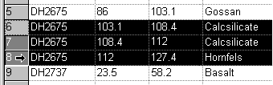
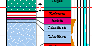
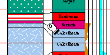

# Selecting Drillhole Intervals

Drillhole intervals can be selected for general synchronization between windows or while using the Compositor tool. Intervals are selected using different methods in different windows.

### Selecting Intervals in Tables

To select table data interactively:

Position the pointer over the header of the first row so that the pointer shape changes to an arrow, then click once to select the row, or click-and-drag to select more than one row as shown below.

### Selecting Intervals in Plots

Page layout mode must be disabled to select drillhole intervals in plot sheet projections.

To select an interval using snapping:

  1. Position the pointer over a sample in the section view and click once to select.

  2. Click-and-drag the interval end marker down the hole to extend the selected interval.

Note: To clear the selection, click onto the page away from the drillholes, or select another hole.

### Selecting Intervals in Logs

Page layout mode must be disabled to select drillhole intervals in plot sheet projections.

To select an interval without snapping:

  1. Display the log sheet.

  2. Position the pointer at the start (From) of the interval, then click-and-drag down the hole to select the end (To) of the interval.

  3. The selected interval is displayed on the status bar.

  4. To move selection limits, position the cursor over either the upper or lower limit so that the cursor changes to a two pointed arrow and click-and-drag the limit line up and down the hole, for example:

  5. To move the composite, position the cursor between the upper and lower limit so that the cursor changes to a hand symbol and slide composite up and down the hole, for example:

Tip: Display the Compositor control bar to display the composite values as the selection changes.

Related topics and activities

  * [Synchronizing linked views](<Synchronizing%20Linked%20Views.md>)

  * [Compositor tools](<Composite_Tool.md>)

  * [Hole selection tool](<holeselectioncombo.md>)

  * [Selecting and saving intersections](<SaveIntersections.md>)