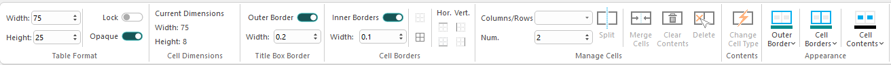
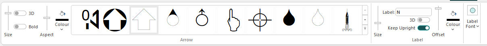
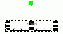

# Symbol Plot Items

Symbol plot items can enhance log and plot sheets. 

A number of general, geological, mining and survey related symbols are available in the standard symbol library. These can be interactively positioned, sized, colored and rotated on a sheet. 

  * Use symbol plot items for a quick and simple way to enhance a sheet with a few symbols.
  * Display symbols and point or line vertex positions using the Format Display (2D projections) or 3D properties (3D projections) screens. See [Projection Overlay Types](<Projection%20Overlay%20Types.md>).

  * You can even [create your own symbols](<https://datamine.freshdesk.com/en/support/solutions/articles/19000044825-creating-custom-studio-symbols>) (external website login required).

**Note** : This plot item can be drawn before or after other plot items, say to ensure it is shown on top of another one, using the **Drawing Order** tab. See [Drawing Order](<Format_Drawing_Order_Dialog.md>).

**Note** : A **[North Arrow](<NorthArrow.md>)** is a special type of symbol.

A symbol can be added to either the sheet or projection level of a plot sheet. See [The Plots Window](<../COMMON/Window_PLOTS_Overview.md>).

## Plot Item Ribbons

Highlighting a plot item anywhere on a plot displays a dedicated ribbon containing various options for resizing, formatting and managing the contents of the target. All commonly-used properties can be accessed here and is generally the most convenient option for configuring plot items.

The options that appear depend on what you select. For example, selecting a [Title Box](<TitleBlock.md>) plot item displays a ribbon to let you manage the arrangement of cells within it, whilst selecting a **[North Arrow](<NorthArrow.md>)** item displays a different set of controls to determine the arrow's appearance:

;>)

The Title Box ribbon

;>)

The North Arrow ribbon

**Note** : To return to more general plot management functions, activate the **Manage** ribbon. Plot item ribbons only display for as long as the plot item is selected.

**Note** : Deselect a plot item by holding <CTRL> and left clicking it.

## Add a New Symbol

To add a symbol to a plot sheet:

  1. Display the plot sheet to receive the new symbol.

  2. Click into the plot sheet (anywhere).

  3. **Manage** ribbon **> > Insert >> Plot Item**.

The **[Plot Item Library](<plotitemlibrary.md>)** displays.

  4. Select _Symbol_ and click **OK**.

A default "+" symbol appears on the plot sheet.

  5. Double-click the new symbol.

The **[Symbol](<Symbol_Properties_Dialog.md>)** screen displays.

  6. Define the symbol's properties. See [Symbol ](<Symbol_Properties_Dialog.md>).

  7. Choose the drawing order for the plot item. See [Drawing Order](<Format_Drawing_Order_Dialog.md>).

  8. Click **OK**.

The symbol updates to reflect the latest settings.

## Edit a Symbol Icon

To change an existing symbol's icon:

  1. Click a symbol on a plot sheet (**[Page Layout mode](<PageLayoutMode.md>)** does not have to be active).

The **Symbol** ribbon displays.

  2. On the **Symbol** ribbon, pick the symbol **Group**. This list contains all symbol groups defined for the current system.
  3. Choose a symbol Size (in points).
  4. Choose a symbol graphic. Expand the menu using the expander in the bottom right of the strip to see all symbols of that group.
  5. Pick a symbol **Colour**.

## Delete a Symbol

  1. Click a symbol on a plot sheet.
  2. Press DELETE.
  3. Confirm. The symbol is removed.

**Note** : You can't undo this operation.

### Move or Resize a Plot Item

To move or resize an existing plot item:

  1. Select the Manage ribbon and enable **Page Layout Mode**.

  2. Click to select the plot item. 

Resize boxes appear around the plot item.

  3. Ensure the **Lock** toggle on the plot item's ribbon is not active. If it is, deactivate it. If the **Lock** toggle is active, the height and width (and rotation) cannot be changed.

  4. To resize the plot item (and if supported, proportionally resize contents) drag one of the control points to a new position.

**Tip** : To retain the original aspect ratio of the plot item during resizing, hold down **CTRL**.

  5. To move the plot item, position the mouse inside the plot item until the cursor changes to a four-way arrow. Then, left-click and drag the plot item to a new position on the sheet.

**Note** : If a plot item is parented to another item, it can still be repositioned outside the boundary of its parent. For example, a title box associated with a projection can be positioned anywhere on the plot sheet, even outside the projection.

**Tip** : When moving a plot item, it will attempt to 'snap' to nearby objects. Override this behaviour by holding down SHIFT.

### Rotate a Plot Item

Plot items that display a green rotation symbol after selection can be rotated. 

To rotate a plot item:

  1. Select the Manage ribbon and enable **Layout Mode**.

  2. Ensure the **Lock** toggle on the plot item's ribbon is not active. If it is, deactivate it. If the **Lock** toggle is active, the height and width (and rotation) cannot be changed.

  3. Left click to select a plot item.

The resize and rotate controls display, for example:

  4. Left click and drag the green rotate control.

  5. Release the left mouse button to redraw the control at the new orientation.

**Tip** : Small plot item resize handles can blend into each other. **[Zoom in](<Zooming.md>)** to see each resizer more clearly.

Related topics and activities

  * [Plot Items](<LogPlotitems.md>)

  * [Plot Item Library](<plotitemlibrary.md>)

  * [Drawing Order](<Format_Drawing_Order_Dialog.md>)