 |  Using Title Boxes Procedures relating to title boxes  
---|---  
  
# Title Box Procedures

This topic contains the following information:

  * Insert a new title box into the current plot sheet
  * Move a title box
  * Resize a title box
  * Resize rows and cells in a title box
  * Rotate a title box
  * Edit the contents of a cell
  * Add a new row or column to a title box
  * Delete a row or column from a title box
  * Delete a cell from a title box
  * Split title box plot cells
  * Merge title box cells
  * Clear the contents of one or more cells

##  

Insert a new title box into the current plot sheet

  1. Activate the Manage ribbon and select Plot Item to display the Plot Item Library.

  2. Select DefaultTitle Box from the Plot Item library. Press OK

  3. A new default title box is placed in the top left corner of the page, it will have 2 rows.

Move a title box

You can move a title box either by drag-and-drop or by editing the title box position and size properties in the Properties dialog or control bar:

  1. Ensure that Page Layout Mode is enabled (Manage ribbon, Layout Mode)
  2. Click on the outer edge of the title box, between the resize positions. In this situation the cursor appears like this:  
  
  
  
With the left-mouse held down, you can drag the title box to a new location, or;
  3. Select the edge of the title box (left-click) and then display the Properties control bar (if not displayed, you can show it using the Home ribbon's Show menu). Then, edit the Position properties, e.g.:  
  
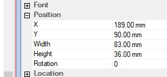  
  
...or;
  4. Double-click the edge of the title box to display a standalone Title BoxProperties dialog with the same controls shown above.

 |  By default, title box boundaries will 'snap' to the edges of other plot items. You can override this behaviour by holding down <CTRL> whilst repositioning.  
---|---  
  

Resize a title box

To interactively resize a title box, you can 'grab' one of the exterior border resize points and drag them to a new position:

  1. Ensure that Page Layout Mode is enabled (Manage ribbon, Layout Mode)
  2. Select the title box to be modified. 
  3. Select one of the grab points of the title box and drag it to a new location to resize the title box. All contents will be resized proportionally:  
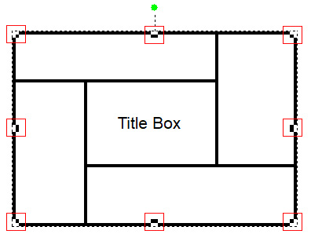

You can also resize a title box by editing its Position properties either using the [Title Box](<title%20box%20frame%20properties%20dialog.md>) dialog, or the [Properties](<../COMMON/properties%20control%20bar%20overview.md>) control bar.

 |  By default, title box boundaries will 'snap' to the edges of other plot items. You can override this behaviour by holding down <CTRL> whilst resizing.  
---|---  
  
  

Resize rows and cells in a title box

You can resize title box cells by repositioning their boundaries. 

This is done by picking up a grab point around a selected cell (or group of cells) within the title box and repositioning it to resize the cell and its neighbors. This will not change the overall dimensions of the title box:

  1. Ensure that Page Layout Mode is enabled (Manage ribbon, Layout Mode)
  2. Select the title box to be modified. 
  3. If you want to restrict resizing to one or more cells, select the cell or cells you wish to resize. It is possible to resize multiple cells, and they don't have to be next to each other.  
  
If no cells are selected, cell resizing will be applied and other neighboring cells will be adjusted (if possible) to accommodate the new border or intersection positions.
  4. Click and drag either a cell border horizontally or vertically, or an intersection to modify the cell(s) in any direction, e.g.:  
  
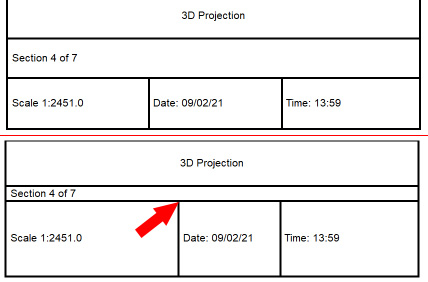  
  
It must be possible to resize all applicable cells. For example, in the image below, it isn't possible to increase the width of the central cell as it would cause another selected cell to resize the title box itself, which isn't permitted (an attempt will be made to resize all cells in the same way).  
  
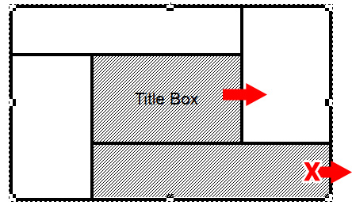

 |  By default, cells borders will 'snap' to neighboring border positions. You can override this behaviour by holding down <CTRL> whilst repositioning.  
---|---  
  

Rotate a title box

You can rotate a title box interactively or by adjusting its Rotation property. Page Layout Mode must be enabled (Manage ribbon, Layout Mode) to perform this procedure.

Interactive rotation is performed by clicking on and moving the rotation grab point, at the top-center of the title box:  
  
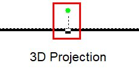

Alternatively you can select the title box and adjust the rotation property (using the value range -180 to +180) either using the [Title Box](<title%20box%20frame%20properties%20dialog.md>) dialog, or the [Properties](<../COMMON/properties%20control%20bar%20overview.md>) control bar.  

## Edit the contents of a cell

A title box cell will be either empty or it will contain one plot item. Page Layout Mode can be active or inactive to follow this procedure.

If a cell is empty, you can add a plot item to it by either:

  * Selecting one cell (only), right-clicking it and selecting Title Box | Insert Cell Contents, or;
  * Double-clicking a selected title box cell containing a plot item

All of these methods will display the Plot Item Library, from which a default plot item can be selected for further modification.

If a cell already contains a plot item, you can replace it by right-clicking it and selecting Title Box | Insert Cell Contents. This will replace the existing item with a new one from the Plot Item Library.

To edit the properties of a plot item within a title box cell, double-click it to reveal its associated properties dialog.

Split title box plot cells into two or more rows or columns

Cells can be split into one or more columns or rows, and you can select individual or multiple cells in the same operation.

Page Layout Mode must be enabled (Manage ribbon, Layout Mode) to perform this procedure.

  1. Ensure that Page Layout Mode is enabled (Manage ribbon, Layout Mode)
  2. Select all cells that you wish to subdivide, e.g.:  
  
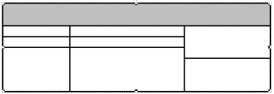  
  
Cells do not have to be contiguous but must be within the same title box.  

  3. Right-click any of the selected cells and choose Title Box | Split Cells into Rows or Split Cells into Columns  

  4. Select the number of subdivisions, e.g. 3:  
  
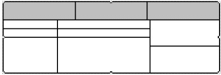

 |  Cells will be split to create subdivision of equal height or width. You can adjust the cell boundaries afterwards if required.  
---|---  
  

## Add a new row or column to a title box

You add new rows or columns to a title box by splitting all cells in a row or column. This will not adjust the overall size of the plot item.

Page Layout Mode must be enabled (Manage ribbon, Layout Mode) to perform this procedure.

In the following example, a new row is created by subdividing the uppermost table cells:

  1. Ensure that Page Layout Mode is enabled (Manage ribbon, Layout Mode)
  2. Select all cells in a row or column, e.g.:  
  
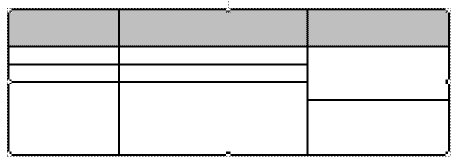
  3. Right-click any of the selected cells and choose Title Box | Split Cells into Rows
  4. Select the number of subdivisions to create (2-10):  
  
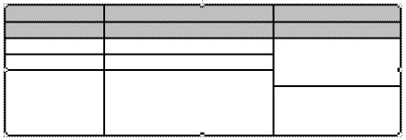  

  5. Resize the rows as required.

A similar procedure is used for adding extra columns by subdividing contiguous vertical cells.

## Delete a row or column from a title box

Page Layout Mode must be enabled (Manage ribbon, Layout Mode) to perform this procedure.

Rows are deleted by either:

  * Selecting all contiguous cells in a row or column and right-clicking to select Title Box | Delete Cells or;
  * Select all contiguous cells in a row or column and pressing <DELETE> or;
  * Selecting two contiguous rows or columns of cells and merging them by row or column, e.g:  
  
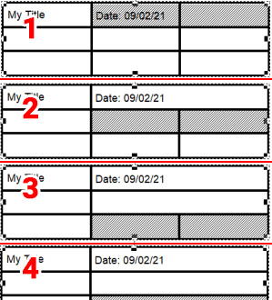

Delete a cell from a title box

Removing cells from a title box will automatically expand (if possible) one of the neighboring cells to the deleted cell's position.

Page Layout Mode must be enabled (Manage ribbon, Layout Mode) to perform this procedure.

Cell deletion can be performed by either:

  * Selecting one or more cells to delete and pressing <DELETE> or;

  * Selecting one or more cells to delete, right-clicking any selected cell and choosing Title Box | Delete Cells.

The cell that is modified will be the first cell that can be expanded, without affecting the integrity of the title box, in the following positional order relative to the deleted cell; right, left, top, bottom. If deletion can't be achieved without 'breaking' the title box, it is aborted and the cell will not be deleted.

Merge multiple cells into one cell

You can merge any cells providing the end result is rectangular and the merged super-cell doesn't contain more than 1 plot item.

Page Layout Mode must be enabled (Manage ribbon, Layout Mode) to perform this procedure.

  1. If needed, remove the contents of cells to ensure only 1 exists in all cells to be merged.

  2. Select two or more contiguous cells that form a rectangle, e.g.:  
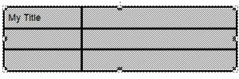

  3. Right-click any selected cell and choose Title Box | Merge Cells, e.g.:  
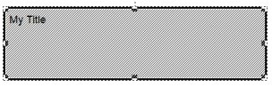

Clear the contents of one or more cells without removing the cell(s)

To remove the contents of the cell whilst retaining the cell:

  * With Page Layout Mode active, select the cell or cells containing plot items you wish to remove, then right-click to choose Title Box | Clear Cell Contents, or;

  * In any mode, select the cells you wish to clear, then hold down <CTRL> then press <DELETE>

 |  Related Topics  
---|---  
| [Title Boxes Overview](<TitleBlock.md>)[Title Box Properties](<title%20box%20frame%20properties%20dialog.md>)[Plot Item Library](<plotitemlibrary.md>)