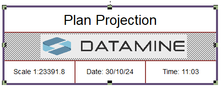
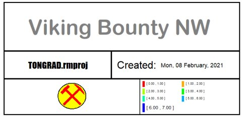

# Title Box Plot Item

To add a title box plot item to a plot sheet: 

  * **Plots** window >> **Manage** ribbon **> > Plot Item** and select _Title Box_ from the **[Plot Item Library](<plotitemlibrary.md>)**.

  * **Plots** window >> **Manage** ribbon **> > Plot Item >> Title Box**.

  * **Plots** window >> **Manage** ribbon **> > Plot Item >> Title Box for Plans**.

A  _title box plot item_ is a plot component from the **[Plot Item Library](<plotitemlibrary.md>)**.Typically, it heads the plot sheet to describe its purpose, but can be used to entitle any plot component, such as a projection or table. It is a tabular plot item with rows and cells. Cells can contain freeform text, calculated values or data object values. 

A title box can be positioned anywhere on a plot sheet. They can be resized, rotated and you can manage how cells are arranged, including splitting and merging cells. Context is text-based, although other plot items (such as clip art) can be added on top of an empty cell, say, to display a company logo.

Title boxes can be any size, with any number of rows and cells per row.

A title box showing resize squares

Like many plot items, a title box 'belongs' to a parent object. At the top level, this could be the plot sheet itself. In this situation, the default layout of the title box includes cells to display the application name, the current date and time. If a title box is created within a projection, it will show the projection name, the current section number (if appropriate), the scale, date and time. This is similar to the example above, although the section cell contents has been replaced with clip art.

A title box is ideal as the key identifier for a plot, although it can be used for any collection of plot items you wish to group together.

Title box plot items can be:

  * Moved as a whole by dragging one of the outer edges (that isn't a resizer point - see below)
  * Resized as a whole, changing the scale of all cells within it, maintaining the same overall proportions for all cells
  * Resized in length or width, changing the height or width of all cells correspondingly
  * Modified by adjusting their cell borders.
  * Modified by adding or deleting rows of cells.
  * Modified by adding or deleting individual cells (if possible)
  * Reformatted to show different borders (per-cell, if required)
  * Modified by changing cell contents and their formats

**Note** : This plot item can be drawn before or after other plot items, say to ensure it is shown on top of another one, using the **Drawing Order** tab. See [Drawing Order](<Format_Drawing_Order_Dialog.md>).

### Title Box Cells

Each title box cell can contain a single plot item of any type. 

If you need to add more plot items (text boxes, scale bars etc.) to your title box, you can add more cells by inserting or splitting rows or columns. Providing you adhere to this "one plot item per cell" rule, you can lay your plot item out however you like. 

Inserting a new plot item into a cell will replace the one that is currently there. 

;>)

A Title Box containing multiple plot items

When editing a title box _text_ cell, additional options are provided via a **Text Cell** ribbon and a **[Text Box](<text%20box%20properties%20dialog.md>)** screen (right-click a title box and select **Title Box Properties** to display it). 

You can also access right-click options to manage the contents and formatting of text cells, or the **[Properties](<title%20box%20frame%20properties%20dialog.md>)** control bar. 

For individual cell text formatting, double click any title box cell to display the **[Cell Format](<cell%20format%20dialog.md>)** screen.

### Text Cell Ribbon

Selecting an individual cell in a title box displays the **Text Cell** ribbon in addition to the **Title Box** ribbon. This provides context-sensitive tools to format the contents of title box cells containing text, including:

  * Font options

  * Changing the cell data category and format

  * Changing the cell opacity or border 

## Plot Item Ribbons

Highlighting a plot item anywhere on a plot displays a dedicated ribbon containing various options for resizing, formatting and managing the contents of the target. All commonly-used properties can be accessed here and is generally the most convenient option for configuring plot items.

The options that appear depend on what you select. For example, selecting a Title Box plot item displays a ribbon to let you manage the arrangement of cells within it, whilst selecting a **[North Arrow](<NorthArrow.md>)** item displays a different set of controls to determine the arrow's appearance:

;>)

The Title Box ribbon

;>)

The North Arrow ribbon

**Note** : To return to more general plot management functions, activate the **Manage** ribbon. Plot item ribbons only display for as long as the plot item is selected.

**Note** : Deselect a plot item by holding <CTRL> and left clicking it.

### Add a Title Box

To add a title box plot item to a plot sheet or plot sheet component:

  1. Select the 'parent' of the title box. This is the item to which the title box relates and can be the whole plot sheet or a projection.

**Note** : Title boxes can't be parented to other plot items, such as clip art, north arrows and so on.

The sheet or projection is selected and highlighted.

  2. **Manage** ribbon **> > Insert >> Plot Item >> Title Box**.

**Note** : You can also click the top level **Plot Item** button and choose _Title Box_ from the [Plot Item Library](<plotitemlibrary.md>).

A default plot item is added to the plot sheet. The cells and contents will depend on whether the title box is parented to the plot sheet or a particular projection.

  3. Configure the plot item using one of the activities below.

  4. **Save** your project. Plot data is saved within the project.

### Move or Resize a Plot Item

To move or resize an existing plot item:

  1. Select the Manage ribbon and enable **Page Layout Mode**.

  2. Click to select the plot item. 

Resize boxes appear around the plot item.

  3. Ensure the **Lock** toggle on the plot item's ribbon is not active. If it is, deactivate it. If the **Lock** toggle is active, the height and width (and rotation) cannot be changed.

  4. To resize the plot item (and if supported, proportionally resize contents) drag one of the control points to a new position.

**Tip** : To retain the original aspect ratio of the plot item during resizing, hold down **CTRL**.

  5. To move the plot item, position the mouse inside the plot item until the cursor changes to a four-way arrow. Then, left-click and drag the plot item to a new position on the sheet.

**Note** : If a plot item is parented to another item, it can still be repositioned outside the boundary of its parent. For example, a title box associated with a projection can be positioned anywhere on the plot sheet, even outside the projection.

**Tip** : When moving a plot item, it will attempt to 'snap' to nearby objects. Override this behaviour by holding down SHIFT.

### Rotate a Plot Item

Plot items that display a green rotation symbol after selection can be rotated. 

To rotate a plot item:

  1. Select the Manage ribbon and enable **Layout Mode**.

  2. Ensure the **Lock** toggle on the plot item's ribbon is not active. If it is, deactivate it. If the **Lock** toggle is active, the height and width (and rotation) cannot be changed.

  3. Left click to select a plot item.

The resize and rotate controls display, for example:

  4. Left click and drag the green rotate control.

  5. Release the left mouse button to redraw the control at the new orientation.

**Tip** : Small plot item resize handles can blend into each other. **[Zoom in](<Zooming.md>)** to see each resizer more clearly.

### Resize Title Box Cell Size

To change the dimensions of tables cells of a title box:

  1. Select the Manage ribbon and enable **Layout Mode**.

  2. Click inside a title box cell to select it. 

Selected cells are shown with cross hatching

  3. Move the cursor to the boundary between two cells.

The cursor changes to a two-way cursor.

  4. Left click and drag the cell boundary to a new position.

**Note** : The **Title Box** ribbon's **Cell Dimensions** fields update as you move the mouse. Use these values for a precise result.

  5. Release the left mouse button to resize the affected cell(s).

Note: You can resize both horizontal and vertical cell boundaries. If you plan to resize an entire row, preselect all cells in that row first.

### Merge and Split Table Cells

  1. Select the Manage ribbon and enable **Layout Mode**.

  2. Hold down CTRL and left click two or more EMPTY cells of your title box.

**Note** : You cannot merge cells if the resulting cell would contain two or more plot items. It is necessary to remove the contents of the cells first by right-clicking one of the selected cells and selecting Title Box >> Delete Cell Contents.

  3. **Title Box** ribbon **> > Manage Cells >> Merge Cells**.

**Note** : You can also right-click one of the selected cells and select Title Box >> Merge Cells.

The selected cells are merged into one cell.

  4. To split cells into two or more cells, either vertically or horizontally, select the cell to be split.

The cell becomes cross-hatched to indicate it is selected.

  5. Right-click the cell and choose either:

     * **Title Box >> Split Cells into Rows** to split the cell horizontally into 2 or more rows.

     * **Title Box >> Split Cells into Columns** to split the cell vertically into 2 or more columns.

Alternatively, use the **Title Box** ribbon's **Manage Cells** tools, for example, to split a cell into 2 rows and 3 columns:

     1. In the **Manage Cells >> Columns/Rows** field, select _Rows_.

     2. In the Num. field, enter "2".

     3. Click **Split**.

     4. In the **Manage Cells >> Columns/Rows** field, select _Columns_.

     5. In the Num. field, enter "3".

     6. Click **Split**.

**Note** : Row and column heights are distributed evenly by default, but can be moved afterwards. See "Resize Title Box Cells", above.

### Add Plot Items to a Title Box

A title box is a good container for other plot items, which don't have to be plain text. 

To add a plot item to a title box:

  1. Select the Manage ribbon and enable **Layout Mode**.

  2. Double click an empty cell of a title box.

**Note** : Title box cells can contain only one plot item or text value. If you need to add a new item, delete the contents of the cell first (Right click **> > Title Box >> Clear Cell Contents**).

The **Plot Item Library** displays.

  3. Select the plot item to add (scale bar, clip art and so on) and click OK.

The plot item displays in the title box cell.

  4. Configure the plot item within the cell as you would a standalone item.

**Note** : Plot items added to title boxes move and rotate with the title box.

To change the type of title box cell content:

  1. Select a cell within a title box (Page Layout mode does not have to be active).

  2. On the **Title Box** ribbon, select **Contents >> Change Cell Type**.

The **Plot Item Library** displays.

  3. Select a plot item to replace the existing cell contents.

The cell contents are replaced by a default plot item of the selected type.

### Format a Title Box and Cell Contents

Title boxes can be formatted as a whole and by formatting individual cell contents.

**Note** : In the activities below, the title box ribbon controls are used. These options can also be found by double-clicking the edge of a title box and viewing the **Title Box** properties screen. 

To format a title box:

  1. Select a title box (**Page Layout** Mode does not have to be active).

The **Title Box** ribbon appears.

  2. Ensure the **Lock** toggle on the ribbon is not active. If it is, deactivate it. If the **Lock** toggle is active, the height and width (and rotation) cannot be changed.

  3. Change the Height or Width of the title box using the **Table Format** controls. 

  4. Change the outer border of the title box by:

     * Hiding or showing the border using the **Outer Border** toggle.

     * If **Outer Border** is active, edit the Width of the border using the ribbon control.

  5. Set the colour of the outer border using the **Title Box** ribbon's **Appearance >> Outer Border** menu.

  6. Change the colour of all text in the title box using the **Title Box** ribbon's **Appearance >> Cell Contents** menu.

To format title box cells:

  1. Select a title box (**Page Layout** Mode does not have to be active).

The **Title Box** ribbon appears.

  2. Ensure the **Lock** toggle on the ribbon is not active. If it is, deactivate it. If the **Lock** toggle is active, the height and width (and rotation) cannot be changed.

  3. Click inside a cell to highlight it.

Cross-hatching appears.

  4. Using the **Title Box** ribbon, format the **Cell Borders** :

     * Show or hide cell borders by toggling Inner Borders.

     * Change the **Width** of all cell borders. Note that it is not currently possible to set per-cell widths.

     * Hide or display cell border edges within the selected cell(s) by toggling the Hor. (Horizontal) and Ver. (Vertical) buttons on the **Title Box** ribbon (**Cell Borders** group).

**Note** : Remember that if a cell is adjacent to another, there are actually two borders next to each other. Also, only internal cell borders are adjusted, for example, toggling the upper horizontal cell border for a cell that is at the top of the title box will have no effect.

     * Change the colour of internal cell borders using the **Title Box** ribbon's **Appearance >> Cell Borders** menu.

### Title Box Keyboard Shortcuts

  * Double-click a cell to show the corresponding plot item properties, or show the Plot Item Library if the cell is empty.

  * <CTRL>+<A> will select all cells in the active title box.

  * Left-click then a subsequent <SHIFT>\+ left-click can be used to select all cells between the two points.

  * <CTRL> can alternate the selected/deselected state of any cell. Can be used to select/deselect multiple cells.

  * <DELETE> will delete the selected cells (providing cells can be deleted whilst maintaining the integrity of the title box.

  * <DELETE> will delete the title box if no cells are selected.

  * <CTRL>+<DELETE> will delete the contents (only) of selected cells

  * <CTRL> can be held down while dragging to disable snapping

Related topics and activities

  * [Title Box Properties](<title%20box%20frame%20properties%20dialog.md>)

  * [Plot Items](<LogPlotitems.md>)

  * [Plot Item Library](<plotitemlibrary.md>)