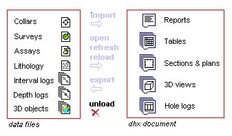

 |  Unloading Data Removing files from the current project  
---|---  
  
# Removing data objects from the project

All views in your application are just different interpretations of the data contained in the project document. Removing a data table by right-clicking an item in the Sheets control bar and selecting Delete. This simply removes one view of the data, it does not remove the data object being viewed.

## To remove an object completely from the project document

  1. Activate theDataribbon and selectUnload | Select...

  2. Select the object or objects to be removed in the Data Unload dialog.

  3. Choose OK.

